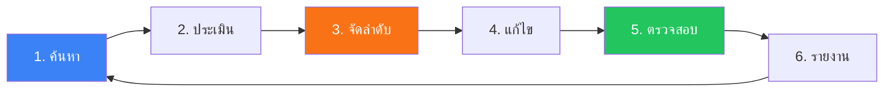
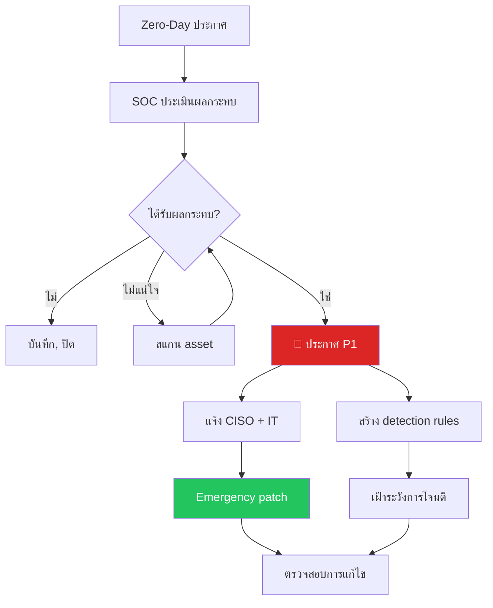

# Vulnerability Management SOP / SOP การจัดการช่องโหว่

**รหัสเอกสาร**: OPS-SOP-020
**เวอร์ชัน**: 1.0
**การจัดชั้นความลับ**: ใช้ภายใน
**อัปเดตล่าสุด**: 2026-02-15

> ขั้นตอน SOC สำหรับ **สแกนช่องโหว่, จัดลำดับ, ติดตาม, และตรวจสอบการแก้ไข** ประสานกับทีม patching, IT operations, และ risk management

---

## วงจร Vulnerability Management

---

## ตาราง Scan

| ประเภท Scan | ขอบเขต | ความถี่ | เครื่องมือ |
|:---|:---|:---:|:---|
| **Network vulnerability** | ทุก IP range | รายสัปดาห์ | Nessus / Qualys / OpenVAS |
| **Web application** | ทุก web app | รายเดือน | Burp Suite / OWASP ZAP |
| **Cloud posture** | AWS / Azure / GCP | รายวัน | CSPM tool |
| **Container images** | CI/CD pipeline | ทุก build | Trivy / Grype |
| **Configuration audit** | Servers, endpoints | รายเดือน | CIS Benchmarks |
| **AD/Identity** | Active Directory | รายเดือน | PingCastle / BloodHound |
| **External attack surface** | Public-facing assets | รายสัปดาห์ | EASM tool |

---

## การจำแนก Severity

### CVSS → SOC Priority

| CVSS | Severity | Priority | SLA แก้ไข |
|:---:|:---|:---:|:---:|
| 9.0–10.0 | 🔴 Critical | **P1** | 24 ชม. |
| 7.0–8.9 | 🟠 High | **P2** | 7 วัน |
| 4.0–6.9 | 🟡 Medium | **P3** | 30 วัน |
| 0.1–3.9 | 🟢 Low | **P4** | 90 วัน |

### การปรับตามบริบท

| ปัจจัย | การปรับ | ตัวอย่าง |
|:---|:---:|:---|
| **Internet-facing** | +1 Priority | CVSS 7.5 High → P1 |
| **มี PII / payment data** | +1 Priority | CVSS 5.0 Med → P2 |
| **อยู่ใน CISA KEV** | → P1 เสมอ | ทุก CVE ใน KEV list |
| **มี compensating control** | −1 Priority | WAF บล็อก exploit |
| **เครือข่ายแยก** | −1 Priority | Air-gapped system |

---

## ขั้นตอนตอบสนอง Zero-Day

### Checklist Zero-Day

- [ ] ได้รับและทบทวน advisory
- [ ] สำรวจ asset ที่ได้รับผลกระทบ
- [ ] ประเมินผลกระทบ
- [ ] แจ้ง CISO (ถ้า P1)
- [ ] Deploy detection rules
- [ ] ประเมิน/ใช้ compensating controls
- [ ] เริ่ม emergency patching
- [ ] เปิด exploitation monitoring
- [ ] สแกนซ้ำหลัง patch
- [ ] อัปเดต stakeholders

---

## การติดตามการแก้ไข

### SLA Tracking Dashboard

| Priority | เปิดอยู่ | ตาม SLA | เลย SLA | % Compliant |
|:---:|:---:|:---:|:---:|:---:|
| 🔴 P1 | _____ | _____ | _____ | ___% |
| 🟠 P2 | _____ | _____ | _____ | ___% |
| 🟡 P3 | _____ | _____ | _____ | ___% |
| 🟢 P4 | _____ | _____ | _____ | ___% |

### กระบวนการ Exception / Risk Acceptance

| ขั้น | ผู้รับผิดชอบ | ผลลัพธ์ |
|:---:|:---|:---|
| 1 | เจ้าของ asset ขอ exception | แบบฟอร์ม exception |
| 2 | SOC ประเมินความเสี่ยงและ compensating controls | การประเมินความเสี่ยง |
| 3 | Risk Manager ทบทวน | คำแนะนำ |
| 4 | CISO อนุมัติ (P1/P2) หรือ Security Manager (P3/P4) | ลงนาม |
| 5 | SOC เพิ่มใน exception tracker | ติดตามพร้อมวันทบทวน |
| 6 | ทบทวนเมื่อหมดอายุ (สูงสุด 90 วัน) | ต่อหรือแก้ไข |

---

## ตัวชี้วัด

| ตัวชี้วัด | เป้าหมาย |
|:---|:---:|
| แก้ไข P1 ตาม SLA | ≥ 95% |
| แก้ไข P2 ตาม SLA | ≥ 90% |
| เวลาเฉลี่ยแก้ไข P1 | < 24 ชม. |
| เวลาเฉลี่ยแก้ไข P2 | < 7 วัน |
| Scan coverage | ≥ 95% |
| ตรวจสอบหลัง patch | ≥ 90% |
| P1/P2 เปิดเกิน SLA | 0 |
| Detection rule coverage สำหรับ KEV | 100% |

---

## เอกสารที่เกี่ยวข้อง

-   [Threat Landscape Report](Threat_Landscape_Report.en.md) — การติดตาม CVE
-   [Log Source Matrix](Log_Source_Matrix.en.md) — แหล่งข้อมูล scan
-   [Cloud Security Monitoring](Cloud_Security_Monitoring.en.md) — Cloud vulns
-   [SOC Automation Catalog](SOC_Automation_Catalog.en.md) — Auto-scan
-   [Escalation Matrix](../05_Incident_Response/Escalation_Matrix.en.md) — Zero-day escalation
