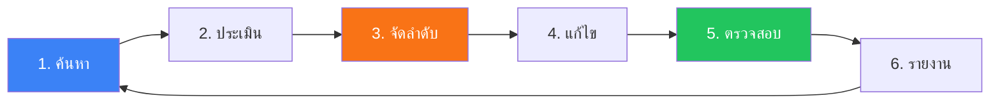
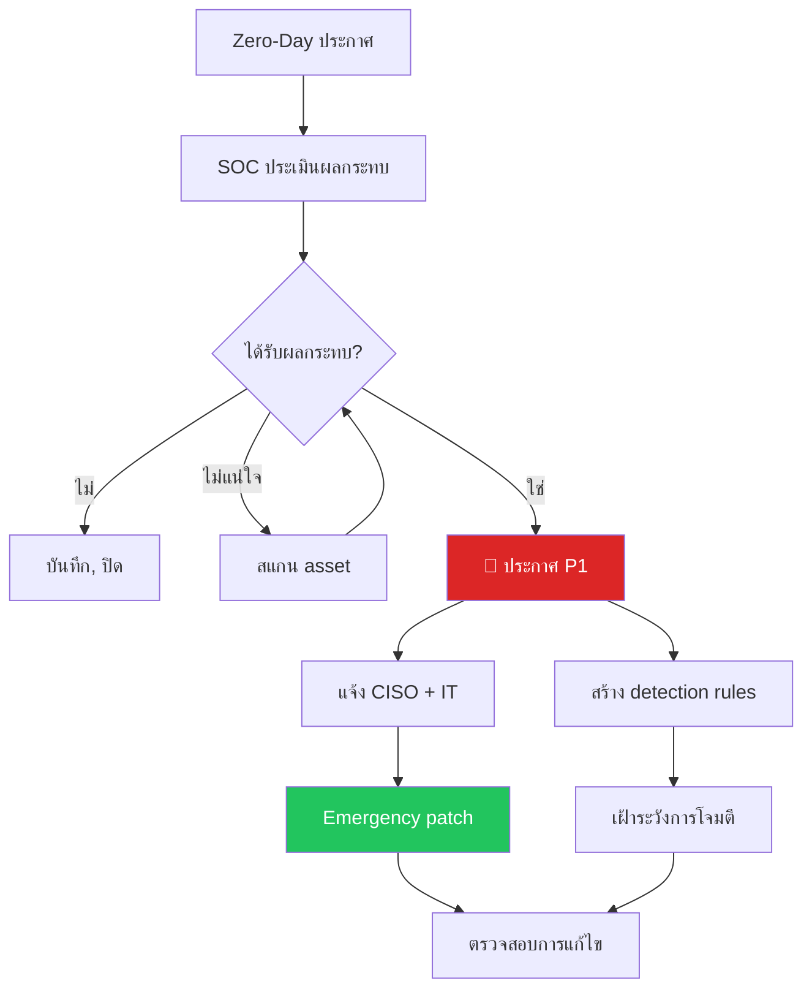
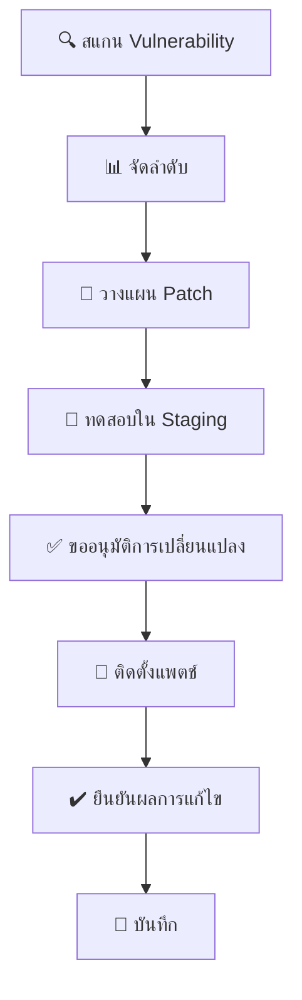

# Vulnerability Management SOP / SOP การจัดการช่องโหว่

**รหัสเอกสาร**: OPS-SOP-020
**เวอร์ชัน**: 1.0
**การจัดชั้นความลับ**: ใช้ภายใน
**อัปเดตล่าสุด**: 2026-02-15

> ขั้นตอน SOC สำหรับ **สแกนช่องโหว่, จัดลำดับ, ติดตาม, และตรวจสอบการแก้ไข** ประสานกับทีม patching, IT operations, และ risk management

---

## วงจร Vulnerability Management

```mermaid
graph LR
    A[1. ค้นหา] --> B[2. ประเมิน]
    B --> C[3. จัดลำดับ]
    C --> D[4. แก้ไข]
    D --> E[5. ตรวจสอบ]
    E --> F[6. รายงาน]
    F --> A

    style A fill:#3b82f6,color:#fff
    style C fill:#f97316,color:#fff
    style E fill:#22c55e,color:#fff
```

---

## ตาราง Scan

| ประเภท Scan | ขอบเขต | ความถี่ | เครื่องมือ |
|:---|:---|:---:|:---|
| **Network vulnerability** | ทุก IP range | รายสัปดาห์ | Nessus / Qualys / OpenVAS |
| **Web application** | ทุก web app | รายเดือน | Burp Suite / OWASP ZAP |
| **Cloud posture** | AWS / Azure / GCP | รายวัน | CSPM tool |
| **Container images** | CI/CD pipeline | ทุก build | Trivy / Grype |
| **Configuration audit** | Servers, endpoints | รายเดือน | CIS Benchmarks |
| **AD/Identity** | Active Directory | รายเดือน | PingCastle / BloodHound |
| **External attack surface** | Public-facing assets | รายสัปดาห์ | EASM tool |

---

## การจำแนก Severity

### CVSS → SOC Priority

| CVSS | Severity | Priority | SLA แก้ไข |
|:---:|:---|:---:|:---:|
| 9.0–10.0 | 🔴 Critical | **P1** | 24 ชม. |
| 7.0–8.9 | 🟠 High | **P2** | 7 วัน |
| 4.0–6.9 | 🟡 Medium | **P3** | 30 วัน |
| 0.1–3.9 | 🟢 Low | **P4** | 90 วัน |

### การปรับตามบริบท

| ปัจจัย | การปรับ | ตัวอย่าง |
|:---|:---:|:---|
| **Internet-facing** | +1 Priority | CVSS 7.5 High → P1 |
| **มี PII / payment data** | +1 Priority | CVSS 5.0 Med → P2 |
| **อยู่ใน CISA KEV** | → P1 เสมอ | ทุก CVE ใน KEV list |
| **มี compensating control** | −1 Priority | WAF บล็อก exploit |
| **เครือข่ายแยก** | −1 Priority | Air-gapped system |

---

## ขั้นตอนตอบสนอง Zero-Day

```mermaid
flowchart TD
    A[Zero-Day ประกาศ] --> B[SOC ประเมินผลกระทบ]
    B --> C{ได้รับผลกระทบ?}
    C -->|ไม่| D[บันทึก, ปิด]
    C -->|ไม่แน่ใจ| E[สแกน asset]
    C -->|ใช่| F[🔴 ประกาศ P1]
    E --> C
    F --> G[แจ้ง CISO + IT]
    F --> H[สร้าง detection rules]
    G --> I[Emergency patch]
    H --> J[เฝ้าระวังการโจมตี]
    I --> K[ตรวจสอบการแก้ไข]
    J --> K

    style F fill:#dc2626,color:#fff
    style I fill:#22c55e,color:#fff
```

### Checklist Zero-Day

- [ ] ได้รับและทบทวน advisory
- [ ] สำรวจ asset ที่ได้รับผลกระทบ
- [ ] ประเมินผลกระทบ
- [ ] แจ้ง CISO (ถ้า P1)
- [ ] Deploy detection rules
- [ ] ประเมิน/ใช้ compensating controls
- [ ] เริ่ม emergency patching
- [ ] เปิด exploitation monitoring
- [ ] สแกนซ้ำหลัง patch
- [ ] อัปเดต stakeholders

---

## การติดตามการแก้ไข

### SLA Tracking Dashboard

| Priority | เปิดอยู่ | ตาม SLA | เลย SLA | % Compliant |
|:---:|:---:|:---:|:---:|:---:|
| 🔴 P1 | _____ | _____ | _____ | ___% |
| 🟠 P2 | _____ | _____ | _____ | ___% |
| 🟡 P3 | _____ | _____ | _____ | ___% |
| 🟢 P4 | _____ | _____ | _____ | ___% |

### กระบวนการ Exception / Risk Acceptance

| ขั้น | ผู้รับผิดชอบ | ผลลัพธ์ |
|:---:|:---|:---|
| 1 | เจ้าของ asset ขอ exception | แบบฟอร์ม exception |
| 2 | SOC ประเมินความเสี่ยงและ compensating controls | การประเมินความเสี่ยง |
| 3 | Risk Manager ทบทวน | คำแนะนำ |
| 4 | CISO อนุมัติ (P1/P2) หรือ Security Manager (P3/P4) | ลงนาม |
| 5 | SOC เพิ่มใน exception tracker | ติดตามพร้อมวันทบทวน |
| 6 | ทบทวนเมื่อหมดอายุ (สูงสุด 90 วัน) | ต่อหรือแก้ไข |

---

## ตัวชี้วัด

| ตัวชี้วัด | เป้าหมาย |
|:---|:---:|
| แก้ไข P1 ตาม SLA | ≥ 95% |
| แก้ไข P2 ตาม SLA | ≥ 90% |
| เวลาเฉลี่ยแก้ไข P1 | < 24 ชม. |
| เวลาเฉลี่ยแก้ไข P2 | < 7 วัน |
| Scan coverage | ≥ 95% |
| ตรวจสอบหลัง patch | ≥ 90% |
| P1/P2 เปิดเกิน SLA | 0 |
| Detection rule coverage สำหรับ KEV | 100% |

---

## Vulnerability Prioritization Framework

### CVSS + Context-Based Scoring

| ปัจจัย | น้ำหนัก | คำอธิบาย |
|:---|:---:|:---|
| **CVSS Score** | 30% | Base score จาก NVD |
| **Exploitability** | 25% | มี public exploit หรือไม่ |
| **Asset Criticality** | 25% | ระบบนี้สำคัญแค่ไหน |
| **Exposure** | 20% | Internet-facing หรือ internal |

### ตาราง Priority Matrix

| | CVSS 9-10 | CVSS 7-8.9 | CVSS 4-6.9 | CVSS 0-3.9 |
|:---|:---:|:---:|:---:|:---:|
| **Internet-facing + Critical** | 🔴 P1 (24h) | 🔴 P1 (48h) | 🟡 P2 (7d) | 🟢 P3 (30d) |
| **Internet-facing + Non-critical** | 🔴 P1 (48h) | 🟡 P2 (7d) | 🟡 P2 (14d) | 🟢 P3 (30d) |
| **Internal + Critical** | 🟡 P2 (7d) | 🟡 P2 (14d) | 🟢 P3 (30d) | ⚪ P4 (90d) |
| **Internal + Non-critical** | 🟡 P2 (14d) | 🟢 P3 (30d) | ⚪ P4 (90d) | ⚪ P4 (Next cycle) |

## Patch Management Workflow

```mermaid
graph TD
    Scan["🔍 สแกน Vulnerability"] --> Prioritize["📊 จัดลำดับ"]
    Prioritize --> Plan["📝 วางแผน Patch"]
    Plan --> Test["🧪 ทดสอบใน Staging"]
    Test --> Approve["✅ ขออนุมัติการเปลี่ยนแปลง"]
    Approve --> Deploy["🚀 ติดตั้งแพตช์"]
    Deploy --> Verify["✔️ ยืนยันผลการแก้ไข"]
    Verify --> Document["📄 บันทึก"]
```

## Vulnerability Management KPIs

| ตัวชี้วัด | เป้าหมาย | ปัจจุบัน |
|:---|:---|:---|
| เวลาแก้ไข Critical vuln | ≤ 24 ชม. | [XX] ชม. |
| เวลาแก้ไข High vuln | ≤ 7 วัน | [XX] วัน |
| เวลาแก้ไข Medium vuln | ≤ 30 วัน | [XX] วัน |
| Scan Coverage | ≥ 95% ของ assets | [XX]% |
| Recurring Vulnerability Rate | < 5% | [XX]% |

## Exception Management

| รายการ | เนื้อหา |
|:---|:---|
| **Exception ID** | VULN-EXC-YYYY-NNN |
| **Vulnerability** | CVE-YYYY-NNNNN |
| **ระบบที่ได้รับผลกระทบ** | [ระบุ] |
| **เหตุผลที่ไม่ patch** | [ระบุ — incompatibility / vendor pending] |
| **Compensating Controls** | [ระบุ — WAF rule / network segmentation] |
| **Risk Owner** | [ชื่อ + ตำแหน่ง] |
| **วันหมดอายุ Exception** | [วันที่] |
| **Review Date** | [วันที่ — ภายใน 30 วัน] |

## Vulnerability Remediation SLA

### SLA by CVSS Score

| CVSS Score | Severity | Patch SLA | Verify SLA |
|:---|:---|:---|:---|
| 9.0-10.0 | Critical | 24 ชั่วโมง | 48 ชั่วโมง |
| 7.0-8.9 | High | 7 วัน | 14 วัน |
| 4.0-6.9 | Medium | 30 วัน | 45 วัน |
| 0.1-3.9 | Low | 90 วัน | 120 วัน |

### Exception Process

| ขั้นตอน | ผู้ดำเนินการ | Timeline |
|:---|:---|:---|
| ขอ exception | System owner | ก่อน SLA หมด |
| Review risk | Security team | 2 วันทำการ |
| อนุมัติ/ปฏิเสธ | CISO | 1 วันทำการ |
| Compensating controls | System owner | 5 วันทำการ |
| Re-assess | Security team | ทุก 30 วัน |

### Vulnerability Scanning Schedule

| Scan Type | Scope | Frequency | Owner |
|:---|:---|:---|:---|
| External | Internet-facing | Weekly | Security Team |
| Internal | All servers | Monthly | IT + Security |
| Web App | OWASP Top 10 | Monthly | AppSec |
| Container | Docker images | Per build | DevOps |
| Cloud | AWS/Azure config | Daily | Cloud Team |

### Scan Coverage Dashboard

| Scope | Assets | Scanned | Coverage |
|:---|:---|:---|:---|
| External | 150 | 148 | 99% |
| Internal | 500 | 465 | 93% |
| Cloud | 200 | 190 | 95% |

### Patch Priority Quick Guide

| CVSS | Exploitable? | Action |
|:---|:---|:---|
| 9+ | Yes | Emergency patch |
| 9+ | No | 24 hr patch |
| 7-8.9 | Yes | 72 hr patch |
| 7-8.9 | No | 7 day patch |

## Trigger สำหรับการยกระดับเชิงปฏิบัติการ

| Trigger | ต้อง escalate ไปหา | เหตุผล |
|:---|:---|:---|
| **P1 vulnerability ยังไม่มี owner หรือ patch plan** | CISO + หัวหน้า IT Operations | รู้ exposure แล้วแต่ยังควบคุมไม่ได้ |
| **พบการใช้ประโยชน์โจมตีก่อน remediation เสร็จ** | IR Lead + SOC Manager | ช่องโหว่ได้กลายเป็น active incident แล้ว |
| **critical asset เลย SLA** | ผู้บริหารของ asset owner + CISO | ความเสี่ยงเกินกว่าระดับปฏิบัติการทั่วไป |
| **มีการขอ exception โดยไม่มี compensating control** | Risk Manager | risk acceptance ยังป้องกันเชิงเหตุผลไม่ได้ |

## หลักฐานขั้นต่ำก่อนปิดเคสช่องโหว่

| หลักฐาน | มาตรฐานขั้นต่ำ |
|:---|:---|
| **บันทึกการแก้ไข** | มี change ticket หรือ patch reference ผูกกับ asset ที่ได้รับผลกระทบ |
| **ผลการ verify scan** | re-scan หรือหลักฐานเทียบเท่าที่ยืนยันว่าช่องโหว่หายแล้ว |
| **บันทึก compensating control** | ต้องมีถ้าเลื่อน patch หรือแก้ได้เพียงบางส่วน |
| **การตรวจ exposure** | ยืนยันว่า asset internet-facing หรือ asset สำคัญไม่ได้รับผลกระทบค้างอยู่ |

## เอกสารที่เกี่ยวข้อง

-   [Threat Landscape Report](Threat_Landscape_Report.th.md) — การติดตาม CVE
-   [Log Source Matrix](Log_Source_Matrix.th.md) — แหล่งข้อมูล scan
-   [Cloud Security Monitoring](Cloud_Security_Monitoring.th.md) — Cloud vulns
-   [SOC Automation Catalog](SOC_Automation_Catalog.th.md) — Auto-scan
-   [Escalation Matrix](../05_Incident_Response/Escalation_Matrix.th.md) — Zero-day escalation

## References

- [CISA Known Exploited Vulnerabilities Catalog](https://www.cisa.gov/known-exploited-vulnerabilities-catalog)
- [NIST National Vulnerability Database](https://nvd.nist.gov/)
