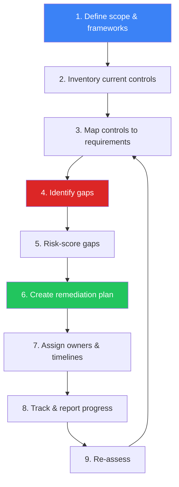

# Compliance Gap Analysis SOP

**Document ID**: COMP-SOP-003
**Version**: 1.0
**Classification**: Internal
**Last Updated**: 2026-02-16

> Procedures for **assessing organizational compliance posture** against regulatory frameworks, identifying gaps, prioritizing remediation, and tracking progress. Covers ISO 27001, NIST CSF, PCI DSS, PDPA, and GDPR mapping.

---

## Compliance Frameworks Matrix

| Framework | Scope | Applicability | Review Cycle |
|:---|:---|:---|:---:|
| **ISO 27001:2022** | Information Security Management System | All organizations | Annual |
| **NIST CSF 2.0** | Cybersecurity risk management | Critical infrastructure, voluntary | Annual |
| **PCI DSS v4.0** | Cardholder data protection | Payment card processing | Quarterly + Annual |
| **PDPA** | Personal data protection (Thailand) | All Thai data processing | Annual |
| **GDPR** | Personal data protection (EU) | EU citizen data processing | Annual |
| **CSA CCM v4** | Cloud security controls | Cloud service providers | Annual |

---

## Gap Analysis Process

```mermaid
flowchart TD
    A[1. Define scope & frameworks] --> B[2. Inventory current controls]
    B --> C[3. Map controls to requirements]
    C --> D[4. Identify gaps]
    D --> E[5. Risk-score gaps]
    E --> F[6. Create remediation plan]
    F --> G[7. Assign owners & timelines]
    G --> H[8. Track & report progress]
    H --> I[9. Re-assess]
    I --> C

    style A fill:#3b82f6,color:#fff
    style D fill:#dc2626,color:#fff
    style F fill:#22c55e,color:#fff
```

### Phase Details

| Phase | Activities | Output | Duration |
|:---|:---|:---|:---:|
| **1. Scope** | Identify applicable frameworks, business units, systems | Scope document | 1 week |
| **2. Inventory** | Document existing policies, processes, tools, controls | Control inventory | 2 weeks |
| **3. Map** | Map each control to framework requirements | Control mapping matrix | 2 weeks |
| **4. Identify** | Compare implemented vs required → find gaps | Gap register | 1 week |
| **5. Risk-score** | Score each gap by impact × likelihood | Prioritized gap list | 1 week |
| **6. Plan** | Define remediation actions, resources, budget | Remediation plan | 2 weeks |
| **7. Assign** | Designate owners, set deadlines | RACI + timeline | 1 week |
| **8. Track** | Monitor progress, report to stakeholders | Progress dashboard | Ongoing |
| **9. Re-assess** | Validate remediation effectiveness | Updated gap register | Quarterly |

---

## SOC-Specific Control Areas

### Detection & Response Controls

| Control Area | ISO 27001 | NIST CSF | PCI DSS | Key Questions |
|:---|:---:|:---:|:---:|:---|
| **SIEM deployment** | A.8.15 | DE.CM | 10.6 | Is SIEM covering all critical log sources? |
| **Log collection** | A.8.15 | DE.CM-3 | 10.2 | Are all required sources onboarded? |
| **Alert monitoring** | A.8.16 | DE.AE | 10.6.1 | Is 24/7 monitoring in place? |
| **Incident response plan** | A.5.24 | RS.RP | 12.10 | Is IR plan documented and tested? |
| **Vulnerability scanning** | A.8.8 | DE.CM-8 | 11.3 | Is scanning running at required frequency? |
| **Penetration testing** | A.8.8 | PR.IP | 11.4 | Is annual pentest conducted? |
| **Access management** | A.8.2 | PR.AC | 7.1 | Is least privilege enforced? |
| **MFA** | A.8.5 | PR.AC-7 | 8.4 | Is MFA enabled for all admin access? |
| **Encryption** | A.8.24 | PR.DS-1 | 3.4 | Is data encrypted at rest and in transit? |
| **Backup & recovery** | A.8.13 | PR.IP-4 | 9.5 | Are backups tested regularly? |

### Data Protection Controls (PDPA/GDPR)

| Control | PDPA Section | GDPR Article | Assessment Questions |
|:---|:---:|:---:|:---|
| **Lawful basis** | §24 | Art. 6 | Is lawful basis documented for each processing activity? |
| **Consent management** | §19 | Art. 7 | Is consent freely given, specific, informed? |
| **Data subject rights** | §30–36 | Art. 15–22 | Can requests be fulfilled within 30 days? |
| **Breach notification** | §37 | Art. 33–34 | Can we notify within 72 hours? |
| **DPO appointment** | §41 | Art. 37 | Is DPO appointed with adequate authority? |
| **DPIA** | §26 | Art. 35 | Are DPIAs conducted for high-risk processing? |
| **Cross-border transfer** | §28 | Art. 44–49 | Are adequate safeguards in place? |
| **Records of processing** | §39 | Art. 30 | Are processing records maintained? |

---

## Gap Risk Scoring

### Scoring Matrix

| Factor | 1 — Low | 2 — Medium | 3 — High | 4 — Critical |
|:---|:---|:---|:---|:---|
| **Business impact** | Minimal disruption | Moderate impact | Significant loss | Business-critical failure |
| **Regulatory risk** | Advisory finding | Minor non-compliance | Material non-compliance | Regulatory action / fine |
| **Exploit likelihood** | Unlikely | Possible | Probable | Active exploitation |
| **Data sensitivity** | Public data | Internal data | Confidential / PII | Restricted / regulated |

### Risk Score Calculation

| Combined Score | Priority | Remediation Timeline | Reporting |
|:---:|:---|:---:|:---|
| **13–16** | 🔴 Critical | < 30 days | Weekly to CISO |
| **9–12** | 🟠 High | < 90 days | Monthly to CISO |
| **5–8** | 🟡 Medium | < 180 days | Quarterly review |
| **1–4** | 🟢 Low | Next audit cycle | Annual review |

---

## Remediation Tracking

### Remediation Plan Template

| Field | Value |
|:---|:---|
| **Gap ID** | GAP-____-_____ |
| **Framework** | ISO 27001 / NIST / PCI / PDPA |
| **Control Reference** | ______________ |
| **Current State** | ______________ |
| **Required State** | ______________ |
| **Gap Description** | ______________ |
| **Risk Score** | _____ / 16 |
| **Remediation Action** | ______________ |
| **Owner** | ______________ |
| **Budget Required** | ฿____________ |
| **Target Date** | ____-__-__ |
| **Evidence Required** | ______________ |
| **Status** | 🔴 Open / 🟡 In Progress / 🟢 Closed |

### Progress Dashboard

| Metric | Formula | Target |
|:---|:---|:---:|
| Overall compliance score | (Controls met ÷ Total controls) × 100 | ≥ 85% |
| Critical gaps open | Count of score 13–16 open | 0 |
| High gaps overdue | Count of score 9–12 past due | 0 |
| Mean time to remediate (critical) | Avg days gap open → closed | < 30 days |
| Mean time to remediate (high) | Avg days gap open → closed | < 90 days |
| Gaps reopened | Gaps that failed re-validation | < 5% |

---

## Audit Preparation

### Pre-Audit Checklist

| Category | Items | Owner |
|:---|:---|:---|
| **Documentation** | Policies, procedures, standards current | Compliance Manager |
| **Evidence** | Screenshots, logs, configurations collected | SOC Lead |
| **Access** | Auditor accounts provisioned | IT Admin |
| **Interviews** | Staff briefed on roles and processes | Department Heads |
| **Testing** | Recent scan/pentest reports available | Security Engineer |
| **Remediation** | Previous findings addressed with evidence | Control Owners |

### Evidence Collection Matrix

| Control Type | Acceptable Evidence | Collection Frequency |
|:---|:---|:---:|
| **Technical** | System configs, screenshots, tool exports | Real-time / daily |
| **Administrative** | Policies, procedures, meeting minutes | As updated |
| **Operational** | Logs, reports, incident records | Daily / weekly |
| **Physical** | Photos, access logs, visitor records | Monthly |

---

## Reporting

### Compliance Report Structure

| Section | Content | Audience |
|:---|:---|:---|
| **Executive Summary** | Overall score, critical findings, trend | Board / CISO |
| **Framework Status** | Per-framework compliance percentage | Management |
| **Gap Register** | All open gaps with risk scores | Control owners |
| **Remediation Progress** | Timeline tracking, overdue items | Project managers |
| **Risk Heat Map** | Visual risk distribution | Board / CISO |
| **Recommendations** | Prioritized next steps | Management |

### Reporting Cadence

| Report | Frequency | Audience |
|:---|:---:|:---|
| Critical gap alert | Immediate | CISO |
| Compliance dashboard | Weekly | Security team |
| Progress report | Monthly | Management |
| Framework assessment | Quarterly | Board / CISO |
| Full audit report | Annual | Board / External |

---

## Metrics

| Metric | Target |
|:---|:---:|
| Overall compliance score | ≥ 85% |
| Critical gaps open | 0 |
| Gap remediation on-time rate | ≥ 90% |
| Average remediation time (critical) | < 30 days |
| Audit finding recurrence rate | < 10% |
| Evidence availability | ≥ 95% |

## Minimum Evidence for Gap Closure

| Evidence | Why It Matters | Owner |
|:---|:---|:---|
| Updated control or procedure reference | Proves the gap was addressed in documentation | Control Owner |
| Operating evidence from production (ticket, log, screenshot, export) | Confirms the fix is working, not just written down | SOC Analyst / Security Engineer |
| Approval or risk-acceptance record | Distinguishes remediation from accepted residual risk | SOC Manager / CISO |
| Re-test or validation result | Shows the gap no longer fails the original check | Compliance Officer |
| Closure date and review trail in gap register | Preserves accountability and audit traceability | Compliance Officer |

## Executive Escalation Triggers for Gaps

| Condition | Escalate To | SLA | Required Decision |
|:---|:---|:---:|:---|
| Critical gap has no owner or no funded plan | CISO | Same business day | Assign owner and approve remediation path |
| Gap affects regulated data, cardholder systems, or legal reporting | CISO + Legal / DPO | Immediate | Accept risk temporarily or mandate control change |
| High-risk gap misses deadline twice | Executive sponsor | Next governance review | Escalate beyond local team remediation |
| Closure evidence is missing or fails validation | Compliance Officer + Control Owner | Within 5 business days | Reopen gap or provide evidence |

---

## Related Documents

-   [Compliance Mapping](Compliance_Mapping.en.md) — ISO 27001 / NIST CSF / PCI DSS mapping
-   [PDPA Incident Response](PDPA_Incident_Response.en.md) — 72-hour notification SOP
-   [SOC Maturity Assessment](../06_Operations_Management/SOC_Maturity_Assessment.en.md) — SOC capability assessment
-   [Vulnerability Management](../06_Operations_Management/Vulnerability_Management.en.md) — Scanning & remediation
-   [Third-Party Risk](../06_Operations_Management/Third_Party_Risk.en.md) — Vendor compliance

## References

-   [NIST Cybersecurity Framework 2.0](https://www.nist.gov/cyberframework)
-   [ISO/IEC 27001:2022](https://www.iso.org/standard/27001)
-   [PCI DSS v4.0](https://www.pcisecuritystandards.org/document_library/)
