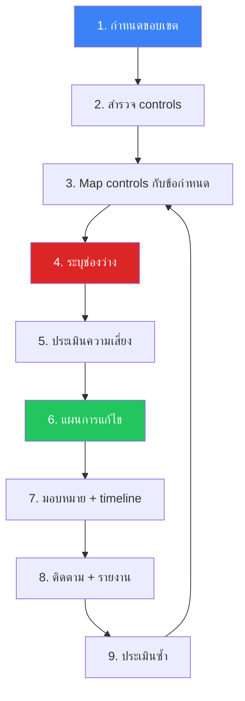
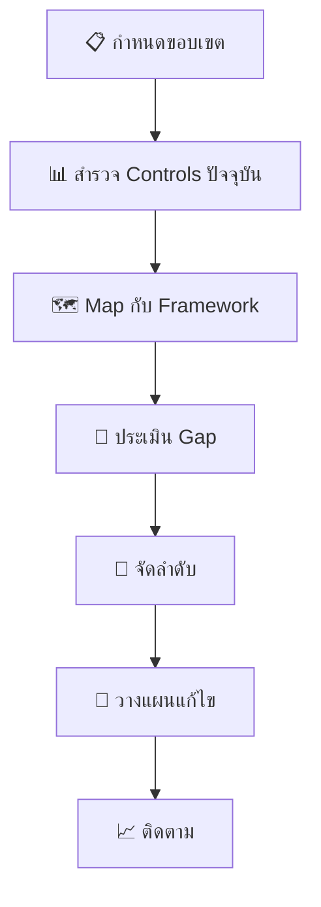

# Compliance Gap Analysis SOP / SOP การวิเคราะห์ช่องว่างด้าน Compliance

**รหัสเอกสาร**: COMP-SOP-003
**เวอร์ชัน**: 1.0
**การจัดชั้นความลับ**: ใช้ภายใน
**อัปเดตล่าสุด**: 2026-02-16

> ขั้นตอน **ประเมินสถานะ Compliance, ระบุช่องว่าง, จัดลำดับการแก้ไข, และติดตามความคืบหน้า** ครอบคลุม ISO 27001, NIST CSF, PCI DSS, PDPA, และ GDPR

---

## กรอบ Compliance

| Framework | ขอบเขต | รอบทบทวน |
|:---|:---|:---:|
| **ISO 27001:2022** | ระบบจัดการความมั่นคงปลอดภัยสารสนเทศ | รายปี |
| **NIST CSF 2.0** | บริหารจัดการ cybersecurity risk | รายปี |
| **PCI DSS v4.0** | ปกป้องข้อมูลบัตรชำระเงิน | รายไตรมาส + รายปี |
| **PDPA** | คุ้มครองข้อมูลส่วนบุคคล (ไทย) | รายปี |
| **GDPR** | คุ้มครองข้อมูลส่วนบุคคล (EU) | รายปี |

---

## กระบวนการ Gap Analysis

```mermaid
flowchart TD
    A[1. กำหนดขอบเขต] --> B[2. สำรวจ controls]
    B --> C[3. Map controls กับข้อกำหนด]
    C --> D[4. ระบุช่องว่าง]
    D --> E[5. ประเมินความเสี่ยง]
    E --> F[6. แผนการแก้ไข]
    F --> G[7. มอบหมาย + timeline]
    G --> H[8. ติดตาม + รายงาน]
    H --> I[9. ประเมินซ้ำ]
    I --> C

    style A fill:#3b82f6,color:#fff
    style D fill:#dc2626,color:#fff
    style F fill:#22c55e,color:#fff
```

---

## SOC-Specific Controls

### Detection & Response

| Control Area | ISO 27001 | NIST CSF | PCI DSS | คำถามหลัก |
|:---|:---:|:---:|:---:|:---|
| **SIEM** | A.8.15 | DE.CM | 10.6 | SIEM ครอบคลุม log sources ทั้งหมด? |
| **Log collection** | A.8.15 | DE.CM-3 | 10.2 | Onboard log sources ที่จำเป็นครบ? |
| **Alert monitoring** | A.8.16 | DE.AE | 10.6.1 | มี 24/7 monitoring? |
| **IR plan** | A.5.24 | RS.RP | 12.10 | IR plan ทดสอบแล้ว? |
| **Vuln scanning** | A.8.8 | DE.CM-8 | 11.3 | สแกนตามความถี่ที่กำหนด? |
| **Pentest** | A.8.8 | PR.IP | 11.4 | ทดสอบเจาะระบบรายปี? |
| **Access mgmt** | A.8.2 | PR.AC | 7.1 | Least privilege? |
| **MFA** | A.8.5 | PR.AC-7 | 8.4 | MFA สำหรับ admin ทั้งหมด? |

### Data Protection (PDPA/GDPR)

| Control | PDPA | GDPR | คำถาม |
|:---|:---:|:---:|:---|
| **ฐานทางกฎหมาย** | §24 | Art. 6 | มีฐานกฎหมายครบทุกกิจกรรม? |
| **ความยินยอม** | §19 | Art. 7 | Consent เป็น free, specific, informed? |
| **สิทธิเจ้าของข้อมูล** | §30–36 | Art. 15–22 | ดำเนินการได้ภายใน 30 วัน? |
| **แจ้งเหตุละเมิด** | §37 | Art. 33–34 | แจ้งได้ภายใน 72 ชม.? |
| **DPO** | §41 | Art. 37 | แต่งตั้ง DPO แล้ว? |
| **DPIA** | §26 | Art. 35 | ทำ DPIA สำหรับ high-risk? |

---

## การให้คะแนนความเสี่ยง

| คะแนนรวม | Priority | แก้ไขภายใน | รายงาน |
|:---:|:---|:---:|:---|
| **13–16** | 🔴 Critical | < 30 วัน | รายสัปดาห์ถึง CISO |
| **9–12** | 🟠 High | < 90 วัน | รายเดือนถึง CISO |
| **5–8** | 🟡 Medium | < 180 วัน | รายไตรมาส |
| **1–4** | 🟢 Low | Audit cycle ถัดไป | รายปี |

---

## การติดตามการแก้ไข

| ตัวชี้วัด | สูตร | เป้าหมาย |
|:---|:---|:---:|
| Compliance score รวม | (Controls met ÷ Total) × 100 | ≥ 85% |
| Critical gaps open | จำนวน score 13–16 ที่เปิด | 0 |
| High gaps overdue | จำนวน score 9–12 เลยกำหนด | 0 |
| MTTR (critical) | วันเฉลี่ยจากเปิด→ปิด | < 30 วัน |
| MTTR (high) | วันเฉลี่ยจากเปิด→ปิด | < 90 วัน |
| Gaps reopened | Gaps ที่ re-validate ไม่ผ่าน | < 5% |

---

## ตัวชี้วัด

| ตัวชี้วัด | เป้าหมาย |
|:---|:---:|
| Overall compliance score | ≥ 85% |
| Critical gaps open | 0 |
| Gap remediation on-time | ≥ 90% |
| Remediation time (critical) | < 30 วัน |
| Audit finding recurrence | < 10% |
| Evidence availability | ≥ 95% |

## หลักฐานขั้นต่ำสำหรับการปิด Gap (Minimum Evidence for Gap Closure)

| หลักฐาน | เหตุผล | ผู้รับผิดชอบ |
|:---|:---|:---|
| เอกสาร control หรือ procedure ที่อัปเดตแล้ว | พิสูจน์ว่ามีการแก้ในระดับเอกสารจริง | Control Owner |
| หลักฐานจาก production เช่น ticket, log, screenshot, export | ยืนยันว่าการแก้ทำงานจริง ไม่ใช่แค่เขียนเพิ่ม | SOC Analyst / Security Engineer |
| approval หรือ risk-acceptance record | แยกให้ชัดว่าปิดด้วย remediation หรือยอมรับความเสี่ยง | SOC Manager / CISO |
| ผล re-test หรือ validation | แสดงว่า gap ไม่ตกเงื่อนไขเดิมอีก | Compliance Officer |
| วันที่ปิดและ review trail ใน gap register | เก็บ accountability และ audit traceability | Compliance Officer |

## Trigger สำหรับการยกระดับช่องว่าง (Executive Escalation Triggers for Gaps)

| เงื่อนไข | ยกระดับถึง | SLA | การตัดสินใจที่ต้องได้ |
|:---|:---|:---:|:---|
| critical gap ไม่มี owner หรือไม่มีแผนที่ได้รับงบ | CISO | ภายในวันทำการเดียวกัน | แต่งตั้ง owner และอนุมัติ remediation path |
| gap กระทบ regulated data, ระบบบัตร, หรือภาระรายงานตามกฎหมาย | CISO + Legal / DPO | ทันที | รับความเสี่ยงชั่วคราวหรือบังคับเปลี่ยน control |
| high-risk gap เลยกำหนดสองครั้ง | Executive sponsor | governance review ถัดไป | ยกระดับเกินกว่าการแก้ในทีมย่อย |
| closure evidence ไม่มีหรือ validation ไม่ผ่าน | Compliance Officer + Control Owner | ภายใน 5 วันทำการ | เปิด gap ใหม่หรือจัดหลักฐานเพิ่ม |

---

## Gap Analysis Methodology

```mermaid
graph TD
    Scope["📋 กำหนดขอบเขต"] --> Inventory["📊 สำรวจ Controls ปัจจุบัน"]
    Inventory --> Map["🗺️ Map กับ Framework"]
    Map --> Assess["📝 ประเมิน Gap"]
    Assess --> Prioritize["🎯 จัดลำดับ"]
    Prioritize --> Remediate["🔧 วางแผนแก้ไข"]
    Remediate --> Track["📈 ติดตาม"]
```

## เทมเพลตการประเมินรายละเอียด

### ISO 27001 Controls Mapping

| Control | หมวด | สถานะ | Gap | ลำดับ |
|:---|:---|:---:|:---|:---:|
| A.5 | Information Security Policies | ✅/⚠️/❌ | [ระบุ] | 🔴/🟡/🟢 |
| A.6 | Organization of InfoSec | ✅/⚠️/❌ | [ระบุ] | 🔴/🟡/🟢 |
| A.7 | Human Resource Security | ✅/⚠️/❌ | [ระบุ] | 🔴/🟡/🟢 |
| A.8 | Asset Management | ✅/⚠️/❌ | [ระบุ] | 🔴/🟡/🟢 |
| A.9 | Access Control | ✅/⚠️/❌ | [ระบุ] | 🔴/🟡/🟢 |
| A.10 | Cryptography | ✅/⚠️/❌ | [ระบุ] | 🔴/🟡/🟢 |
| A.11 | Physical Security | ✅/⚠️/❌ | [ระบุ] | 🔴/🟡/🟢 |
| A.12 | Operations Security | ✅/⚠️/❌ | [ระบุ] | 🔴/🟡/🟢 |
| A.13 | Communications Security | ✅/⚠️/❌ | [ระบุ] | 🔴/🟡/🟢 |

### NIST CSF Mapping

| Function | Category | สถานะ | ระดับ (1-4) |
|:---|:---|:---:|:---:|
| **Identify** | Asset Management | ✅/⚠️/❌ | [X] |
| **Identify** | Risk Assessment | ✅/⚠️/❌ | [X] |
| **Protect** | Access Control | ✅/⚠️/❌ | [X] |
| **Detect** | Continuous Monitoring | ✅/⚠️/❌ | [X] |
| **Respond** | Response Planning | ✅/⚠️/❌ | [X] |
| **Recover** | Recovery Planning | ✅/⚠️/❌ | [X] |

## Remediation Tracking

| Gap ID | Framework | Control | ลำดับ | Owner | Deadline | สถานะ |
|:---:|:---|:---|:---:|:---|:---:|:---:|
| GAP-001 | ISO 27001 | A.12.4 | 🔴 | [ชื่อ] | [วันที่] | ☐ |
| GAP-002 | NIST CSF | DE.CM | 🟡 | [ชื่อ] | [วันที่] | ☐ |
| GAP-003 | PDPA | Art.37 | 🔴 | [ชื่อ] | [วันที่] | ☐ |

## KPIs สำหรับ Compliance

| ตัวชี้วัด | เป้าหมาย | ปัจจุบัน |
|:---|:---|:---|
| % Controls Implemented | ≥ 90% | [XX]% |
| Critical Gaps Outstanding | 0 | [XX] |
| Time to Remediate (Critical) | ≤ 30 วัน | [XX] วัน |
| Compliance Score (รวม) | ≥ 85% | [XX]% |

## Gap Remediation Tracking

### Remediation Priority Matrix

| Gap Category | Impact | Effort | Priority |
|:---|:---|:---|:---|
| Missing controls | สูง | สูง | P1 - ดำเนินการทันที |
| Incomplete policies | สูง | ต่ำ | P1 - Quick win |
| Outdated procedures | กลาง | ต่ำ | P2 - ปรับปรุง |
| Documentation gaps | ต่ำ | ต่ำ | P3 - จัดทำ |
| Training deficiencies | กลาง | กลาง | P2 - วางแผน |

### Gap Assessment Checklist

| Control Area | ISO 27001 | NIST CSF | PCI DSS | สถานะ |
|:---|:---|:---|:---|:---|
| Risk Assessment | A.6 | ID.RA | 12.2 | ✅/⚠️/❌ |
| Access Control | A.9 | PR.AC | 7,8 | ✅/⚠️/❌ |
| Incident Response | A.16 | RS | 12.10 | ✅/⚠️/❌ |
| Logging & Monitoring | A.12 | DE | 10 | ✅/⚠️/❌ |
| Data Protection | A.8 | PR.DS | 3,4 | ✅/⚠️/❌ |

### Quarterly Gap Review Cadence

| Activity | Timeline | Owner |
|:---|:---|:---|
| Scan for new requirements | Week 1 | Compliance Officer |
| Update gap register | Week 2 | Security Team |
| Risk re-assessment | Week 3 | CISO |
| Remediation planning | Week 4 | All |

### Gap Severity Criteria

| Severity | Definition | SLA |
|:---|:---|:---|
| Critical | Active non-compliance | 30 days |
| High | Significant gap | 60 days |
| Medium | Partial compliance | 90 days |
| Low | Documentation gap | 180 days |

### Gap Status Legend

| Icon | Meaning |
|:---|:---|
| ✅ | Compliant |
| ⚠️ | Partial |
| ❌ | Non-compliant |

## เอกสารที่เกี่ยวข้อง

-   [Compliance Mapping](Compliance_Mapping.th.md) — ISO 27001 / NIST CSF / PCI DSS
-   [PDPA Incident Response](PDPA_Incident_Response.th.md) — แจ้ง 72 ชม.
-   [SOC Maturity Assessment](../06_Operations_Management/SOC_Maturity_Assessment.th.md) — ประเมิน SOC
-   [Vulnerability Management](../06_Operations_Management/Vulnerability_Management.th.md) — การสแกนและแก้ไข

## References

-   [NIST Cybersecurity Framework 2.0](https://www.nist.gov/cyberframework)
-   [ISO/IEC 27001:2022](https://www.iso.org/standard/27001)
-   [PCI DSS v4.0](https://www.pcisecuritystandards.org/document_library/)
