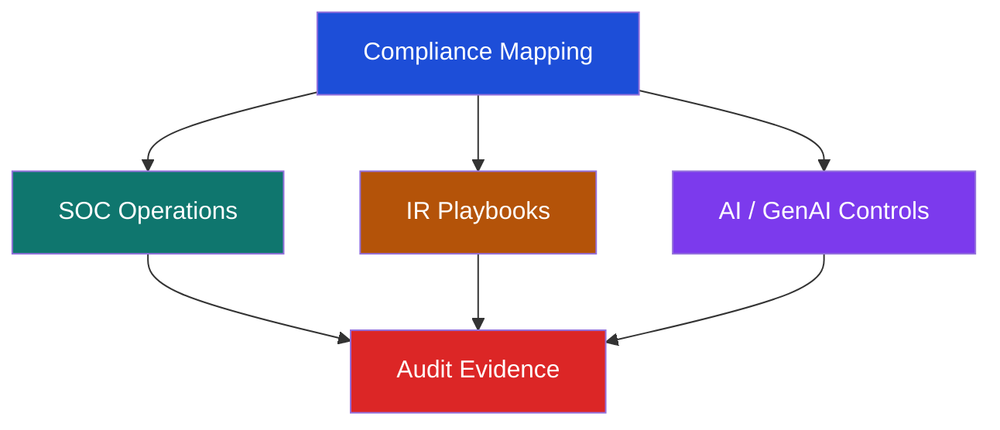

# Compliance Mapping — SOC Playbooks × Frameworks (ภาษาไทย)

> **รหัสเอกสาร:** COMP-MAP-001  
> **เวอร์ชัน:** 1.0  
> **อัปเดตล่าสุด:** 2026-02-15  
> **เจ้าของ:** SOC Manager / Compliance Officer  

---

## วัตถุประสงค์

เอกสารนี้ map **SOC Playbook 53 ชุด**, **Sigma Detection Rule 54 กฎ** และ SOC Controls ต่างๆ เข้ากับกรอบมาตรฐานหลัก:

- **ISO/IEC 27001:2022** — ระบบจัดการความมั่นคงปลอดภัยสารสนเทศ
- **NIST Cybersecurity Framework (CSF) 2.0** — กรอบไซเบอร์สหรัฐฯ
- **PCI DSS v4.0** — มาตรฐานความปลอดภัยอุตสาหกรรมบัตรชำระเงิน
- **NIST AI RMF 1.0** — Govern, Map, Measure, Manage สำหรับระบบ AI / GenAI

ใช้สำหรับ **เตรียม Audit**, **วิเคราะห์ช่องว่าง** และ **แสดงหลักฐาน** ต่อผู้ตรวจสอบ



## ใครควรใช้เอกสารนี้

| บทบาท | ใช้ทำอะไรเป็นหลัก | ผลลัพธ์ที่ควรได้ |
|:---|:---|:---|
| **CISO** | ดู coverage ของความเสี่ยงและช่องว่างที่ต้องลงทุน | risk acceptance และ escalation criteria |
| **SOC Manager** | ตรวจว่ามี workflow และหลักฐานพร้อมสำหรับ audit หรือไม่ | scope, RACI, KPI, review cadence |
| **SOC Analyst** | เข้าใจว่า alert หรือ playbook รองรับข้อกำหนดใด | triage note และ evidence capture ที่ดีขึ้น |
| **Security Engineer** | ผูก controls และ telemetry เข้ากับข้อคาดหวังด้าน compliance | backlog สำหรับ logging และ controls |
| **IR Engineer** | เชื่อม incident เข้ากับ response, rollback, และ notification obligation | incident workflow และ evidence checklist |

---

## Playbook → Framework Mapping

### PB-01 ถึง PB-10 (Playbooks หลัก)

| Playbook | ISO 27001:2022 | NIST CSF 2.0 | PCI DSS v4.0 |
|:---|:---|:---|:---|
| **PB-01** ฟิชชิ่ง | A.5.23, A.8.7 (ป้องกันมัลแวร์) | DE.AE-2, DE.AE-3, RS.AN-1, RS.MI-1 | 5.3, 12.10.5 |
| **PB-02** แรนซัมแวร์ | A.8.7, A.8.13 (สำรองข้อมูล), A.8.14 | DE.AE-3, RS.MI-1, RS.MI-2, RC.RP-1 | 5.2, 5.3, 12.10.5 |
| **PB-03** มัลแวร์ | A.8.7 (ป้องกันมัลแวร์), A.8.23 | DE.CM-4, DE.AE-3, RS.MI-1 | 5.2, 5.3, 11.5.1 |
| **PB-04** Brute Force | A.8.5 (การยืนยันตัวตน), A.5.17 | DE.CM-1, DE.AE-2, PR.AC-7 | 8.2.4, 8.3.4, 10.7 |
| **PB-05** บัญชีถูกยึดครอง | A.5.16 (จัดการตัวตน), A.8.5 | DE.AE-3, RS.AN-1, PR.AC-1 | 8.2, 8.3, 10.6.1 |
| **PB-06** Impossible Travel | A.8.5, A.8.15 (การบันทึก Log) | DE.AE-2, DE.AE-5, RS.AN-1 | 10.6.1, 10.7 |
| **PB-07** ยกระดับสิทธิ์ | A.8.2 (สิทธิ์ Privileged), A.8.18 | DE.CM-3, DE.AE-3, PR.AC-4 | 7.1, 7.2, 10.2.1 |
| **PB-08** ข้อมูลรั่วไหล | A.8.12 (ป้องกันข้อมูลรั่ว), A.8.10 | DE.AE-3, DE.CM-7, RS.MI-1 | 3.4, 10.6.1, 12.10.5 |
| **PB-09** DDoS | A.8.20 (ความปลอดภัยเครือข่าย), A.8.22 | DE.AE-1, RS.MI-1, RS.MI-2 | 11.5.1, 12.10.5 |
| **PB-10** โจมตีเว็บ | A.8.26 (ข้อกำหนดแอป), A.8.28 | DE.CM-6, DE.AE-3, RS.MI-1 | 6.2, 6.4, 11.5.1 |

### PB-11 ถึง PB-20 (Playbooks ขั้นสูง)

| Playbook | ISO 27001:2022 | NIST CSF 2.0 | PCI DSS v4.0 |
|:---|:---|:---|:---|
| **PB-11** Script น่าสงสัย | A.8.7, A.8.19 (ติดตั้งซอฟต์แวร์) | DE.CM-4, DE.AE-3, RS.AN-1 | 5.3, 11.5.1 |
| **PB-12** เคลื่อนตัวข้ามระบบ | A.8.22 (แบ่งแยกเครือข่าย), A.8.20 | DE.CM-1, DE.CM-7, RS.MI-1 | 1.3, 11.4, 11.5.1 |
| **PB-13** C2 Communication | A.8.20, A.8.23 (กรอง Web) | DE.CM-1, DE.AE-2, RS.AN-1 | 1.3, 10.6.1, 11.5.1 |
| **PB-14** Insider Threat | A.5.9, A.6.1 (การคัดกรอง) | DE.CM-3, DE.AE-5, RS.AN-1 | 7.1, 7.2, 10.2.1 |
| **PB-15** Admin ชั่วร้าย | A.8.2 (สิทธิ์ Privileged), A.5.18 | DE.CM-3, DE.AE-3, PR.AC-4 | 7.1, 7.2, 10.2.1 |
| **PB-16** Cloud IAM | A.5.23 (Cloud), A.8.2 | DE.AE-2, DE.CM-3, PR.AC-4 | 7.1, 8.3, 10.6.1 |
| **PB-17** BEC | A.5.14, A.8.7 | DE.AE-3, RS.AN-1, RS.MI-1 | 5.3, 12.10.5 |
| **PB-18** Exploit | A.8.8 (จัดการช่องโหว่), A.8.28 | DE.CM-8, DE.AE-3, RS.MI-1 | 6.3.3, 11.3, 11.5.1 |
| **PB-19** อุปกรณ์หาย | A.7.9 (สินทรัพย์นอกสถานที่), A.8.1 | RS.MI-1, RS.AN-1, PR.DS-3 | 9.4, 9.5, 12.10.5 |
| **PB-20** ลบ Log | A.8.15 (การบันทึก Log), A.8.17 | DE.CM-3, DE.AE-5, PR.PT-1 | 10.3, 10.5, 10.7 |

### PB-21 ถึง PB-25 (Playbooks ใหม่)

| Playbook | ISO 27001:2022 | NIST CSF 2.0 | PCI DSS v4.0 |
|:---|:---|:---|:---|
| **PB-21** Supply Chain | A.5.21 (ห่วงโซ่อุปทาน ICT), A.5.22 | ID.SC-1, ID.SC-2, DE.CM-6, RS.MI-1 | 6.3.2, 12.8, 12.9 |
| **PB-22** API Abuse | A.8.26 (ข้อกำหนดแอป), A.8.25 | DE.CM-6, DE.AE-2, PR.AC-7 | 6.2, 6.4, 11.5.1 |
| **PB-23** ขุดคริปโต | A.8.7 (ป้องกันมัลแวร์), A.8.20 | DE.CM-4, DE.AE-3, RS.MI-1 | 5.2, 5.3, 11.5.1 |
| **PB-24** DNS Tunneling | A.8.20, A.8.23 (กรอง Web) | DE.CM-1, DE.AE-2, RS.MI-1 | 1.3, 10.6.1, 11.5.1 |
| **PB-25** Zero-Day | A.8.8 (จัดการช่องโหว่), A.5.7 | DE.CM-8, RS.AN-5, RS.MI-1 | 6.3.3, 11.3, 12.10.5 |

### PB-26 ถึง PB-30 (ขยาย Coverage)

| Playbook | ISO 27001:2022 | NIST CSF 2.0 | PCI DSS v4.0 |
|:---|:---|:---|:---|
| **PB-26** MFA Bypass / Token Theft | A.8.5 (การยืนยันตัวตน), A.5.17 | DE.AE-2, DE.CM-3, PR.AC-7 | 8.3, 8.4, 8.5 |
| **PB-27** Cloud Storage เปิด Public | A.5.23 (Cloud), A.8.10 | DE.CM-7, RS.MI-1, PR.DS-1 | 3.4, 3.5, 10.6.1 |
| **PB-28** อุปกรณ์มือถือถูกบุกรุก | A.8.1 (อุปกรณ์ผู้ใช้), A.7.9 | DE.CM-4, RS.MI-1, PR.AC-3 | 9.4, 9.5, 12.3 |
| **PB-29** Shadow IT | A.5.23 (Cloud), A.8.23 (กรอง Web) | DE.CM-7, ID.AM-2, PR.AC-4 | 6.4, 12.8, 12.10.5 |
| **PB-30** เหตุการณ์ OT/ICS | A.8.20 (เครือข่าย), A.8.22 | DE.CM-1, RS.RP-1, PR.AC-5 | 1.3, 11.4, 11.5.1 |

---

## สรุป Coverage ตามแต่ละ Framework

## การแมป Controls สำหรับ AI / GenAI

ส่วนนี้เพิ่มเข้าในเอกสารเดิมเพื่อให้ compliance mapping รองรับระบบ AI โดยไม่แยกเป็น report ใหม่ ใช้เมื่อองค์กรมี production AI, LLM assistant, RAG pipeline, model registry, หรือ AI plugins/tools

| พื้นที่ความเสี่ยง AI | คำถามเชิงปฏิบัติ | NIST AI RMF | เอกสาร SOC ที่ใช้ได้ทันที |
|:---|:---|:---|:---|
| Prompt injection และ unsafe tool use | มีจุดใดที่ untrusted content เปลี่ยน prompt หรือสั่ง tool สำคัญได้หรือไม่ | Govern, Map, Measure, Manage | [PB-51 AI Prompt Injection](../05_Incident_Response/Playbooks/AI_Prompt_Injection.th.md), [API Abuse](../05_Incident_Response/Playbooks/API_Abuse.th.md) |
| Data poisoning และ RAG corruption | model behavior เปลี่ยนเพราะข้อมูล, embedding, หรือ document collection ที่ถูก poison ได้หรือไม่ | Map, Measure, Manage | [PB-52 LLM Data Poisoning](../05_Incident_Response/Playbooks/LLM_Data_Poisoning.th.md), [SOC Use Case Library](../08_Detection_Engineering/SOC_Use_Case_Library.th.md) |
| Model theft และ checkpoint exfiltration | ผู้ใช้หรือ insider สามารถดึง model weight, response, หรือ training data สำคัญออกไปได้หรือไม่ | Govern, Measure, Manage | [PB-53 AI Model Theft](../05_Incident_Response/Playbooks/AI_Model_Theft.th.md), [Cloud Security Monitoring](../06_Operations_Management/Cloud_Security_Monitoring.th.md) |
| AI supply chain exposure | third-party model, dataset, package, หรือ plugin มีความเสี่ยงแทรกเข้ามาได้หรือไม่ | Govern, Map, Manage | [PB-32 Supply Chain Attack](../05_Incident_Response/Playbooks/Supply_Chain_Attack.th.md), [Third-Party Risk](../06_Operations_Management/Third_Party_Risk.th.md) |
| Privacy และ regulated data use | prompts, outputs, หรือ model context สามารถเปิดเผยข้อมูลอ่อนไหวหรือ regulated data ได้หรือไม่ | Govern, Map, Manage | [PDPA Incident Response](PDPA_Incident_Response.th.md), [Data Governance Policy](Data_Governance_Policy.th.md) |

## Deliverables ขั้นต่ำสำหรับระบบ AI

ก่อนถือว่าระบบ AI พร้อมใช้งาน production ควรมี artifact ต่อไปนี้:

- [ ] AI system inventory ที่มี business owner และ technical owner
- [ ] approved use case ที่ระบุขอบเขตและสิ่งที่ห้ามทำ
- [ ] trust-boundary map สำหรับ prompts, RAG, tools, plugins, และ external content
- [ ] มาตรฐาน logging สำหรับ prompts, outputs, tool calls, model version, และ data-source change
- [ ] detection mapping สำหรับ prompt injection, poisoning, model theft, และ supply chain abuse
- [ ] ขั้นตอน rollback หรือ disable ที่มี approver ชัดเจน
- [ ] เส้นทาง escalation ไปยัง legal, privacy, และผู้บริหาร

## แผนลงมือใน 30 วันแรก

| ช่วงเวลา | เป้าหมาย | ผลลัพธ์ |
|:---|:---|:---|
| สัปดาห์ที่ 1 | inventory AI systems, endpoints, plugins, และ external providers | AI asset register |
| สัปดาห์ที่ 2 | map trust boundary และ telemetry ที่ต้องเก็บ | trust-boundary diagram และ logging standard |
| สัปดาห์ที่ 3 | เชื่อมความเสี่ยง AI หลักกับ detections และ playbooks | detection backlog และ triage checklist |
| สัปดาห์ที่ 4 | ทดสอบ rollback, evidence capture, และ executive communication | tabletop record และ escalation decision tree |

## ชุดหลักฐานขั้นต่ำสำหรับ Audit (Minimum Audit Evidence Pack)

| หลักฐาน | เหตุผล | ผู้รับผิดชอบ |
|:---|:---|:---|
| IR framework, severity matrix และดัชนี playbook ปัจจุบัน | พิสูจน์ว่ามีกระบวนการตอบเหตุที่ดูแลอยู่จริง | SOC Manager |
| inventory ของ detection ที่ map กับ use case และ ATT&CK | แสดง coverage ของ monitoring และเหตุผลในการออกแบบ | Security Engineer |
| incident ticket ตัวอย่างที่มี timestamp, escalation trail และ closure note | แสดงว่ากระบวนการทำงานได้จริงใน production | SOC Analyst |
| หลักฐานเรื่อง log retention, access review และ monitoring health | รองรับคำกล่าวอ้างเรื่อง control operation ระหว่าง audit | Security Engineer |
| บันทึก lessons learned หรือ corrective action | แสดงการปรับปรุงต่อเนื่อง ไม่ใช่มีแต่เอกสาร | IR Engineer |

## Trigger สำหรับการยกระดับช่องว่างด้าน Compliance (Escalation Triggers for Compliance Gaps)

| เงื่อนไข | ยกระดับถึง | SLA | การตัดสินใจที่ต้องได้ |
|:---|:---|:---:|:---|
| control ที่จำเป็นไม่มี owner, ไม่มีหลักฐาน หรือไม่มี operating procedure | CISO + Compliance Officer | ภายในวันทำการเดียวกัน | แต่งตั้ง owner และกำหนด remediation deadline |
| ตอบคำถาม auditor หรือ regulator จาก record ปัจจุบันไม่ได้ | CISO | ทันที | เปิด remediation track และอนุมัติ interim response |
| monitoring blind spot กระทบระบบหรือข้อมูลที่ถูกกำกับ | SOC Manager + Business owner | ภายใน 24 ชม. | รับความเสี่ยงชั่วคราวหรืออนุมัติการแก้ control |
| ระบบ AI ที่จับ regulated data ไม่มี logging หรือ rollback ที่อนุมัติ | CISO + Legal / DPO | ทันที | ชะลอ go-live หรือรับความเสี่ยงอย่างเป็นทางการ |
| control failure เกิดซ้ำข้ามรอบ monthly/quarterly review | CISO + Executive sponsor | ใน governance meeting ถัดไป | ยกระดับจาก local fix ไปเป็น management action |

### NIST CSF 2.0

| Function | ระดับ Coverage | คำอธิบาย |
|:---|:---:|:---|
| **Identify (ระบุ)** | 🟡 | ครอบคลุมบางส่วน — สินทรัพย์ & Supply Chain |
| **Protect (ป้องกัน)** | 🟡 | ครอบคลุมบางส่วน — Access Control & การฝึกอบรม |
| **Detect (ตรวจจับ)** | 🟢 | ครอบคลุมดี — 54 Sigma Rules + การเฝ้าระวัง |
| **Respond (ตอบสนอง)** | 🟢 | ครอบคลุมดี — 53 Playbooks + ตารางระดับความรุนแรง |
| **Recover (กู้คืน)** | 🟡 | ครอบคลุมบางส่วน — สำรองข้อมูล & สื่อสาร |

### PCI DSS v4.0

| ข้อกำหนด | ระดับ Coverage |
|:---|:---:|
| Req 1 — ควบคุมเครือข่าย | 🟢 |
| Req 5 — ป้องกันมัลแวร์ | 🟢 |
| Req 6 — พัฒนาปลอดภัย | 🟢 |
| Req 7 — ควบคุมการเข้าถึง | 🟢 |
| Req 8 — ระบุตัวตนผู้ใช้ | 🟢 |
| Req 10 — บันทึก Log & เฝ้าระวัง | 🟢 |
| Req 11 — ทดสอบความปลอดภัย | 🟢 |
| Req 12 — นโยบายความปลอดภัย | 🟢 |

---

## Quick Reference สำหรับ Auditor

### ผู้ตรวจ ISO 27001 ถาม:

> "แสดงขั้นตอนการตอบสนองเหตุการณ์"  
→ [IR Framework](../05_Incident_Response/Framework.th.md) + [ตารางความรุนแรง](../05_Incident_Response/Severity_Matrix.th.md) + Playbook ใดก็ได้ (PB-01 ถึง PB-53)

> "แสดงความสามารถในการเฝ้าระวังและตรวจจับ"  
→ [ดัชนี Detection Rules](../08_Detection_Engineering/README.th.md) (54 กฎ Sigma) + [แผนที่ Coverage MITRE ATT&CK](../tools/mitre_attack_heatmap.html)

### QSA ตรวจ PCI DSS ถาม:

> "Req 10.6.1 — ตรวจ Log รายวัน?"  
→ [SOC Metrics & KPIs](../06_Operations_Management/SOC_Metrics.th.md) + ขั้นตอนเฝ้าระวัง 24/7

> "Req 12.10.1 — แผนตอบสนองเหตุการณ์?"  
→ [IR Framework](../05_Incident_Response/Framework.th.md) + [ตารางความรุนแรง](../05_Incident_Response/Severity_Matrix.th.md)

---

## เอกสารที่เกี่ยวข้อง

- [IR Framework](../05_Incident_Response/Framework.th.md)
- [ตารางความรุนแรง](../05_Incident_Response/Severity_Matrix.th.md)
- [ดัชนี Detection Rules](../08_Detection_Engineering/README.th.md)
- [SOC Use Case Library](../08_Detection_Engineering/SOC_Use_Case_Library.th.md)
- [แผนที่ Coverage MITRE ATT&CK](../tools/mitre_attack_heatmap.html)
- [เครื่องมือวัดคะแนน SOC Maturity](../tools/soc_maturity_scorer.html)

## Cross-framework Control Mapping

### Key Control Areas

| Control | ISO 27001 | NIST CSF | PCI DSS | PDPA |
|:---|:---|:---|:---|:---|
| Risk Assessment | A.8 | ID.RA | 12.2 | มาตรา 37 |
| Access Control | A.9 | PR.AC | 7, 8 | มาตรา 37(1) |
| Encryption | A.10 | PR.DS | 3.4, 4.1 | มาตรา 37(1) |
| Logging | A.12 | DE.CM | 10 | มาตรา 37(1) |
| IR Plan | A.16 | RS.RP | 12.10 | มาตรา 37(4) |
| Privacy | - | - | - | มาตรา 23-26 |

### Compliance Status Dashboard

```
ISO 27001: ████████████████████░  93% (7 gaps)
NIST CSF:  ██████████████████░░░  87% (12 gaps)
PCI DSS:   ████████████████░░░░░  80% (15 gaps)
PDPA:      ███████████████████░░  90% (5 gaps)
```

### Annual Compliance Calendar

| เดือน | Activity | Framework |
|:---|:---|:---|
| ม.ค. | Annual risk assessment | ISO 27001 |
| มี.ค. | PCI DSS audit prep | PCI DSS |
| มิ.ย. | PDPA compliance review | PDPA |
| ก.ย. | ISO audit (internal) | ISO 27001 |
| ธ.ค. | NIST CSF self-assessment | NIST CSF |

### Framework Update Tracking

| Framework | Last Update | Next Review |
|:---|:---|:---|
| ISO 27001 | 2022 | Annual |
| NIST CSF | 2.0 (2024) | Annual |
| PCI DSS | 4.0 (2024) | Annual |

## References

- [ISO/IEC 27001:2022](https://www.iso.org/standard/27001)
- [NIST Cybersecurity Framework 2.0](https://www.nist.gov/cyberframework)
- [NIST AI RMF Playbook](https://www.nist.gov/itl/ai-risk-management-framework/nist-ai-rmf-playbook)
- [PCI DSS v4.0](https://www.pcisecuritystandards.org/document_library/)
- [MITRE ATT&CK Framework](https://attack.mitre.org/)
- [MITRE ATLAS](https://atlas.mitre.org/)
