# Data Governance Policy

This policy defines comprehensive standards for data classification, handling, retention, disposal, and access control within the SOC environment. All SOC personnel must follow these guidelines when handling any data.

---

## 1. Data Classification Levels

| Level | Label | Description | Examples | Access Control |
|:---|:---|:---|:---|:---|
| **L4** | 🔴 Restricted | Extremely sensitive, loss would cause severe harm | Credentials, encryption keys, PII (sensitive), payment data | Named individuals only, MFA required |
| **L3** | 🟠 Confidential | Sensitive operational data | Investigation details, IoCs, incident reports, threat intel | SOC team + management, need-to-know |
| **L2** | 🟡 Internal | Internal use, not for external sharing | SOPs, procedures, operational metrics, architecture docs | All employees |
| **L1** | 🟢 Public | Safe for public consumption | Published advisories, open-source tools, public reports | Anyone |

---

## 2. Handling Requirements

### 2.1 Storage

| Classification | Storage Location | Encryption | Backup |
|:---|:---|:---|:---|
| **Restricted** | Encrypted vault, access-logged | AES-256 at rest + in transit | Encrypted backup, separate key |
| **Confidential** | Access-controlled storage | At rest encryption required | Standard encrypted backup |
| **Internal** | Standard enterprise storage | Disk-level encryption | Standard backup |
| **Public** | Any approved storage | Optional | Best effort |

### 2.2 Transmission

| Classification | Allowed Channels | Requirements |
|:---|:---|:---|
| **Restricted** | Encrypted email (S/MIME/PGP), encrypted share | TLP:RED label, end-to-end encryption |
| **Confidential** | Encrypted email, internal chat, VPN | TLP:AMBER label, encryption preferred |
| **Internal** | Internal email, chat, intranet | TLP:GREEN label |
| **Public** | Any channel | TLP:CLEAR label |

### 2.3 Retention & Disposal

| Classification | Retention Period | Disposal Method | Verification |
|:---|:---|:---|:---|
| **Restricted** | Per regulation (PDPA: min 1 year) | Secure delete (DoD 5220.22-M) + log | Written confirmation |
| **Confidential** | 1 year after case closure | Secure delete | Audit log |
| **Internal** | Per policy (typically 3 years) | Standard delete | N/A |
| **Public** | Indefinite | Standard delete | N/A |

---

## 3. SOC-Specific Data Guidelines

### 3.1 Log Data

| Aspect | Requirement |
|:---|:---|
| **Hot storage** | 90 days minimum (SIEM) |
| **Warm storage** | 90 days–1 year (archive/data lake) |
| **Cold storage** | 1–7 years (compliance, legal hold) |
| **Classification** | L2 (Internal) by default, L3 if contains PII/IoCs |

### 3.2 Incident Evidence

| Aspect | Requirement |
|:---|:---|
| **Retention** | 1 year after case closure (or per legal hold) |
| **Chain of custody** | Documented in incident report |
| **Classification** | L3 (Confidential) minimum, L4 if PII involved |
| **Storage** | Read-only, hash-verified, access-logged |

### 3.3 Threat Intelligence

| Aspect | Requirement |
|:---|:---|
| **IoC feeds** | Refresh per feed schedule (5 min–24 hours) |
| **Historical IoCs** | Archive for correlation, review quarterly |
| **TLP handling** | Follow TLP protocol strictly |
| **Classification** | L3 (Confidential), L2 for published advisories |

### 3.4 Personal Data (PII)

| Aspect | Requirement |
|:---|:---|
| **Collection** | Minimize, collect only what's necessary for investigation |
| **Processing** | Follow [PDPA Compliance](PDPA_Compliance.en.md) |
| **Breach notification** | Within 72 hours per PDPA |
| **Classification** | L4 (Restricted) for sensitive PII |

### 3.5 Third-Party Data

| Aspect | Requirement |
|:---|:---|
| **Handling** | Per vendor agreement / NDA terms |
| **Sharing** | Only with authorized parties per contract |
| **Retention** | Per contract terms |
| **Classification** | At minimum L2, typically L3 |

---

## 4. Access Control

| Principle | Implementation |
|:---|:---|
| **Least privilege** | Grant minimum access needed for role |
| **Need-to-know** | L3/L4 data only accessible to those involved in the case |
| **Separation of duties** | Evidence handling requires dual sign-off |
| **Access review** | Quarterly review of all data access permissions |
| **Logging** | All access to L3/L4 data must be logged |

---

## 5. Compliance Mapping

| Framework | Relevant Controls |
|:---|:---|
| **ISO 27001** | A.8.2 (Classification), A.8.3 (Media handling) |
| **NIST 800-53** | SC-28 (Protection at Rest), MP-6 (Media Sanitization) |
| **PDPA** | Section 37 (Security measures), Section 40 (Breach notification) |
| **PCI DSS** | Req 3 (Protect stored data), Req 7 (Restrict access) |

---

## Data Classification Examples for SOC

| Data Type | Classification | TLP | Retention | Access |
|:---|:---|:---|:---|:---|
| SIEM alert metadata | Internal | AMBER | 1 year | All SOC |
| SIEM raw logs (with PII) | Confidential | AMBER | 90 days | T2+ only |
| Forensic disk images | Highly Confidential | RED | Case duration + 1 year | Case team only |
| IOC feeds (public) | Public | CLEAR | Indefinite | All SOC |
| Incident reports (internal) | Confidential | AMBER | 3 years | SOC + Management |
| Vulnerability scan results | Confidential | AMBER | 1 year | SOC + IT |
| Threat intelligence (partner) | Restricted | AMBER/GREEN | 2 years | CTI team |
| Employee PII from investigations | Highly Confidential | RED | Case closure | Lead analyst + DPO |

## Data Lifecycle Management

```mermaid
graph LR
    Create["📝 Create/<br/>Collect"] --> Classify["🏷️ Classify"]
    Classify --> Store["💾 Store<br/>(encrypted)"]
    Store --> Use["🔍 Process/<br/>Analyze"]
    Use --> Share["📤 Share<br/>(per TLP)"]
    Share --> Archive["📦 Archive"]
    Archive --> Destroy["🗑️ Destroy<br/>(per policy)"]
```

| Phase | SOC Responsibility | Control |
|:---|:---|:---|
| **Create** | Log collection, evidence capture | Automated via agents/SIEM |
| **Classify** | Apply TLP label, data category | Manual at creation |
| **Store** | Encrypted storage per classification | Automated encryption |
| **Process** | Access only what's needed (minimization) | RBAC enforcement |
| **Share** | Follow TLP sharing rules | DLP monitoring |
| **Archive** | Move to cold storage per retention | Automated lifecycle |
| **Destroy** | Secure deletion with certificate | Verified destruction |

## Data Quality Standards

| Dimension | Definition | SOC Example | Target |
|:---|:---|:---|:---|
| **Completeness** | All required fields populated | Every alert has source, dest, timestamp | > 95% |
| **Accuracy** | Data correctly represents reality | Alert severity matches actual risk | > 90% |
| **Timeliness** | Data available when needed | Logs arrive in SIEM within 5 min | > 99% |
| **Consistency** | Same data in different systems matches | Ticket info matches SIEM data | > 95% |
| **Uniqueness** | No unnecessary duplicates | One ticket per incident (not duplicated) | 100% |

## Related Documents

- [PDPA Compliance](PDPA_Compliance.en.md)
- [Data Handling Protocol](../06_Operations_Management/Data_Handling_Protocol.en.md)
- [Forensic Investigation](../05_Incident_Response/Forensic_Investigation.en.md)
- [Access Control Policy](../06_Operations_Management/Access_Control.en.md)
- [Evidence Collection](../05_Incident_Response/Evidence_Collection.en.md)

## References

- [ISO 27001 — Information Security Management](https://www.iso.org/iso-27001-information-security.html)
- [NIST SP 800-53 — Security Controls](https://csrc.nist.gov/publications/detail/sp/800-53/rev-5/final)
- [TLP Protocol](https://www.first.org/tlp/)
