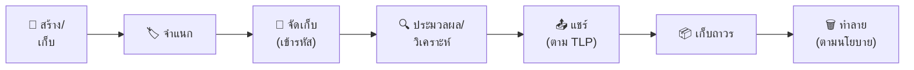

# นโยบายธรรมาภิบาลข้อมูล (Data Governance Policy)

นโยบายนี้กำหนดมาตรฐานสำหรับการจัดระดับ การจัดการ การเก็บรักษา และการทำลายข้อมูลภายในสภาพแวดล้อม SOC บุคลากร SOC ทุกคนต้องปฏิบัติตามแนวปฏิบัตินี้

---

## 1. ระดับการจัดชั้นข้อมูล

| ระดับ | ป้ายกำกับ | ตัวอย่าง | การควบคุมการเข้าถึง |
|:---|:---|:---|:---|
| **L4** | 🔴 จำกัด (Restricted) | Credentials, คีย์เข้ารหัส, PII ที่ละเอียดอ่อน | เฉพาะบุคคลที่ระบุชื่อ + MFA |
| **L3** | 🟠 ลับ (Confidential) | รายละเอียดการสืบสวน, IoCs, รายงาน Incident | ทีม SOC + ผู้บริหาร, need-to-know |
| **L2** | 🟡 ภายใน (Internal) | SOPs, ตัวชี้วัด, เอกสารสถาปัตยกรรม | พนักงานทุกคน |
| **L1** | 🟢 สาธารณะ (Public) | คำแนะนำที่เผยแพร่, เครื่องมือ open-source | ทุกคน |

---

## 2. ข้อกำหนดการจัดการ

### 2.1 การจัดเก็บ

| ระดับ | สถานที่จัดเก็บ | การเข้ารหัส |
|:---|:---|:---|
| **Restricted** | Vault เข้ารหัส, บันทึกการเข้าถึง | AES-256 ทั้ง at rest + in transit |
| **Confidential** | Storage ควบคุมการเข้าถึง | เข้ารหัส at rest |
| **Internal** | Enterprise storage มาตรฐาน | Disk-level encryption |
| **Public** | Storage ที่อนุมัติใดก็ได้ | ตามต้องการ |

### 2.2 การส่งต่อข้อมูล

| ระดับ | ช่องทางที่อนุญาต | ข้อกำหนด |
|:---|:---|:---|
| **Restricted** | อีเมลเข้ารหัส (S/MIME/PGP) | TLP:RED, end-to-end encryption |
| **Confidential** | อีเมลเข้ารหัส, แชทภายใน | TLP:AMBER |
| **Internal** | อีเมลภายใน, แชท, intranet | TLP:GREEN |
| **Public** | ช่องทางใดก็ได้ | TLP:CLEAR |

### 2.3 การเก็บรักษาและทำลาย

| ระดับ | ระยะเวลาเก็บ | วิธีทำลาย |
|:---|:---|:---|
| **Restricted** | ตามกฎหมาย (PDPA: ≥ 1 ปี) | Secure delete + บันทึก |
| **Confidential** | 1 ปีหลังปิดเคส | Secure delete |
| **Internal** | ตามนโยบาย (3 ปี) | Standard delete |
| **Public** | ไม่จำกัด | Standard delete |

---

## 3. แนวปฏิบัติเฉพาะ SOC

### 3.1 ข้อมูล Log

| มิติ | ข้อกำหนด |
|:---|:---|
| **Hot storage** | ≥ 90 วัน (SIEM) |
| **Warm storage** | 90 วัน–1 ปี (archive) |
| **Cold storage** | 1–7 ปี (ตามกฎหมาย) |
| **ระดับชั้น** | L2 เป็นค่าเริ่มต้น, L3 ถ้ามี PII/IoCs |

### 3.2 หลักฐานเหตุการณ์

| มิติ | ข้อกำหนด |
|:---|:---|
| **การเก็บรักษา** | 1 ปีหลังปิดเคส (หรือตาม legal hold) |
| **Chain of custody** | บันทึกในรายงาน incident |
| **ระดับชั้น** | L3 ขั้นต่ำ, L4 ถ้ามี PII |

### 3.3 ข้อมูลส่วนบุคคล (PII)

| มิติ | ข้อกำหนด |
|:---|:---|
| **การเก็บรวบรวม** | เก็บเฉพาะที่จำเป็นสำหรับการสืบสวน |
| **การประมวลผล** | ปฏิบัติตาม [PDPA Compliance](PDPA_Compliance.th.md) |
| **การแจ้งเตือนเหตุรั่วไหล** | ภายใน 72 ชม. ตาม PDPA |
| **ระดับชั้น** | L4 สำหรับ PII ที่ละเอียดอ่อน |

---

## 4. การควบคุมการเข้าถึง

| หลักการ | การดำเนินการ |
|:---|:---|
| **Least privilege** | ให้สิทธิ์ต่ำสุดที่จำเป็นสำหรับบทบาท |
| **Need-to-know** | ข้อมูล L3/L4 เข้าถึงเฉพาะผู้ที่เกี่ยวข้อง |
| **Separation of duties** | การจัดการหลักฐานต้อง dual sign-off |
| **Access review** | ทบทวนทุกไตรมาส |
| **Logging** | บันทึกการเข้าถึง L3/L4 ทุกครั้ง |

---

## 5. Compliance Mapping

| กรอบ | Controls ที่เกี่ยวข้อง |
|:---|:---|
| **ISO 27001** | A.8.2 (Classification), A.8.3 (Media handling) |
| **NIST 800-53** | SC-28 (Protection at Rest), MP-6 (Media Sanitization) |
| **PDPA** | มาตรา 37 (มาตรการรักษาความปลอดภัย), มาตรา 40 (แจ้งเตือนเหตุรั่วไหล) |

---

## ตัวอย่างการจำแนกข้อมูลสำหรับ SOC

| ประเภทข้อมูล | การจำแนก | TLP | ระยะเก็บ | การเข้าถึง |
|:---|:---|:---|:---|:---|
| SIEM alert metadata | ภายใน | AMBER | 1 ปี | SOC ทั้งหมด |
| SIEM raw logs (มี PII) | ลับ | AMBER | 90 วัน | T2+ เท่านั้น |
| Forensic disk images | ลับมาก | RED | ช่วง case + 1 ปี | ทีม case เท่านั้น |
| IOC feeds (สาธารณะ) | สาธารณะ | CLEAR | ไม่จำกัด | SOC ทั้งหมด |
| Incident reports (ภายใน) | ลับ | AMBER | 3 ปี | SOC + ผู้บริหาร |
| ผลสแกนช่องโหว่ | ลับ | AMBER | 1 ปี | SOC + IT |
| Threat intelligence (พันธมิตร) | จำกัด | AMBER/GREEN | 2 ปี | ทีม CTI |
| PII พนักงานจากการสืบสวน | ลับมาก | RED | ปิด case | Lead analyst + DPO |

## การจัดการวงจรข้อมูล

| ขั้นตอน | หน้าที่ SOC | Control |
|:---|:---|:---|
| **สร้าง** | เก็บ log, capture หลักฐาน | อัตโนมัติผ่าน agents/SIEM |
| **จำแนก** | ติด TLP label, หมวดข้อมูล | Manual ตอนสร้าง |
| **จัดเก็บ** | เข้ารหัสตามการจำแนก | เข้ารหัสอัตโนมัติ |
| **ประมวลผล** | เข้าถึงเฉพาะที่จำเป็น (minimization) | บังคับ RBAC |
| **แชร์** | ทำตามกฎ TLP | DLP monitoring |
| **เก็บถาวร** | ย้ายไป cold storage ตาม retention | Lifecycle อัตโนมัติ |
| **ทำลาย** | Secure deletion พร้อม certificate | ยืนยันการทำลาย |

## มาตรฐานคุณภาพข้อมูล

| มิติ | นิยาม | ตัวอย่าง SOC | เป้าหมาย |
|:---|:---|:---|:---|
| **ความสมบูรณ์** | ทุกฟิลด์ที่จำเป็นมีข้อมูล | ทุก alert มี source, dest, timestamp | > 95% |
| **ความถูกต้อง** | ข้อมูลตรงกับความเป็นจริง | ระดับ alert ตรงกับความเสี่ยงจริง | > 90% |
| **ความทันเวลา** | ข้อมูลพร้อมใช้เมื่อต้องการ | Log ถึง SIEM ภายใน 5 นาที | > 99% |
| **ความสอดคล้อง** | ข้อมูลเดียวกันตรงกันข้ามระบบ | ข้อมูลใน ticket ตรงกับ SIEM | > 95% |
| **ความไม่ซ้ำ** | ไม่มี duplicate ที่ไม่จำเป็น | 1 ticket ต่อ 1 incident | 100% |

## เอกสารที่เกี่ยวข้อง

- [PDPA Compliance](PDPA_Compliance.th.md)
- [Data Handling Protocol](../06_Operations_Management/Data_Handling_Protocol.th.md)
- [Forensic Investigation](../05_Incident_Response/Forensic_Investigation.th.md)
- [Access Control Policy](../06_Operations_Management/Access_Control.th.md)

### Data Classification Quick Reference

| Level | Label | Examples | Controls |
|:---|:---|:---|:---|
| 4 - Restricted | ลับมาก | PII, credentials | Encrypted + ACL |
| 3 - Confidential | ลับ | Financial, HR | ACL + logging |
| 2 - Internal | ภายใน | Policies, SOPs | Basic ACL |
| 1 - Public | เปิดเผย | Marketing, website | None |

### Data Handling Quick Reference

| Action | Restricted | Confidential | Internal |
|:---|:---|:---|:---|
| Email | ❌ | Encrypted | ✅ |
| USB copy | ❌ | Approval | ✅ |
| Cloud upload | Encrypted only | Approved cloud | ✅ |
| Print | Approval | ✅ | ✅ |

## อ้างอิง

- [ISO 27001](https://www.iso.org/iso-27001-information-security.html)
- [NIST SP 800-53](https://csrc.nist.gov/publications/detail/sp/800-53/rev-5/final)
- [TLP Protocol](https://www.first.org/tlp/)
