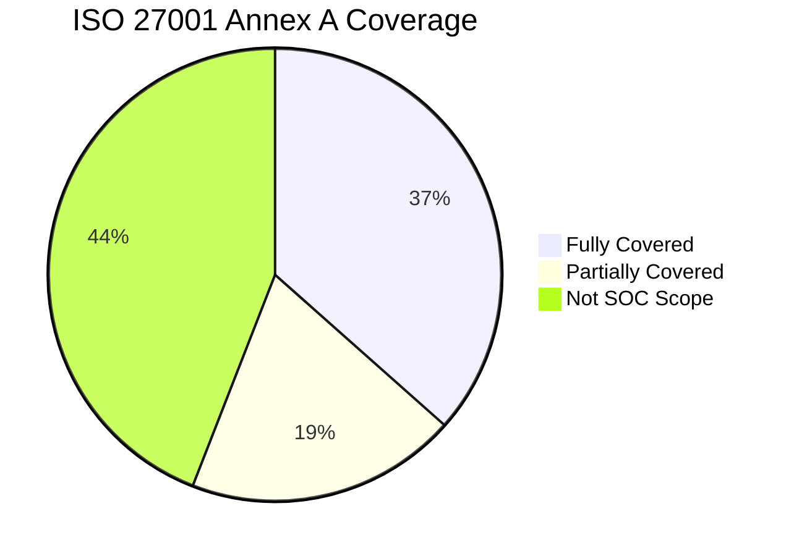

# ISO 27001 Controls Mapping for SOC Operations

> Map SOC operational processes to ISO/IEC 27001:2022 Annex A controls.
>
> Use this document to demonstrate compliance during audits and identify coverage gaps.

---

## 1. Overview

ISO/IEC 27001:2022 is the international standard for Information Security Management Systems (ISMS). This mapping shows how SOC Standard Operating Procedures align with the **93 Annex A controls** grouped into 4 themes.

### Compliance Score

> **52 of 93** Annex A controls are directly or partially addressed by SOC operations.

---

## 2. Organizational Controls (A.5)

| Control | Title | SOC Coverage | SOC Document |
|:---:|:---|:---:|:---|
| A.5.1 | Policies for information security | ✅ Full | [Access Control](../06_Operations_Management/Access_Control.en.md) |
| A.5.2 | Information security roles | ✅ Full | [SOC Team Structure](../06_Operations_Management/SOC_Team_Structure.en.md) |
| A.5.4 | Management responsibilities | ✅ Full | [SOC Metrics & KPIs](../06_Operations_Management/SOC_Metrics.en.md) |
| A.5.5 | Contact with authorities | ✅ Full | [Escalation Matrix](../05_Incident_Response/Escalation_Matrix.en.md) |
| A.5.7 | Threat intelligence | ✅ Full | [TI Lifecycle](../06_Operations_Management/Threat_Intelligence_Lifecycle.en.md) |
| A.5.8 | Information security in project management | 🟡 Partial | [Change Management](../06_Operations_Management/Change_Management.en.md) |
| A.5.23 | Information security for cloud services | ✅ Full | [Cloud Security Monitoring](../06_Operations_Management/Cloud_Security_Monitoring.en.md) |
| A.5.24 | Incident management planning | ✅ Full | [IR Framework](../05_Incident_Response/Framework.en.md) |
| A.5.25 | Assessment and decision on events | ✅ Full | [Severity Matrix](../05_Incident_Response/Severity_Matrix.en.md), [Incident Classification](../05_Incident_Response/Incident_Classification.en.md) |
| A.5.26 | Response to incidents | ✅ Full | [50 Playbooks](../05_Incident_Response/Playbooks/), [Tier Runbooks](../05_Incident_Response/Runbooks/) |
| A.5.27 | Learning from incidents | ✅ Full | [Lessons Learned](../05_Incident_Response/Lessons_Learned_Template.en.md) |
| A.5.28 | Collection of evidence | ✅ Full | [Evidence Collection](../05_Incident_Response/Evidence_Collection.en.md), [Forensic Investigation](../05_Incident_Response/Forensic_Investigation.en.md) |
| A.5.29 | Information security during disruption | ✅ Full | [Disaster Recovery / BCP](../05_Incident_Response/Disaster_Recovery_BCP.en.md) |
| A.5.30 | ICT readiness for business continuity | 🟡 Partial | [DR/BCP](../05_Incident_Response/Disaster_Recovery_BCP.en.md) |
| A.5.35 | Independent review of information security | ✅ Full | [SOC Maturity Assessment](../06_Operations_Management/SOC_Maturity_Assessment.en.md), [SOC Assessment Checklist](../06_Operations_Management/SOC_Assessment_Checklist.en.md) |
| A.5.36 | Compliance with policies | 🟡 Partial | [Compliance Gap Analysis](Compliance_Gap_Analysis.en.md) |
| A.5.37 | Documented operating procedures | ✅ Full | This entire repository |

---

## 3. People Controls (A.6)

| Control | Title | SOC Coverage | SOC Document |
|:---:|:---|:---:|:---|
| A.6.1 | Screening | 🟡 Partial | [SOC Team Structure](../06_Operations_Management/SOC_Team_Structure.en.md) (interview guide) |
| A.6.2 | Terms and conditions of employment | ⬜ Not SOC scope | — |
| A.6.3 | Information security awareness & training | ✅ Full | [Training Checklist](../10_Training_Onboarding/Training_Checklist.en.md), [Analyst Onboarding](../10_Training_Onboarding/Analyst_Onboarding_Path.en.md) |
| A.6.4 | Disciplinary process | 🟡 Partial | [Insider Threat Program](../06_Operations_Management/Insider_Threat_Program.en.md) |
| A.6.7 | Remote working | 🟡 Partial | [VPN Abuse Playbook](../05_Incident_Response/Playbooks/VPN_Abuse.en.md) |

---

## 4. Physical Controls (A.7)

| Control | Title | SOC Coverage | SOC Document |
|:---:|:---|:---:|:---|
| A.7.9 | Security of assets off-premises | ✅ Full | [Lost Device Playbook](../05_Incident_Response/Playbooks/Lost_Device.en.md), [Mobile Compromise](../05_Incident_Response/Playbooks/Mobile_Compromise.en.md) |
| A.7.10 | Storage media | 🟡 Partial | [USB Removable Media Playbook](../05_Incident_Response/Playbooks/USB_Removable_Media.en.md) |

---

## 5. Technological Controls (A.8)

| Control | Title | SOC Coverage | SOC Document |
|:---:|:---|:---:|:---|
| A.8.1 | User endpoint devices | ✅ Full | [Malware Playbook](../05_Incident_Response/Playbooks/Malware_Infection.en.md), EDR monitoring |
| A.8.2 | Privileged access rights | ✅ Full | [Privilege Escalation PB](../05_Incident_Response/Playbooks/Privilege_Escalation.en.md), [Access Control](../06_Operations_Management/Access_Control.en.md) |
| A.8.3 | Information access restriction | ✅ Full | [Access Control](../06_Operations_Management/Access_Control.en.md) |
| A.8.5 | Secure authentication | ✅ Full | [Brute Force PB](../05_Incident_Response/Playbooks/Brute_Force.en.md), [MFA Bypass PB](../05_Incident_Response/Playbooks/MFA_Bypass.en.md) |
| A.8.7 | Protection against malware | ✅ Full | [Malware PB](../05_Incident_Response/Playbooks/Malware_Infection.en.md), [Ransomware PB](../05_Incident_Response/Playbooks/Ransomware.en.md) |
| A.8.8 | Management of technical vulnerabilities | ✅ Full | [Vulnerability Management](../06_Operations_Management/Vulnerability_Management.en.md) |
| A.8.15 | Logging | ✅ Full | [Log Source Matrix](../06_Operations_Management/Log_Source_Matrix.en.md), [Log Source Onboarding](../06_Operations_Management/Log_Source_Onboarding.en.md) |
| A.8.16 | Monitoring activities | ✅ Full | [Network Security Monitoring](../06_Operations_Management/Network_Security_Monitoring.en.md), [Alert Tuning](../06_Operations_Management/Alert_Tuning.en.md) |
| A.8.17 | Clock synchronization | 🟡 Partial | [Log Source Matrix](../06_Operations_Management/Log_Source_Matrix.en.md) |
| A.8.20 | Network security | ✅ Full | [Network Security Monitoring](../06_Operations_Management/Network_Security_Monitoring.en.md) |
| A.8.21 | Security of network services | 🟡 Partial | [DDoS PB](../05_Incident_Response/Playbooks/DDoS_Attack.en.md) |
| A.8.22 | Segregation of networks | 🟡 Partial | [Lateral Movement PB](../05_Incident_Response/Playbooks/Lateral_Movement.en.md) |
| A.8.23 | Web filtering | 🟡 Partial | [Web Attack PB](../05_Incident_Response/Playbooks/Web_Attack.en.md) |
| A.8.25 | Secure development life cycle | 🟡 Partial | [Detection Rule Testing](../06_Operations_Management/Detection_Rule_Testing.en.md) |
| A.8.26 | Application security requirements | 🟡 Partial | [SQL Injection PB](../05_Incident_Response/Playbooks/SQL_Injection.en.md), [API Abuse PB](../05_Incident_Response/Playbooks/API_Abuse.en.md) |
| A.8.28 | Secure coding | 🟡 Partial | [SQL Injection PB](../05_Incident_Response/Playbooks/SQL_Injection.en.md) |

---

## 6. Gap Analysis Summary

### Areas with Strong Coverage (✅)
- **Incident Management** (A.5.24–A.5.28) — Full lifecycle covered by IR Framework + 50 Playbooks
- **Threat Intelligence** (A.5.7) — Dedicated TI Lifecycle + TI Feeds Integration
- **Logging & Monitoring** (A.8.15–A.8.16) — Log Source Matrix + Network/Cloud Monitoring
- **Vulnerability Management** (A.8.8) — Dedicated SOP
- **Business Continuity** (A.5.29) — DR/BCP plan

### Areas Needing Attention (🟡)
- **A.5.8 Project Management** — Add security review checklist for SOC tool deployments
- **A.8.17 Clock Sync** — Add NTP configuration guide to Log Source Onboarding
- **A.8.22 Network Segregation** — Add network zone documentation

### Out of SOC Scope (⬜)
- Physical security controls (A.7.1–A.7.8) — Facility management responsibility
- HR controls (A.6.2, A.6.5, A.6.6) — HR department responsibility
- Cryptography (A.8.24) — Development team responsibility

---

## Related Documents
- [Compliance Mapping](Compliance_Mapping.en.md)
- [Compliance Gap Analysis](Compliance_Gap_Analysis.en.md)
- [PDPA Compliance](PDPA_Compliance.en.md)
- [SOC Maturity Assessment](../06_Operations_Management/SOC_Maturity_Assessment.en.md)
