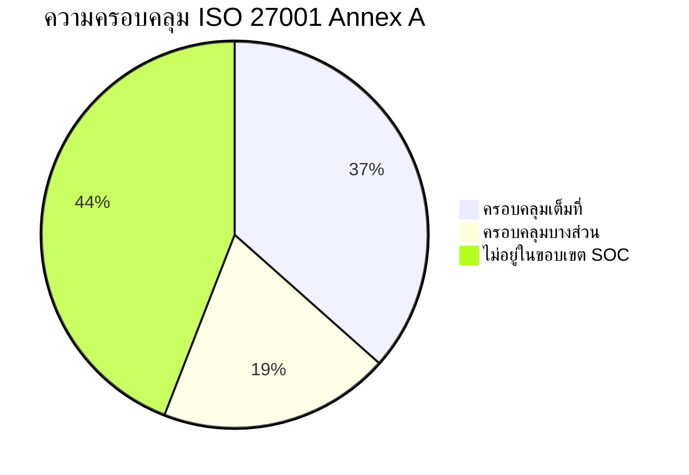

# ISO 27001 — การแมปการควบคุมสำหรับ SOC

> แมปกระบวนการปฏิบัติงาน SOC กับการควบคุม ISO/IEC 27001:2022 Annex A
>
> ใช้เอกสารนี้เพื่อแสดงความสอดคล้องในระหว่างการ Audit และระบุช่องว่าง

---

## 1. ภาพรวม

ISO/IEC 27001:2022 เป็นมาตรฐานสากลสำหรับระบบบริหารจัดการความมั่นคงปลอดภัยสารสนเทศ (ISMS) การแมปนี้แสดงว่า SOP ของ SOC สอดคล้องกับ **93 การควบคุม Annex A** ที่จัดกลุ่มเป็น 4 หมวด

> **52 จาก 93** การควบคุม Annex A ได้รับการดูแลโดยตรงหรือบางส่วนจากการปฏิบัติงาน SOC

---

## 2. การควบคุมด้านองค์กร (A.5)

| Control | ชื่อ | ครอบคลุม | เอกสาร SOC |
|:---:|:---|:---:|:---|
| A.5.1 | นโยบายความมั่นคงปลอดภัยสารสนเทศ | ✅ | [นโยบายควบคุมการเข้าถึง](../06_Operations_Management/Access_Control.th.md) |
| A.5.2 | บทบาทด้านความมั่นคงปลอดภัย | ✅ | [โครงสร้างทีม SOC](../06_Operations_Management/SOC_Team_Structure.th.md) |
| A.5.7 | ข่าวกรองภัยคุกคาม | ✅ | [วงจรชีวิต TI](../06_Operations_Management/Threat_Intelligence_Lifecycle.th.md) |
| A.5.24 | การวางแผนจัดการเหตุการณ์ | ✅ | [กรอบ IR](../05_Incident_Response/Framework.th.md) |
| A.5.25 | การประเมินและตัดสินใจเรื่องเหตุการณ์ | ✅ | [ตารางความรุนแรง](../05_Incident_Response/Severity_Matrix.th.md) |
| A.5.26 | การตอบสนองต่อเหตุการณ์ | ✅ | [50 Playbooks](../05_Incident_Response/Playbooks/), [Runbooks](../05_Incident_Response/Runbooks/) |
| A.5.27 | การเรียนรู้จากเหตุการณ์ | ✅ | [บทเรียน](../05_Incident_Response/Lessons_Learned_Template.th.md) |
| A.5.28 | การเก็บรวบรวมหลักฐาน | ✅ | [การเก็บหลักฐาน](../05_Incident_Response/Evidence_Collection.th.md) |
| A.5.29 | ความมั่นคงปลอดภัยในช่วงหยุดชะงัก | ✅ | [แผน DR/BCP](../05_Incident_Response/Disaster_Recovery_BCP.th.md) |
| A.5.35 | การทบทวนอิสระ | ✅ | [ประเมินวุฒิภาวะ SOC](../06_Operations_Management/SOC_Maturity_Assessment.th.md) |

## 3. การควบคุมด้านเทคโนโลยี (A.8) — ส่วนที่เกี่ยวข้อง SOC

| Control | ชื่อ | ครอบคลุม | เอกสาร SOC |
|:---:|:---|:---:|:---|
| A.8.2 | สิทธิ์เข้าถึงแบบ Privileged | ✅ | [PB ยกสิทธิ์](../05_Incident_Response/Playbooks/Privilege_Escalation.th.md) |
| A.8.7 | การป้องกันมัลแวร์ | ✅ | [PB มัลแวร์](../05_Incident_Response/Playbooks/Malware_Infection.th.md), [PB แรนซัมแวร์](../05_Incident_Response/Playbooks/Ransomware.th.md) |
| A.8.8 | การจัดการช่องโหว่ | ✅ | [การจัดการช่องโหว่](../06_Operations_Management/Vulnerability_Management.th.md) |
| A.8.15 | การบันทึก Log | ✅ | [ตารางแหล่ง Log](../06_Operations_Management/Log_Source_Matrix.th.md) |
| A.8.16 | กิจกรรมเฝ้าระวัง | ✅ | [เฝ้าระวังเครือข่าย](../06_Operations_Management/Network_Security_Monitoring.th.md) |

---

## สรุปว่าง (Gap)

### ครอบคลุมดี ✅
- **การจัดการเหตุการณ์** (A.5.24–A.5.28) — กรอบ IR + 50 Playbooks
- **ข่าวกรองภัยคุกคาม** (A.5.7) — TI Lifecycle + TI Feeds
- **การบันทึกและเฝ้าระวัง** (A.8.15–A.8.16) — Log Source Matrix + Network/Cloud Monitoring

### ต้องปรับปรุง 🟡
- **A.8.17 การซิงค์เวลา** — เพิ่มคู่มือ NTP ใน Log Source Onboarding
- **A.8.22 การแบ่งเครือข่าย** — เพิ่มเอกสาร Network Zone

---

## เอกสารที่เกี่ยวข้อง
- [Compliance Mapping](Compliance_Mapping.th.md)
- [Compliance Gap Analysis](Compliance_Gap_Analysis.th.md)
- [PDPA Compliance](PDPA_Compliance.th.md)
