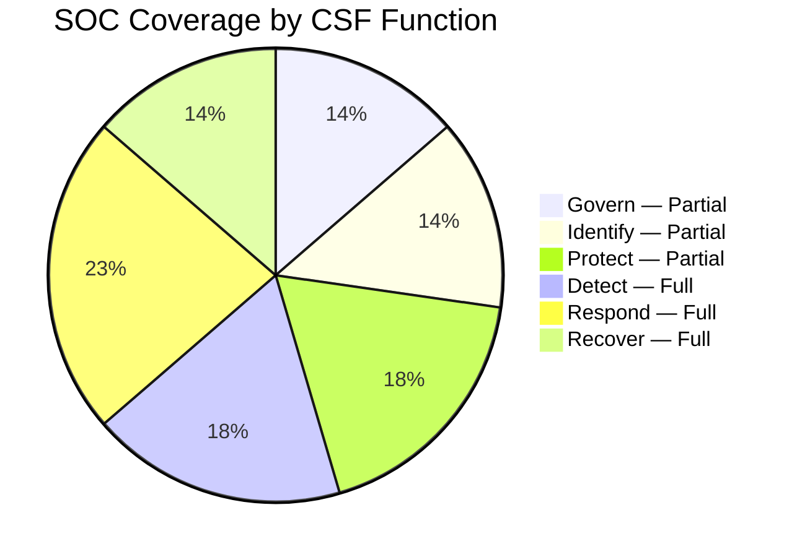

# NIST Cybersecurity Framework 2.0 — SOC Mapping

> Maps SOC operational processes to NIST CSF 2.0 Functions and Categories
>
> Use this document to demonstrate alignment during audits and identify coverage gaps

---

## 1. Overview

The NIST Cybersecurity Framework (CSF) 2.0, released February 2024, organizes cybersecurity activities into **6 Functions** and **22 Categories**. This mapping shows how SOC SOPs address each function.

> **SOC directly covers 12/22 Categories** with full or substantial alignment. 10 remaining categories are outside core SOC scope (HR, procurement, physical security, etc.)

---

## 2. GOVERN (GV) — Organizational Context

| Category | Description | Coverage | SOC Documents |
|:---:|:---|:---:|:---|
| GV.OC | Organizational Context | 🟡 Partial | [SOC 101](../00_Getting_Started/SOC_101.en.md) |
| GV.RM | Risk Management Strategy | 🟡 Partial | [Risk Register](../06_Operations_Management/Risk_Register.en.md) |
| GV.RR | Roles & Responsibilities | ✅ Full | [SOC Team Structure](../06_Operations_Management/SOC_Team_Structure.en.md), [RACI Matrix](../06_Operations_Management/RACI_Matrix.en.md) |
| GV.PO | Policy | ✅ Full | [Access Control](../06_Operations_Management/Access_Control.en.md), [Data Governance](../07_Compliance_Privacy/Data_Governance_Policy.en.md) |
| GV.SC | Supply Chain Risk | 🟡 Partial | [PB-22 Third-Party Breach](../05_Incident_Response/Playbooks/Third_Party_Breach.en.md), [PB-23 Supply Chain](../05_Incident_Response/Playbooks/Supply_Chain_Attack.en.md) |
| GV.OV | Oversight | ✅ Full | [SOC Maturity Assessment](../06_Operations_Management/SOC_Maturity_Assessment.en.md), [SOC Metrics](../06_Operations_Management/SOC_Metrics.en.md) |

## 3. IDENTIFY (ID) — Asset & Risk Understanding

| Category | Description | Coverage | SOC Documents |
|:---:|:---|:---:|:---|
| ID.AM | Asset Management | 🟡 Partial | [Log Source Matrix](../06_Operations_Management/Log_Source_Matrix.en.md) |
| ID.RA | Risk Assessment | ✅ Full | [Risk Register](../06_Operations_Management/Risk_Register.en.md), [Compliance Gap Analysis](../07_Compliance_Privacy/Compliance_Gap_Analysis.en.md) |
| ID.IM | Improvement | ✅ Full | [Lessons Learned](../05_Incident_Response/Lessons_Learned_Template.en.md), [SOC Maturity Assessment](../06_Operations_Management/SOC_Maturity_Assessment.en.md) |

## 4. PROTECT (PR) — Safeguards

| Category | Description | Coverage | SOC Documents |
|:---:|:---|:---:|:---|
| PR.AA | Identity & Access | ✅ Full | [Access Control](../06_Operations_Management/Access_Control.en.md), [PB-05 Account Compromise](../05_Incident_Response/Playbooks/Account_Compromise.en.md), [PB-27 MFA Bypass](../05_Incident_Response/Playbooks/MFA_Bypass.en.md) |
| PR.AT | Awareness & Training | ✅ Full | [Training Checklist](../10_Training_Onboarding/Training_Checklist.en.md), [SOC Onboarding](../10_Training_Onboarding/SOC_Onboarding.en.md), [Phishing Simulation](../09_Simulation_Testing/Phishing_Simulation.en.md) |
| PR.DS | Data Security | 🟡 Partial | [Data Governance](../07_Compliance_Privacy/Data_Governance_Policy.en.md), [PB-08 Data Exfiltration](../05_Incident_Response/Playbooks/Data_Exfiltration.en.md) |
| PR.PS | Platform Security | 🟡 Partial | [Vulnerability Management](../06_Operations_Management/Vulnerability_Management.en.md) |
| PR.IR | Technology Infrastructure Resilience | ✅ Full | [DR/BCP](../05_Incident_Response/Disaster_Recovery_BCP.en.md) |

## 5. DETECT (DE) — Detection & Analysis ⭐

> **This is the SOC's primary function** — coverage is comprehensive

| Category | Description | Coverage | SOC Documents |
|:---:|:---|:---:|:---|
| DE.CM | Continuous Monitoring | ✅ Full | [Network Monitoring](../06_Operations_Management/Network_Security_Monitoring.en.md), [Cloud Monitoring](../06_Operations_Management/Cloud_Security_Monitoring.en.md), [SOC Checklists](../06_Operations_Management/SOC_Checklists.en.md) |
| DE.AE | Adverse Event Analysis | ✅ Full | [Alert Tuning](../06_Operations_Management/Alert_Tuning.en.md), [Detection Rule Testing](../06_Operations_Management/Detection_Rule_Testing.en.md), [36 Sigma Rules](../08_Detection_Engineering/sigma_rules/) |
| DE.DP | Detection Processes | ✅ Full | [Tier 1](../05_Incident_Response/Runbooks/Tier1_Runbook.en.md)/[2](../05_Incident_Response/Runbooks/Tier2_Runbook.en.md)/[3 Runbooks](../05_Incident_Response/Runbooks/Tier3_Runbook.en.md), [Log Source Onboarding](../06_Operations_Management/Log_Source_Onboarding.en.md) |

## 6. RESPOND (RS) — Incident Response ⭐

> **Core SOC mission** — the most thoroughly covered function

| Category | Description | Coverage | SOC Documents |
|:---:|:---|:---:|:---|
| RS.MA | Incident Management | ✅ Full | [IR Framework](../05_Incident_Response/Framework.en.md), [50 Playbooks](../05_Incident_Response/Playbooks/), [Severity Matrix](../05_Incident_Response/Severity_Matrix.en.md) |
| RS.AN | Incident Analysis | ✅ Full | [Forensic Investigation](../05_Incident_Response/Forensic_Investigation.en.md), [Evidence Collection](../05_Incident_Response/Evidence_Collection.en.md), [Threat Hunting](../05_Incident_Response/Runbooks/Threat_Hunting_Playbook.en.md) |
| RS.CO | Incident Communication | ✅ Full | [Escalation Matrix](../05_Incident_Response/Escalation_Matrix.en.md), [SOC Communication SOP](../06_Operations_Management/SOC_Communication_SOP.en.md) |
| RS.RP | Incident Response Reporting | ✅ Full | [Incident Report Template](../11_Reporting_Templates/incident_report.en.md), [Monthly Report](../11_Reporting_Templates/Monthly_SOC_Report.en.md) |
| RS.MI | Incident Mitigation | ✅ Full | [50 Playbooks](../05_Incident_Response/Playbooks/) (containment + eradication sections) |

## 7. RECOVER (RC) — Recovery

| Category | Description | Coverage | SOC Documents |
|:---:|:---|:---:|:---|
| RC.RP | Recovery Planning | ✅ Full | [DR/BCP](../05_Incident_Response/Disaster_Recovery_BCP.en.md) |
| RC.CO | Recovery Communication | ✅ Full | [SOC Communication SOP](../06_Operations_Management/SOC_Communication_SOP.en.md), [Escalation Matrix](../05_Incident_Response/Escalation_Matrix.en.md) |
| RC.IM | Recovery Improvements | ✅ Full | [Lessons Learned](../05_Incident_Response/Lessons_Learned_Template.en.md), [Post-Incident Review](../05_Incident_Response/Post_Incident_Review.en.md) |

---

## 8. Coverage Summary

| Function | Categories | SOC Covered | Key Strength |
|:---|:---:|:---:|:---|
| **Govern** | 6 | 3 full + 3 partial | Team structure, policies, oversight |
| **Identify** | 3 | 2 full + 1 partial | Risk assessment, improvement cycle |
| **Protect** | 5 | 3 full + 2 partial | IAM, training, DR/BCP |
| **Detect** | 3 | 3 full | Monitoring, Sigma rules, runbooks |
| **Respond** | 5 | 5 full | IR framework, 50 playbooks, forensics |
| **Recover** | 3 | 3 full | DR/BCP, lessons learned, comms |
| **Total** | **22** | **16 full + 6 partial** | |

### Gaps Requiring Attention 🟡

| Gap | Recommendation | Priority |
|:---|:---|:---:|
| ID.AM Asset Management | Integrate CMDB/asset inventory into Log Source Matrix | Medium |
| PR.DS Data Security | Expand DLP monitoring documentation | Medium |
| PR.PS Platform Security | Add SIEM/EDR hardening guide | Low |
| GV.OC Organizational Context | Reference enterprise risk appetite in SOC charter | Low |

---

## Related Documents
- [ISO 27001 Controls Mapping](ISO27001_Controls_Mapping.en.md)
- [PCI-DSS SOC Requirements](PCI_DSS_SOC_Requirements.en.md)
- [Compliance Mapping](Compliance_Mapping.en.md)
- [Compliance Gap Analysis](Compliance_Gap_Analysis.en.md)

## References
- [NIST CSF 2.0](https://www.nist.gov/cyberframework)
- [NIST CSF 2.0 Reference Tool](https://csrc.nist.gov/projects/cybersecurity-framework/filters#/csf/filters)
- [NIST SP 800-61r2 — Computer Security Incident Handling Guide](https://csrc.nist.gov/publications/detail/sp/800-61/rev-2/final)
