# NIST Cybersecurity Framework 2.0 — การแมป SOC

> แมปกระบวนการปฏิบัติงาน SOC กับ NIST CSF 2.0 Functions และ Categories
>
> ใช้เพื่อแสดงความสอดคล้องในระหว่างการ Audit และระบุช่องว่าง

---

## 1. ภาพรวม

NIST Cybersecurity Framework (CSF) 2.0 เผยแพร่กุมภาพันธ์ 2024 จัดกิจกรรมด้านความมั่นคงปลอดภัยเป็น **6 ฟังก์ชัน** และ **22 หมวด** เอกสารนี้แสดงว่า SOP ของ SOC สอดคล้องกับแต่ละฟังก์ชัน

```mermaid
pie title ความครอบคลุม SOC ตาม CSF Function
    "กำกับ — บางส่วน" : 3
    "ระบุ — บางส่วน" : 3
    "ป้องกัน — บางส่วน" : 4
    "ตรวจจับ — เต็ม" : 4
    "ตอบสนอง — เต็ม" : 5
    "กู้คืน — เต็ม" : 3
```

> **SOC ครอบคลุม 16/22 หมวด** (เต็มหรือบางส่วน) — 6 หมวดที่เหลืออยู่นอกขอบเขต SOC

---

## 2. GOVERN (กำกับ)

| หมวด | คำอธิบาย | ครอบคลุม | เอกสาร SOC |
|:---:|:---|:---:|:---|
| GV.RR | บทบาทและความรับผิดชอบ | ✅ | [โครงสร้างทีม SOC](../06_Operations_Management/SOC_Team_Structure.th.md) |
| GV.PO | นโยบาย | ✅ | [นโยบายการเข้าถึง](../06_Operations_Management/Access_Control.th.md) |
| GV.OV | การกำกับดูแล | ✅ | [ประเมินวุฒิภาวะ SOC](../06_Operations_Management/SOC_Maturity_Assessment.th.md) |

## 3. IDENTIFY (ระบุ)

| หมวด | คำอธิบาย | ครอบคลุม | เอกสาร SOC |
|:---:|:---|:---:|:---|
| ID.RA | การประเมินความเสี่ยง | ✅ | [Risk Register](../06_Operations_Management/Risk_Register.th.md) |
| ID.IM | การปรับปรุง | ✅ | [บทเรียน](../05_Incident_Response/Lessons_Learned_Template.th.md) |

## 4. PROTECT (ป้องกัน)

| หมวด | คำอธิบาย | ครอบคลุม | เอกสาร SOC |
|:---:|:---|:---:|:---|
| PR.AA | การจัดการตัวตนและสิทธิ์ | ✅ | [นโยบายการเข้าถึง](../06_Operations_Management/Access_Control.th.md) |
| PR.AT | การฝึกอบรม | ✅ | [Training Checklist](../10_Training_Onboarding/Training_Checklist.th.md) |
| PR.IR | ความทนทานของโครงสร้าง | ✅ | [แผน DR/BCP](../05_Incident_Response/Disaster_Recovery_BCP.th.md) |

## 5. DETECT (ตรวจจับ) ⭐

> **ฟังก์ชันหลักของ SOC** — ครอบคลุมสมบูรณ์

| หมวด | คำอธิบาย | ครอบคลุม | เอกสาร SOC |
|:---:|:---|:---:|:---|
| DE.CM | เฝ้าระวังต่อเนื่อง | ✅ | [เฝ้าระวังเครือข่าย](../06_Operations_Management/Network_Security_Monitoring.th.md), [เฝ้าระวัง Cloud](../06_Operations_Management/Cloud_Security_Monitoring.th.md) |
| DE.AE | วิเคราะห์เหตุการณ์ | ✅ | [ปรับจูน Alert](../06_Operations_Management/Alert_Tuning.th.md), [36 Sigma Rules](../08_Detection_Engineering/sigma_rules/) |
| DE.DP | กระบวนการตรวจจับ | ✅ | [Tier 1](../05_Incident_Response/Runbooks/Tier1_Runbook.th.md)/[2](../05_Incident_Response/Runbooks/Tier2_Runbook.th.md)/[3 Runbooks](../05_Incident_Response/Runbooks/Tier3_Runbook.th.md) |

## 6. RESPOND (ตอบสนอง) ⭐

> **ภารกิจหลัก SOC** — ครอบคลุมมากที่สุด

| หมวด | คำอธิบาย | ครอบคลุม | เอกสาร SOC |
|:---:|:---|:---:|:---|
| RS.MA | จัดการเหตุการณ์ | ✅ | [กรอบ IR](../05_Incident_Response/Framework.th.md), [50 Playbooks](../05_Incident_Response/Playbooks/) |
| RS.AN | วิเคราะห์เหตุการณ์ | ✅ | [การสืบสวน Forensic](../05_Incident_Response/Forensic_Investigation.th.md) |
| RS.CO | สื่อสารเหตุการณ์ | ✅ | [ตาราง Escalation](../05_Incident_Response/Escalation_Matrix.th.md) |
| RS.RP | รายงานเหตุการณ์ | ✅ | [แบบรายงานเหตุการณ์](../11_Reporting_Templates/incident_report.en.md) |
| RS.MI | บรรเทาเหตุการณ์ | ✅ | [50 Playbooks](../05_Incident_Response/Playbooks/) |

## 7. RECOVER (กู้คืน)

| หมวด | คำอธิบาย | ครอบคลุม | เอกสาร SOC |
|:---:|:---|:---:|:---|
| RC.RP | วางแผนกู้คืน | ✅ | [แผน DR/BCP](../05_Incident_Response/Disaster_Recovery_BCP.th.md) |
| RC.CO | สื่อสารการกู้คืน | ✅ | [ตาราง Escalation](../05_Incident_Response/Escalation_Matrix.th.md) |
| RC.IM | ปรับปรุงการกู้คืน | ✅ | [บทเรียน](../05_Incident_Response/Lessons_Learned_Template.th.md) |

---

## 8. สรุปความครอบคลุม

| ฟังก์ชัน | หมวด | SOC ครอบคลุม | จุดแข็ง |
|:---|:---:|:---:|:---|
| **กำกับ** | 6 | 3 เต็ม + 3 บางส่วน | โครงสร้างทีม นโยบาย |
| **ระบุ** | 3 | 2 เต็ม + 1 บางส่วน | ประเมินความเสี่ยง |
| **ป้องกัน** | 5 | 3 เต็ม + 2 บางส่วน | IAM ฝึกอบรม DR/BCP |
| **ตรวจจับ** | 3 | 3 เต็ม | Monitoring, Sigma, Runbooks |
| **ตอบสนอง** | 5 | 5 เต็ม | IR framework, 50 playbooks |
| **กู้คืน** | 3 | 3 เต็ม | DR/BCP, บทเรียน |
| **รวม** | **22** | **16 เต็ม + 6 บางส่วน** | |

---

## เอกสารที่เกี่ยวข้อง
- [ISO 27001 แมปการควบคุม](ISO27001_Controls_Mapping.th.md)
- [PCI-DSS ข้อกำหนด SOC](PCI_DSS_SOC_Requirements.th.md)
- [Compliance Mapping](Compliance_Mapping.th.md)
- [Compliance Gap Analysis](Compliance_Gap_Analysis.th.md)
