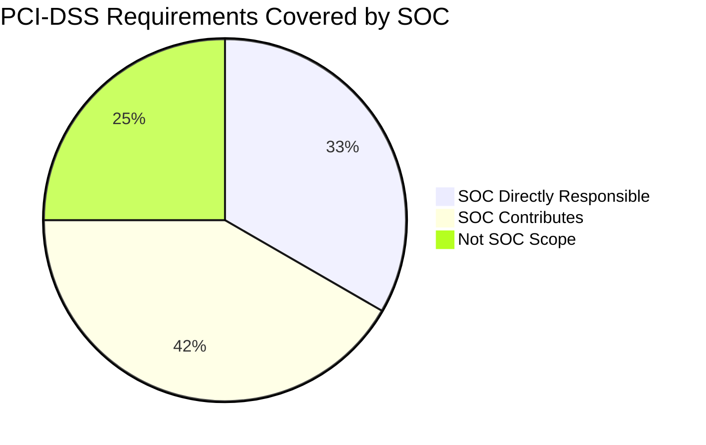

# PCI-DSS v4.0 — SOC Requirements Checklist

> Map SOC operational requirements to PCI-DSS v4.0 controls.
>
> Use this document for audit preparation and gap identification.

---

## 1. Overview

PCI-DSS v4.0 (effective March 2024) defines security requirements for organizations handling payment card data. SOC teams play a critical role in meeting **monitoring, detection, and response** requirements.

### SOC-Relevant Requirements

> SOC operations directly address **Requirements 10, 11, 12.10** and contribute to **Requirements 1, 2, 5, 6, 7**.

---

## 2. Requirement 10 — Log and Monitor All Access

**SOC Role**: Primary owner of log management and monitoring.

| Sub-Req | Control | SOC Coverage | SOC Document |
|:---:|:---|:---:|:---|
| 10.1 | Processes and mechanisms for logging and monitoring | ✅ | [Log Source Matrix](../06_Operations_Management/Log_Source_Matrix.en.md) |
| 10.2 | Audit logs capture required events | ✅ | [Log Source Onboarding](../06_Operations_Management/Log_Source_Onboarding.en.md) |
| 10.3 | Audit logs are protected from destruction | 🟡 | [Log Clearing PB](../05_Incident_Response/Playbooks/Log_Clearing.en.md) |
| 10.4 | Audit logs are reviewed for anomalies | ✅ | [Alert Tuning](../06_Operations_Management/Alert_Tuning.en.md), [Detection Rules](../08_Detection_Engineering/README.en.md) |
| 10.5 | Audit log history is retained | 🟡 | [Data Handling Protocol](../06_Operations_Management/Data_Handling_Protocol.en.md) |
| 10.6 | Time-synchronization technology | 🟡 | [Log Source Matrix](../06_Operations_Management/Log_Source_Matrix.en.md) |
| 10.7 | Failures of critical security controls detected & reported | ✅ | [SOC Checklists](../06_Operations_Management/SOC_Checklists.en.md), [Shift Handoff](../06_Operations_Management/Shift_Handoff.en.md) |

---

## 3. Requirement 11 — Test Security Regularly

**SOC Role**: Detection validation and vulnerability scanning.

| Sub-Req | Control | SOC Coverage | SOC Document |
|:---:|:---|:---:|:---|
| 11.1 | Processes for regular security testing | ✅ | [Simulation Guide](../09_Simulation_Testing/Simulation_Guide.en.md) |
| 11.2 | Wireless access points managed | ⬜ | Not SOC scope (network team) |
| 11.3 | Vulnerabilities identified and addressed | ✅ | [Vulnerability Management](../06_Operations_Management/Vulnerability_Management.en.md) |
| 11.4 | External/internal penetration testing | 🟡 | [Purple Team Exercise](../09_Simulation_Testing/Purple_Team_Exercise.en.md) |
| 11.5 | Network intrusions/changes detected and responded to | ✅ | [Network Security Monitoring](../06_Operations_Management/Network_Security_Monitoring.en.md), [IDS/IPS Sigma Rules](../08_Detection_Engineering/sigma_rules/) |
| 11.6 | Unauthorized changes to payment pages detected | 🟡 | [Web Attack PB](../05_Incident_Response/Playbooks/Web_Attack.en.md) |

---

## 4. Requirement 12.10 — Incident Response

**SOC Role**: Primary owner of incident response.

| Sub-Req | Control | SOC Coverage | SOC Document |
|:---:|:---|:---:|:---|
| 12.10.1 | Incident response plan exists | ✅ | [IR Framework](../05_Incident_Response/Framework.en.md) |
| 12.10.2 | Plan is reviewed and tested annually | ✅ | [Purple Team Exercise](../09_Simulation_Testing/Purple_Team_Exercise.en.md), [Phishing Simulation](../09_Simulation_Testing/Phishing_Simulation.en.md) |
| 12.10.3 | Specific personnel available 24/7 | ✅ | [SOC Team Structure](../06_Operations_Management/SOC_Team_Structure.en.md), [Shift Handoff](../06_Operations_Management/Shift_Handoff.en.md) |
| 12.10.4 | Personnel are properly trained | ✅ | [Training Checklist](../10_Training_Onboarding/Training_Checklist.en.md), [Analyst Onboarding](../10_Training_Onboarding/Analyst_Onboarding_Path.en.md) |
| 12.10.4.1 | Frequency of IR training defined | ✅ | [Training Checklist](../10_Training_Onboarding/Training_Checklist.en.md) |
| 12.10.5 | Alerts from security monitoring trigger response | ✅ | [Escalation Matrix](../05_Incident_Response/Escalation_Matrix.en.md), [50 Playbooks](../05_Incident_Response/Playbooks/) |
| 12.10.6 | IR plan is modified based on lessons learned | ✅ | [Lessons Learned Template](../05_Incident_Response/Lessons_Learned_Template.en.md) |
| 12.10.7 | IR procedures in place for critical alerts | ✅ | [Severity Matrix](../05_Incident_Response/Severity_Matrix.en.md); P1 playbooks |

---

## 5. SOC Contributions to Other Requirements

| Req | Title | SOC Contribution | Document |
|:---:|:---|:---|:---|
| **1** | Network Security Controls | Monitor firewall & IDS alerts | [Network Security Monitoring](../06_Operations_Management/Network_Security_Monitoring.en.md) |
| **2** | Secure Configurations | Detect misconfigurations via monitoring | [Cloud Security Monitoring](../06_Operations_Management/Cloud_Security_Monitoring.en.md) |
| **5** | Anti-Malware | Monitor endpoint protection alerts | [Malware PB](../05_Incident_Response/Playbooks/Malware_Infection.en.md), [Ransomware PB](../05_Incident_Response/Playbooks/Ransomware.en.md) |
| **6** | Secure Systems & Software | Monitor for exploitation attempts | [Exploit PB](../05_Incident_Response/Playbooks/Exploit.en.md), [Zero-Day PB](../05_Incident_Response/Playbooks/Zero_Day_Exploit.en.md) |
| **7** | Restrict Access | Monitor access control violations | [Access Control](../06_Operations_Management/Access_Control.en.md), [Privilege Escalation PB](../05_Incident_Response/Playbooks/Privilege_Escalation.en.md) |

---

## 6. Audit Preparation Checklist

Use this checklist before a PCI-DSS audit:

- [ ] **Log retention** — Verify 12 months of logs available (3 months immediately accessible)
- [ ] **Monitoring coverage** — Confirm all CDE (Cardholder Data Environment) systems in Log Source Matrix
- [ ] **Alert response** — Document SLA compliance for P1/P2 alerts
- [ ] **IR testing** — Provide evidence of annual Purple Team exercise or tabletop
- [ ] **Training records** — Show analyst training completion dates
- [ ] **Change detection** — Demonstrate file integrity monitoring on payment pages
- [ ] **Vulnerability scans** — Show quarterly internal/external scan results
- [ ] **Incident log** — Provide ticketing system export with resolution times

---

## 7. Key Differences: PCI-DSS v3.2.1 → v4.0

| Area | v3.2.1 | v4.0 (New) | SOC Impact |
|:---|:---|:---|:---|
| **Log review** | Daily manual review | Automated monitoring + targeted risk analysis | Increase SIEM automation |
| **Detection** | IDS/IPS required | + Network behavioral analysis | Add network anomaly detection |
| **IR testing** | Annual test | Annual test + scenario-specific exercises | Add Purple Team exercises |
| **Authentication** | MFA for remote access | MFA for all CDE access | Monitor for MFA bypass |
| **Customized approach** | N/A | Organizations can customize controls | Document alternative approaches |

---

## Related Documents
- [Compliance Mapping](Compliance_Mapping.en.md)
- [Compliance Gap Analysis](Compliance_Gap_Analysis.en.md)
- [ISO 27001 Controls Mapping](ISO27001_Controls_Mapping.en.md)
- [PDPA Compliance](PDPA_Compliance.en.md)
