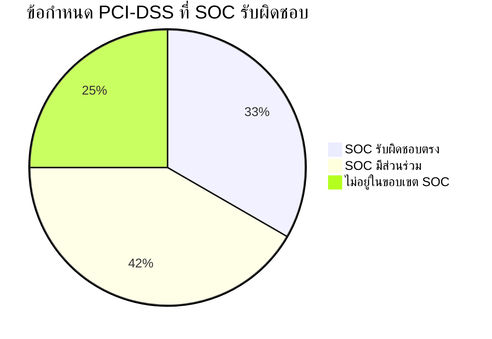

# PCI-DSS v4.0 — ข้อกำหนด SOC

> แมปความรับผิดชอบ SOC กับข้อกำหนด PCI-DSS v4.0
>
> ใช้สำหรับเตรียมตัว Audit และระบุช่องว่าง

---

## 1. ภาพรวม

PCI-DSS v4.0 (มีผลมีนาคม 2024) กำหนดข้อกำหนดด้านความปลอดภัยสำหรับองค์กรที่จัดการข้อมูลบัตรชำระเงิน SOC มีบทบาทสำคัญในข้อกำหนดด้าน **การเฝ้าระวัง การตรวจจับ และการตอบสนอง**

---

## 2. ข้อกำหนด 10 — บันทึก Log และเฝ้าระวังการเข้าถึงทั้งหมด

| Sub-Req | การควบคุม | ครอบคลุม | เอกสาร SOC |
|:---:|:---|:---:|:---|
| 10.1 | กระบวนการ Log และเฝ้าระวัง | ✅ | [ตารางแหล่ง Log](../06_Operations_Management/Log_Source_Matrix.th.md) |
| 10.2 | Audit log เก็บเหตุการณ์ที่กำหนด | ✅ | [คู่มือ Onboard Log](../06_Operations_Management/Log_Source_Onboarding.th.md) |
| 10.4 | ตรวจสอบ Audit log หาความผิดปกติ | ✅ | [การปรับจูน Alert](../06_Operations_Management/Alert_Tuning.th.md) |
| 10.7 | ตรวจจับความล้มเหลวของระบบ Security | ✅ | [รายการตรวจสอบ](../06_Operations_Management/SOC_Checklists.th.md) |

## 3. ข้อกำหนด 11 — ทดสอบความปลอดภัยสม่ำเสมอ

| Sub-Req | การควบคุม | ครอบคลุม | เอกสาร SOC |
|:---:|:---|:---:|:---|
| 11.1 | กระบวนการทดสอบความปลอดภัย | ✅ | [Simulation Guide](../09_Simulation_Testing/Simulation_Guide.th.md) |
| 11.3 | จัดการช่องโหว่ | ✅ | [การจัดการช่องโหว่](../06_Operations_Management/Vulnerability_Management.th.md) |
| 11.5 | ตรวจจับการบุกรุกเครือข่าย | ✅ | [เฝ้าระวังเครือข่าย](../06_Operations_Management/Network_Security_Monitoring.th.md) |

## 4. ข้อกำหนด 12.10 — การตอบสนองต่อเหตุการณ์

| Sub-Req | การควบคุม | ครอบคลุม | เอกสาร SOC |
|:---:|:---|:---:|:---|
| 12.10.1 | มีแผน IR | ✅ | [กรอบ IR](../05_Incident_Response/Framework.th.md) |
| 12.10.2 | ทดสอบแผนประจำปี | ✅ | [Purple Team Exercise](../09_Simulation_Testing/Purple_Team_Exercise.th.md) |
| 12.10.3 | บุคลากรพร้อม 24/7 | ✅ | [โครงสร้างทีม SOC](../06_Operations_Management/SOC_Team_Structure.th.md) |
| 12.10.4 | บุคลากรได้รับการฝึก | ✅ | [Training Checklist](../10_Training_Onboarding/Training_Checklist.th.md) |
| 12.10.5 | Alert กระตุ้นการตอบสนอง | ✅ | [ตารางการส่งต่อ](../05_Incident_Response/Escalation_Matrix.th.md), [50 Playbooks](../05_Incident_Response/Playbooks/) |
| 12.10.6 | ปรับปรุงแผนจากบทเรียน | ✅ | [บทเรียน](../05_Incident_Response/Lessons_Learned_Template.th.md) |

---

## 5. Checklist เตรียม Audit

- [ ] **เก็บ Log** — ยืนยัน 12 เดือน (3 เดือนเข้าถึงได้ทันที)
- [ ] **ครอบคลุมเฝ้าระวัง** — ยืนยันระบบ CDE ทั้งหมดอยู่ใน Log Source Matrix
- [ ] **ตอบสนอง Alert** — แสดงผล SLA สำหรับ P1/P2
- [ ] **ทดสอบ IR** — หลักฐาน Purple Team Exercise ประจำปี
- [ ] **บันทึกฝึกอบรม** — แสดงวันฝึกจบของ Analyst
- [ ] **สแกนช่องโหว่** — ผลสแกนรายไตรมาส

---

## เอกสารที่เกี่ยวข้อง
- [Compliance Mapping](Compliance_Mapping.th.md)
- [ISO 27001 Controls Mapping](ISO27001_Controls_Mapping.th.md)
- [PDPA Compliance](PDPA_Compliance.th.md)
