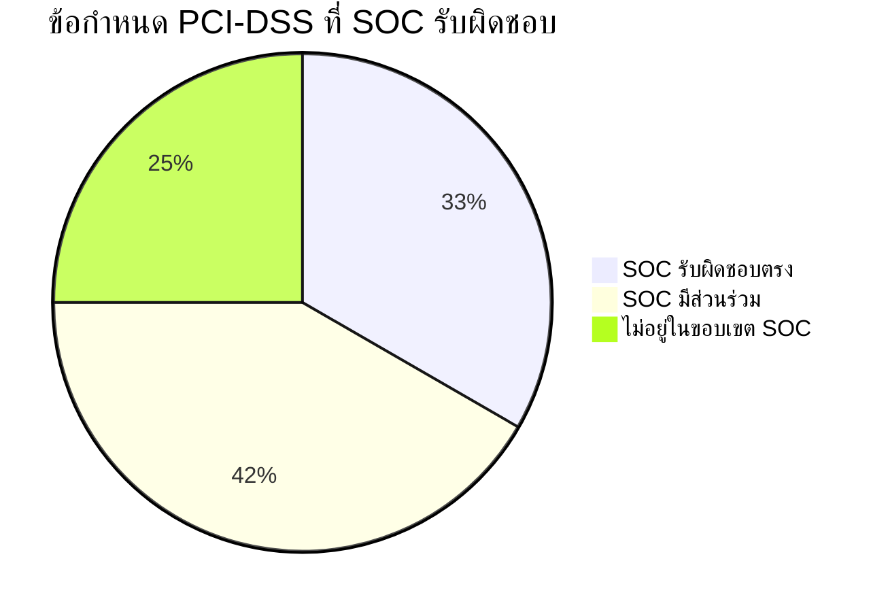

# PCI-DSS v4.0 — ข้อกำหนด SOC

> แมปความรับผิดชอบ SOC กับข้อกำหนด PCI-DSS v4.0
>
> ใช้สำหรับเตรียมตัว Audit และระบุช่องว่าง

---

## 1. ภาพรวม

PCI-DSS v4.0 (มีผลมีนาคม 2024) กำหนดข้อกำหนดด้านความปลอดภัยสำหรับองค์กรที่จัดการข้อมูลบัตรชำระเงิน SOC มีบทบาทสำคัญในข้อกำหนดด้าน **การเฝ้าระวัง การตรวจจับ และการตอบสนอง**

```mermaid
pie title ข้อกำหนด PCI-DSS ที่ SOC รับผิดชอบ
    "SOC รับผิดชอบตรง" : 4
    "SOC มีส่วนร่วม" : 5
    "ไม่อยู่ในขอบเขต SOC" : 3
```

---

## 2. ข้อกำหนด 10 — บันทึก Log และเฝ้าระวังการเข้าถึงทั้งหมด

| Sub-Req | การควบคุม | ครอบคลุม | เอกสาร SOC |
|:---:|:---|:---:|:---|
| 10.1 | กระบวนการ Log และเฝ้าระวัง | ✅ | [ตารางแหล่ง Log](../06_Operations_Management/Log_Source_Matrix.th.md) |
| 10.2 | Audit log เก็บเหตุการณ์ที่กำหนด | ✅ | [คู่มือ Onboard Log](../06_Operations_Management/Log_Source_Onboarding.th.md) |
| 10.4 | ตรวจสอบ Audit log หาความผิดปกติ | ✅ | [การปรับจูน Alert](../06_Operations_Management/Alert_Tuning.th.md) |
| 10.7 | ตรวจจับความล้มเหลวของระบบ Security | ✅ | [รายการตรวจสอบ](../06_Operations_Management/SOC_Checklists.th.md) |

## 3. ข้อกำหนด 11 — ทดสอบความปลอดภัยสม่ำเสมอ

| Sub-Req | การควบคุม | ครอบคลุม | เอกสาร SOC |
|:---:|:---|:---:|:---|
| 11.1 | กระบวนการทดสอบความปลอดภัย | ✅ | [Simulation Guide](../09_Simulation_Testing/Simulation_Guide.th.md) |
| 11.3 | จัดการช่องโหว่ | ✅ | [การจัดการช่องโหว่](../06_Operations_Management/Vulnerability_Management.th.md) |
| 11.5 | ตรวจจับการบุกรุกเครือข่าย | ✅ | [เฝ้าระวังเครือข่าย](../06_Operations_Management/Network_Security_Monitoring.th.md) |

## 4. ข้อกำหนด 12.10 — การตอบสนองต่อเหตุการณ์

| Sub-Req | การควบคุม | ครอบคลุม | เอกสาร SOC |
|:---:|:---|:---:|:---|
| 12.10.1 | มีแผน IR | ✅ | [กรอบ IR](../05_Incident_Response/Framework.th.md) |
| 12.10.2 | ทดสอบแผนประจำปี | ✅ | [Purple Team Exercise](../09_Simulation_Testing/Purple_Team_Exercise.th.md) |
| 12.10.3 | บุคลากรพร้อม 24/7 | ✅ | [โครงสร้างทีม SOC](../06_Operations_Management/SOC_Team_Structure.th.md) |
| 12.10.4 | บุคลากรได้รับการฝึก | ✅ | [Training Checklist](../10_Training_Onboarding/Training_Checklist.th.md) |
| 12.10.5 | Alert กระตุ้นการตอบสนอง | ✅ | [ตารางการส่งต่อ](../05_Incident_Response/Escalation_Matrix.th.md), [53 Playbooks](../05_Incident_Response/Playbooks/Phishing.th.md) |
| 12.10.6 | ปรับปรุงแผนจากบทเรียน | ✅ | [บทเรียน](../05_Incident_Response/Lessons_Learned_Template.th.md) |

---

## 5. Checklist เตรียม Audit

- [ ] **เก็บ Log** — ยืนยัน 12 เดือน (3 เดือนเข้าถึงได้ทันที)
- [ ] **ครอบคลุมเฝ้าระวัง** — ยืนยันระบบ CDE ทั้งหมดอยู่ใน Log Source Matrix
- [ ] **ตอบสนอง Alert** — แสดงผล SLA สำหรับ P1/P2
- [ ] **ทดสอบ IR** — หลักฐาน Purple Team Exercise ประจำปี
- [ ] **บันทึกฝึกอบรม** — แสดงวันฝึกจบของ Analyst
- [ ] **สแกนช่องโหว่** — ผลสแกนรายไตรมาส

## หลักฐานขั้นต่ำสำหรับ PCI-DSS Readiness (Minimum Evidence for PCI-DSS Readiness)

| หลักฐาน | เหตุผล | ผู้รับผิดชอบ |
|:---|:---|:---|
| inventory ของ CDE log source และสถานะการ onboard | พิสูจน์ coverage ของระบบที่อยู่ในขอบเขต | Security Engineer |
| ตัวอย่าง alert review และ incident response สำหรับเหตุที่กระทบ cardholder data | แสดงการปฏิบัติงานจริงของ Req. 10 และ 12.10 | SOC Analyst / IR Engineer |
| หลักฐานเรื่อง log retention และ time-sync | รองรับข้อกำหนด Req. 10.5 และ 10.6 | Security Engineer |
| บันทึก IR testing และการฝึกอบรม analyst | แสดงว่า annual review และ readiness ถูกทำจริง | SOC Manager |
| หลักฐาน vuln scan / detection validation ที่ผูกกับ CDE | แสดงการสนับสนุน Req. 11 โดย SOC | Security Engineer |

## Trigger สำหรับการยกระดับช่องว่าง PCI (Escalation Triggers for PCI Gaps)

| เงื่อนไข | ยกระดับถึง | SLA | การตัดสินใจที่ต้องได้ |
|:---|:---|:---:|:---|
| ระบบ CDE ใดไม่ส่ง log ที่ต้องใช้ | SOC Manager + CDE owner | ภายในวันทำการเดียวกัน | กู้ logging กลับมาหรือรับความเสี่ยงชั่วคราวอย่างเป็นทางการ |
| log retention ต่ำกว่าระยะที่กำหนดสำหรับข้อมูลในขอบเขต | CISO + Compliance Officer | ทันที | เก็บข้อมูลที่เหลือและเปิด urgent remediation |
| alert สำคัญที่เกี่ยวกับ cardholder data หลุด SLA | CISO | ทันที | ทบทวน staffing/process และ corrective action |
| ไม่มีหลักฐาน annual IR test หรือ quarterly scan ก่อน audit | Compliance Officer + SOC Manager | ภายใน 5 วันทำการ | จัดหลักฐานให้ครบหรือบันทึกเป็น gap สำหรับ audit response |

---

## เอกสารที่เกี่ยวข้อง
- [Compliance Mapping](Compliance_Mapping.th.md)
- [Compliance Gap Analysis](Compliance_Gap_Analysis.th.md)
- [ISO 27001 Controls Mapping](ISO27001_Controls_Mapping.th.md)
- [PDPA Compliance](PDPA_Compliance.th.md)

## References

- [PCI DSS v4.0](https://www.pcisecuritystandards.org/document_library/)
- [NIST SP 800-61r2](https://csrc.nist.gov/publications/detail/sp/800-61/rev-2/final)
