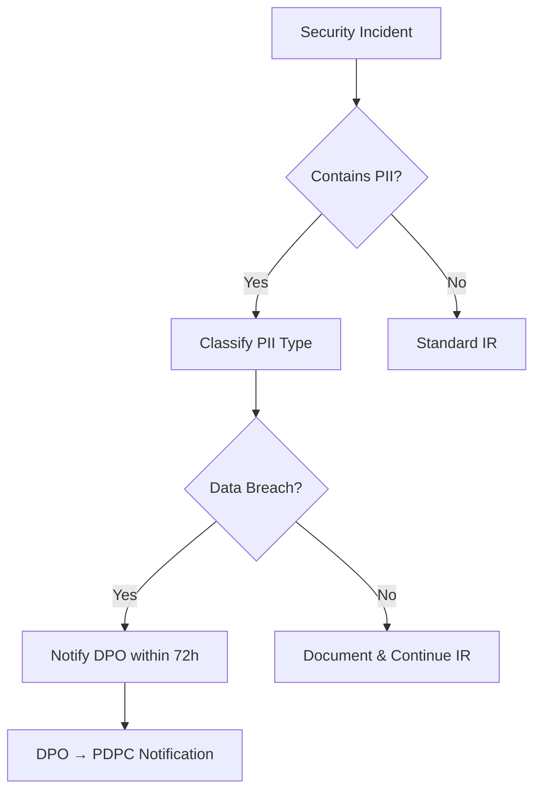

# PDPA Compliance SOP

This document outlines SOC procedures for handling personal data in compliance with Thailand's **Personal Data Protection Act (PDPA) B.E. 2562 (2019)**.

---

## Overview

The PDPA governs the collection, use, and disclosure of personal data. SOC analysts frequently encounter personal data (PII) during investigations. This SOP ensures data handling meets legal requirements.

## Data Classification

| Category | Examples | Handling |
|:---|:---|:---|
| **General PII** | Name, email, phone, IP address, employee ID | Log access, minimize retention |
| **Sensitive PII** | National ID, health records, biometrics, religion | Encrypt, restrict access, audit trail |
| **Non-PII** | System logs without user identifiers, hash values | Standard handling |

## SOC Analyst Responsibilities

1. **Minimization** — Access only the personal data necessary for investigation
2. **Purpose limitation** — Use data only for security incident response
3. **Retention** — Delete PII from investigation notes after case closure (retain only in official case file)
4. **Access control** — Share PII only with authorized personnel on need-to-know basis
5. **Logging** — All access to PII must be logged in case management system

## Breach Notification Requirements

| Condition | Timeline | Notify |
|:---|:---|:---|
| Personal data breach detected | **≤ 72 hours** | Data Protection Officer (DPO) → PDPC |
| Breach likely to affect data subjects | Without undue delay | Affected individuals |
| High-risk breach (sensitive data) | Immediately | DPO → PDPC → Affected individuals |

## Incident Response Integration

## Related Documents

- [Data Handling Protocol](../06_Operations_Management/Data_Handling_Protocol.en.md)
- [IR Framework](../05_Incident_Response/Framework.en.md)
- [Forensic Investigation](../05_Incident_Response/Forensic_Investigation.en.md)

## References

- [PDPA B.E. 2562 (Official)](https://www.pdpc.or.th/)
- [GDPR Comparison Guide](https://gdpr.eu/)
