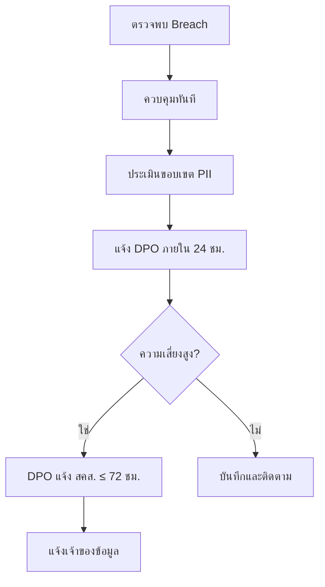

# ขั้นตอนปฏิบัติตาม PDPA (PDPA Compliance SOP)

เอกสารนี้ระบุขั้นตอนของ SOC ในการจัดการข้อมูลส่วนบุคคลตาม **พ.ร.บ. คุ้มครองข้อมูลส่วนบุคคล พ.ศ. 2562 (PDPA)**

---

## การจำแนกข้อมูล

| ประเภท | ตัวอย่าง | การจัดการ |
|:---|:---|:---|
| **PII ทั่วไป** | ชื่อ, อีเมล, โทรศัพท์, IP address, รหัสพนักงาน | บันทึกการเข้าถึง, จำกัดระยะเวลาเก็บ |
| **PII อ่อนไหว** | เลขบัตรประชาชน, ข้อมูลสุขภาพ, ข้อมูลชีวมิติ | เข้ารหัส, จำกัดสิทธิ์เข้าถึง, audit trail |
| **ไม่ใช่ PII** | System logs ที่ไม่มี user identifiers, hash values | จัดการปกติ |

## ความรับผิดชอบของ SOC Analyst

1. **ลดให้น้อยที่สุด** — เข้าถึงเฉพาะข้อมูลส่วนบุคคลที่จำเป็นสำหรับการสืบสวน
2. **จำกัดวัตถุประสงค์** — ใช้ข้อมูลเฉพาะเพื่อการตอบสนองต่อเหตุการณ์ความปลอดภัย
3. **การเก็บรักษา** — ลบ PII จากบันทึกการสืบสวนหลังปิดเคส
4. **การควบคุมการเข้าถึง** — แบ่งปัน PII เฉพาะผู้ที่ได้รับอนุญาตตาม need-to-know
5. **การบันทึก** — ทุกการเข้าถึง PII ต้องบันทึกในระบบ

## ข้อกำหนดแจ้งเตือนการรั่วไหล

| เงื่อนไข | ระยะเวลา | แจ้ง |
|:---|:---|:---|
| ตรวจพบ data breach | **≤ 72 ชั่วโมง** | DPO → สำนักงาน คปส. |
| การรั่วมีผลต่อเจ้าของข้อมูล | โดยเร็ว | เจ้าของข้อมูลที่ได้รับผลกระทบ |
| การรั่วความเสี่ยงสูง (ข้อมูลอ่อนไหว) | ทันที | DPO → สำนักงาน คปส. → เจ้าของข้อมูล |

## สิทธิของเจ้าของข้อมูล

| สิทธิ | ผลกระทบต่อ SOC | การดำเนินการ |
|:---|:---|:---|
| **สิทธิในการเข้าถึง** | เจ้าของข้อมูลอาจขอสำเนา PII | ส่งต่อคำขอไปยัง DPO |
| **สิทธิในการลบ** | เจ้าของข้อมูลอาจขอลบข้อมูล | DPO ประเมิน; SOC เก็บไว้หากจำเป็นสำหรับคดี |
| **สิทธิในการแก้ไข** | เจ้าของข้อมูลอาจขอแก้ไข | ส่งต่อไปยัง DPO |
| **สิทธิในการคัดค้าน** | เจ้าของข้อมูลอาจคัดค้านการประมวลผล | DPO ประเมิน |
| **สิทธิในการโอนย้าย** | เจ้าของข้อมูลอาจขอส่งออก | ส่งต่อไปยัง DPO |

## การประสานงาน DPO

| สถานการณ์ | การดำเนินการของ SOC | การดำเนินการของ DPO | กรอบเวลา |
|:---|:---|:---|:---|
| พบ PII ในการสอบสวน | บันทึกการเข้าถึง, จำแนกข้อมูล | รับแจ้งเพื่อกำกับดูแล | ทันที |
| สงสัยว่ามีการละเมิดข้อมูล | ยกระดับไปยัง DPO | ประเมินภาระการแจ้งเตือน | ≤ 72 ชั่วโมง |
| ได้รับคำขอจากเจ้าของข้อมูล | ส่งต่อไปยัง DPO | ดำเนินการและตอบกลับ | ≤ 30 วัน |

## รายการตรวจสอบ PDPA

| รายการ | ความถี่ | ผู้รับผิดชอบ | สถานะ |
|:---|:---|:---|:---:|
| เปิดใช้งานการบันทึกการเข้าถึง PII | รายเดือน | SOC Engineer | ☐ |
| ติดป้ายจำแนกข้อมูลในทุกคดี | ทุกคดี | นักวิเคราะห์ | ☐ |
| ทดสอบ SOP การแจ้งเตือนละเมิด | รายไตรมาส | SOC Manager | ☐ |
| ข้อมูลติดต่อ DPO เป็นปัจจุบัน | รายเดือน | SOC Manager | ☐ |
| อบรม PDPA สำหรับทีม SOC ทั้งหมด | รายปี | HR + SOC Manager | ☐ |

## การจัดการหลักฐานที่มี PII

1. **ลดให้น้อย** — ตัด PII ออกจากบันทึกการสืบสวนเมื่อไม่จำเป็น
2. **เข้ารหัส** — จัดเก็บหลักฐานที่มี PII ในพื้นที่เข้ารหัสเท่านั้น
3. **ติดป้าย** — ทำเครื่องหมาย `TLP:RED` หรือ `TLP:AMBER` ในทุกเอกสารที่มี PII
4. **บันทึกการเข้าถึง** — Log ทุกการเข้าถึงหลักฐานที่มี PII
5. **การเก็บรักษา** — ลบ PII จากพื้นที่ทำงานหลังปิดคดี
6. **การส่งต่อ** — ห้ามส่ง PII ผ่านช่องทางไม่เข้ารหัส (ไม่ใช้อีเมลธรรมดา)

## กระบวนการตอบสนองเมื่อมีการละเมิดข้อมูล

## เอกสารที่เกี่ยวข้อง

- [Data Handling Protocol](../06_Operations_Management/Data_Handling_Protocol.th.md)
- [กรอบ IR](../05_Incident_Response/Framework.th.md)

### PDPA Key Dates

| Event | Deadline |
|:---|:---|
| Breach notification (สคส.) | 72 ชั่วโมง |
| DPIA completion | ก่อนเริ่มโครงการ |
| Annual privacy review | ทุก 12 เดือน |
| DPO appointment | ตามเกณฑ์ สคส. |

## อ้างอิง

- [พ.ร.บ. คุ้มครองข้อมูลส่วนบุคคล (PDPA)](https://www.pdpc.or.th/)
