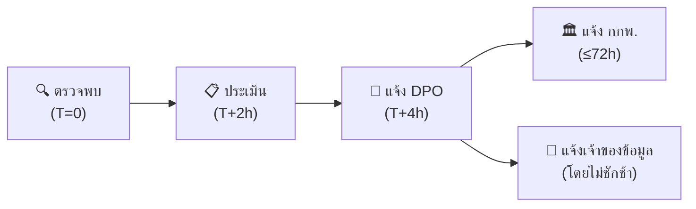

# คู่มือตอบเหตุข้อมูลรั่วตาม PDPA

> **รหัสเอกสาร:** PDPA-IR-001  
> **เวอร์ชัน:** 1.0  
> **อัปเดตล่าสุด:** 2026-02-15  
> **กฎหมาย:** พ.ร.บ.คุ้มครองข้อมูลส่วนบุคคล พ.ศ. 2562

---

## เมื่อไหร่ที่ PDPA เกี่ยวข้อง?

เมื่อเกิดการ **เข้าถึง / ส่งออก / แก้ไข / ทำลาย / เปิดเผย** ข้อมูลส่วนบุคคลโดยไม่ได้รับอนุญาต

### ข้อมูลส่วนบุคคลตาม PDPA

| หมวด | ตัวอย่าง |
|:---|:---|
| ข้อมูลระบุตัวตน | เลขบัตรประชาชน, หนังสือเดินทาง |
| ข้อมูลติดต่อ | ชื่อ, ที่อยู่, เบอร์โทร, email |
| ข้อมูลการเงิน | บัญชีธนาคาร, บัตรเครดิต, เงินเดือน |
| ข้อมูลสุขภาพ | ประวัติการแพทย์, ประกันสุขภาพ |
| ข้อมูลชีวมิติ | ลายนิ้วมือ, สแกนใบหน้า |
| **ข้อมูลอ่อนไหว** | ศาสนา, ความเห็นทางการเมือง, ประวัติอาชญากรรม |

---

## Timeline การแจ้ง 72 ชั่วโมง

```
ชม. 0:      ตรวจพบ data breach
ชม. 0–4:    ยืนยันว่ามีข้อมูลส่วนบุคคลเกี่ยวข้อง
ชม. 4–24:   ประเมินขอบเขต, จำนวนเจ้าของข้อมูล, ประเภทข้อมูล
ชม. 24–48:  เตรียมเอกสารแจ้ง สคส.
ชม. 48–72:  ส่งแจ้ง สคส. ← กำหนดตามกฎหมาย
หลังแจ้ง:    แจ้งเจ้าของข้อมูล (ถ้ามีความเสี่ยงสูง)
```

---

## ขั้นตอนสำหรับ SOC

### ขั้นที่ 1: ตรวจพบ & ประเมินเบื้องต้น (ชม. 0–4)

```
□ ยืนยันว่า incident เกี่ยวข้องกับข้อมูลส่วนบุคคล
□ จัดระดับ:
  - P1: รั่วมาก (>1,000 records) หรือข้อมูลอ่อนไหว
  - P2: รั่วจำกัด (<1,000 records)
□ แจ้ง SOC Manager ทันที
□ แจ้ง DPO ทันที
□ เริ่มเก็บหลักฐาน
□ ห้ามปิดบัง ลดความสำคัญ หรือล่าช้า
```

### ขั้นที่ 2: ประเมินขอบเขต (ชม. 4–24)

```
□ ข้อมูลอะไรรั่ว? (ระบุตัวตน, การเงิน, สุขภาพ, อ่อนไหว)
□ จำนวนเจ้าของข้อมูลที่ได้รับผลกระทบ
□ ขอบเขตทางภูมิศาสตร์ (คนไทย? ข้ามพรมแดน?)
□ ข้อมูลถูกดูเท่านั้น vs คัดลอก/ส่งออก
□ ข้อมูลถูกเข้ารหัสอยู่แล้วหรือไม่
```

### ขั้นที่ 3: Contain & เตรียมเอกสาร (ชม. 24–48)

```
□ Contain (isolate, block, patch)
□ เตรียมแจ้ง สคส. ร่วมกับ DPO/กฎหมาย:
  1. ชื่อ+ติดต่อผู้ควบคุมข้อมูล
  2. ชื่อ+ติดต่อ DPO
  3. ธรรมชาติของ breach
  4. ประเภท+จำนวนเจ้าของข้อมูล
  5. ประเภท+จำนวน records
  6. ผลกระทบที่อาจเกิดขึ้น
  7. มาตรการที่ดำเนินการแล้ว
  8. มาตรการบรรเทาผลกระทบ

□ เตรียมแจ้งเจ้าของข้อมูล (ภาษาไทยเข้าใจง่าย):
  - เกิดอะไรขึ้น
  - ข้อมูลอะไรได้รับผลกระทบ
  - ควรทำอะไร (เปลี่ยนรหัส, ตรวจบัญชี)
  - ติดต่อใครได้
```

### ขั้นที่ 4: แจ้งเตือน (ชม. 48–72)

```
□ ส่งแจ้ง สคส. (สำนักงานคณะกรรมการคุ้มครองข้อมูลส่วนบุคคล)
  - Email: complaint@pdpc.or.th
  - เว็บ: https://www.pdpc.or.th
  - อ้างอิง: มาตรา 37(4) พ.ร.บ.คุ้มครองข้อมูลส่วนบุคคล
□ ถ้าเสี่ยงสูง → แจ้งเจ้าของข้อมูลทันที
□ เก็บสำเนาทุกการแจ้ง
```

### ขั้นที่ 5: หลัง 72 ชม.

```
□ สืบสวนและแก้ไขต่อ
□ ตอบคำถาม สคส. (ถ้ามี)
□ ทำ Lessons Learned
□ อัปเดต breach register
□ รายงานผู้บริหาร/คณะกรรมการ
```

---

## บทลงโทษ PDPA

| การละเมิด | ค่าปรับทางปกครอง | โทษอาญา |
|:---|:---:|:---:|
| ไม่แจ้ง breach ให้ สคส. | สูงสุด ฿5,000,000 | — |
| ไม่แจ้งเจ้าของข้อมูล | สูงสุด ฿5,000,000 | — |
| ประมวลผลโดยมิชอบ | สูงสุด ฿5,000,000 | จำคุก 1 ปี / ฿1,000,000 |
| ส่งข้อมูลข้ามแดนไม่มีมาตรการ | สูงสุด ฿5,000,000 | — |
| ค่าเสียหาย + ค่าเสียหายเชิงลงโทษ | ศาลกำหนด (สูงสุด 2 เท่า) | — |

---

## ทะเบียน Breach

| วันที่ | Incident ID | คำอธิบาย | Records | ประเภทข้อมูล | แจ้ง สคส. | แจ้งเจ้าของ | สถานะ |
|:---|:---|:---|:---:|:---|:---:|:---:|:---|
| | | | | | ☐ | ☐ | |

---

## ผู้ติดต่อ

| บทบาท | ชื่อ | ติดต่อ |
|:---|:---|:---|
| DPO | ___________ | ___________ |
| ที่ปรึกษากฎหมาย | ___________ | ___________ |
| CISO | ___________ | ___________ |
| สคส. | — | 02-142-1033 / complaint@pdpc.or.th |

---

## PDPA Breach Notification Timeline



## เกณฑ์การพิจารณาแจ้ง

| ปัจจัย | ต้องแจ้ง | ไม่ต้องแจ้ง |
|:---|:---|:---|
| ข้อมูลถูก exfiltrate confirmed | ✅ | — |
| ข้อมูล sensitive (สุขภาพ, การเงิน) | ✅ | — |
| จำนวนเจ้าของข้อมูล > 500 | ✅ | — |
| ข้อมูล encrypted + key ไม่ถูก compromise | — | ✅ |
| Access log only, no PII accessed | — | ✅ |

## Breach Notification Contents (ตาม ม.37)

| ส่วน | เนื้อหาที่ต้องระบุ |
|:---|:---|
| **ลักษณะการละเมิด** | อธิบายว่าเกิดอะไร, อย่างไร |
| **ข้อมูลที่ได้รับผลกระทบ** | ประเภท + จำนวนโดยประมาณ |
| **ผลกระทบที่อาจเกิด** | ความเสี่ยงต่อเจ้าของข้อมูล |
| **มาตรการแก้ไข** | สิ่งที่ดำเนินการแล้ว + แผนเพิ่มเติม |
| **ข้อมูล DPO** | ชื่อ, ช่องทางติดต่อ |
| **คำแนะนำ** | สิ่งที่เจ้าของข้อมูลควรทำ |

## PDPA Fines & Penalties

| ฝ่าฝืน | โทษสูงสุด |
|:---|:---|
| ไม่แจ้ง breach ภายใน 72 ชม. | 3 ล้านบาท |
| ไม่มีมาตรการรักษาความปลอดภัย | 5 ล้านบาท |
| ข้อมูลรั่วไหลจากความประมาท | 5 ล้านบาท + โทษอาญา |
| ไม่แต่งตั้ง DPO (กรณีที่ต้องมี) | 1 ล้านบาท |

### PDPA Notification Timeline

| Event | Action | Deadline |
|:---|:---|:---|
| Breach detected | Internal triage | ทันที |
| Impact assessed | DPO notification | 24 ชม. |
| Reportable breach | แจ้ง สคส. | 72 ชม. |
| Data subject notice | แจ้งเจ้าของข้อมูล | โดยไม่ชักช้า |

## เอกสารที่เกี่ยวข้อง

- [IR Framework](../05_Incident_Response/Framework.th.md)
- [เก็บหลักฐาน](../05_Incident_Response/Evidence_Collection.th.md)
- [แม่แบบ Lessons Learned](../05_Incident_Response/Lessons_Learned_Template.th.md)
- [Compliance Mapping](Compliance_Mapping.th.md)
