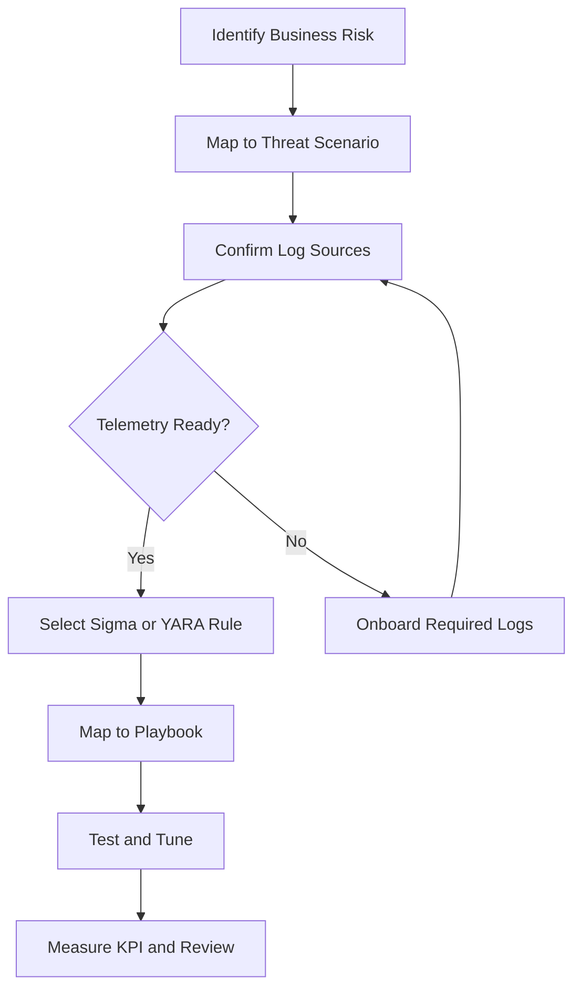

# SOC Use Case Library

**Document ID**: DET-UC-001
**Version**: 1.0
**Last Updated**: 2026-04-26
**Owner**: SOC Lead / Detection Engineer

---

## Purpose

Define a practical use case library for prioritizing, implementing, and measuring SOC detections. Use this document to decide which detections to build first, what telemetry is required, which playbook should handle the alert, and how to measure operational value.

---

## Use Case Selection Flow

---

## 1. Use Case Tiers

| Tier | Maturity | Goal | Example Use Cases |
|:---|:---|:---|:---|
| Tier 1 | Foundational | Detect common attacks with high analyst confidence | Phishing, brute force, malware execution, suspicious PowerShell |
| Tier 2 | Operational | Detect attack progression across identity, endpoint, network, and cloud | Lateral movement, privilege escalation, impossible travel, data exfiltration |
| Tier 3 | Advanced | Detect low-signal, high-impact, or business-specific threats | Insider threat, supply chain compromise, AI abuse, cloud cryptojacking |

---

## 2. Foundational Use Cases

| Use Case | Primary Logs | Detection Rule | Playbook | KPI |
|:---|:---|:---|:---|:---|
| Phishing attachment or link execution | Email, endpoint process, DNS, proxy | `proc_office_spawn_powershell.yml` | [PB-01 Phishing](../05_Incident_Response/Playbooks/Phishing.en.md) | Time from report to containment |
| Ransomware file activity | Endpoint, file audit, EDR telemetry | `file_bulk_renaming_ransomware.yml` | [PB-02 Ransomware](../05_Incident_Response/Playbooks/Ransomware.en.md) | Hosts isolated within SLA |
| Malware execution from user-writable paths | Endpoint process, file creation | `proc_temp_folder_execution.yml` | [PB-03 Malware Infection](../05_Incident_Response/Playbooks/Malware_Infection.en.md) | True positive rate |
| Multiple failed logins | Identity provider, Windows security logs, VPN | `win_multiple_failed_logins.yml` | [PB-04 Brute Force](../05_Incident_Response/Playbooks/Brute_Force.en.md) | False positive rate |
| Suspicious script execution | Endpoint process, command line, script block logs | `proc_powershell_encoded.yml` | [PB-11 Suspicious Script](../05_Incident_Response/Playbooks/Suspicious_Script.en.md) | Alert-to-triage time |

---

## 3. Operational Use Cases

| Use Case | Primary Logs | Detection Rule | Playbook | KPI |
|:---|:---|:---|:---|:---|
| Impossible travel or anomalous login | Identity provider, VPN, cloud audit | `cloud_impossible_travel.yml` | [PB-06 Impossible Travel](../05_Incident_Response/Playbooks/Impossible_Travel.en.md) | Account containment time |
| Privilege escalation | Directory audit, admin group changes | `win_domain_admin_group_add.yml` | [PB-07 Privilege Escalation](../05_Incident_Response/Playbooks/Privilege_Escalation.en.md) | Unauthorized admin changes reversed |
| Data exfiltration | Proxy, firewall, DLP, file audit | `net_large_upload.yml` | [PB-08 Data Exfiltration](../05_Incident_Response/Playbooks/Data_Exfiltration.en.md) | Exfiltration volume confirmed |
| Lateral movement over admin shares | Windows security, endpoint, network flow | `win_admin_share_access.yml` | [PB-12 Lateral Movement](../05_Incident_Response/Playbooks/Lateral_Movement.en.md) | Affected hosts identified |
| C2 beaconing | DNS, proxy, firewall, network flow | `net_beaconing.yml` | [PB-13 C2 Communication](../05_Incident_Response/Playbooks/C2_Communication.en.md) | Beacon dwell time |
| Cloud storage exposure | Cloud audit, storage access logs | `cloud_storage_public_access.yml` | [PB-27 Cloud Storage Exposure](../05_Incident_Response/Playbooks/Cloud_Storage_Exposure.en.md) | Public exposure duration |

---

## 4. Advanced Use Cases

| Use Case | Primary Logs | Detection Rule | Playbook | KPI |
|:---|:---|:---|:---|:---|
| Insider data staging | File audit, DLP, proxy, HR risk signals | `win_data_collection_staging.yml` | [PB-14 Insider Threat](../05_Incident_Response/Playbooks/Insider_Threat.en.md) | Confirmed risk cases reviewed |
| Supply chain compromise | CI/CD, package manager, cloud audit | `cloud_supply_chain_compromise.yml` | [PB-32 Supply Chain Attack](../05_Incident_Response/Playbooks/Supply_Chain_Attack.en.md) | Affected dependencies identified |
| Cloud cryptojacking | Cloud billing, instance inventory, audit logs | `cloud_cryptojacking.yml` | [PB-47 Cloud Cryptojacking](../05_Incident_Response/Playbooks/Cloud_Cryptojacking.en.md) | Cost spike contained |
| Deepfake social engineering | Email, collaboration, ticketing, financial workflow | `net_deepfake_social.yml` | [PB-48 Deepfake Social Engineering](../05_Incident_Response/Playbooks/Deepfake_Social_Engineering.en.md) | High-risk requests verified |
| AI prompt injection | Application logs, AI gateway logs, tool execution logs | `ai_prompt_injection.yml` | [PB-51 AI Prompt Injection](../05_Incident_Response/Playbooks/AI_Prompt_Injection.en.md) | Unsafe tool calls blocked |
| LLM data poisoning | Data pipeline, RAG index, model evaluation logs | `ai_data_poisoning.yml` | [PB-52 LLM Data Poisoning](../05_Incident_Response/Playbooks/LLM_Data_Poisoning.en.md) | Poisoned records removed |
| AI model theft | API logs, repository audit, storage access logs | `ai_model_theft.yml` | [PB-53 AI Model Theft](../05_Incident_Response/Playbooks/AI_Model_Theft.en.md) | Unauthorized extraction stopped |

---

## 5. Intake Checklist

-   [ ] **Business risk**: Identify the asset, process, or user group the use case protects.
-   [ ] **Threat mapping**: Map the scenario to MITRE ATT&CK tactic and technique where applicable.
-   [ ] **Telemetry**: Confirm required logs are collected, parsed, retained, and searchable.
-   [ ] **Detection logic**: Select or write a Sigma, YARA, or SIEM-native rule.
-   [ ] **Response path**: Link the alert to the correct incident response playbook.
-   [ ] **Tuning plan**: Define expected false positives, exclusions, and review cadence.
-   [ ] **Metric**: Assign one operational KPI that proves the use case is useful.

---

## 6. Prioritization Model

Score each candidate use case from 1 to 5.

| Factor | Question | Weight |
|:---|:---|:---:|
| Business Impact | Would failure affect critical operations, regulated data, or executive risk? | 30% |
| Threat Likelihood | Is the threat common in the sector or current threat landscape? | 25% |
| Telemetry Readiness | Are the required logs available and reliable? | 20% |
| Response Readiness | Does a tested playbook and owner exist? | 15% |
| Tuning Cost | Can the team handle expected alert volume? | 10% |

Use cases scoring **4.0+** should be implemented first. Use cases below **3.0** should be deferred unless required by compliance, audit, or executive direction.

---

## 7. Review Cadence

| Cadence | Activity | Owner |
|:---|:---|:---|
| Weekly | Review noisy alerts and false positives | Detection Engineer |
| Monthly | Compare use cases against incident trends and threat intelligence | SOC Lead |
| Quarterly | Update MITRE coverage, retired rules, and control mappings | SOC Manager |
| Annually | Re-score all use cases against business risk | CISO / Risk Owner |

---

## Related Documents

-   [Detection Coverage Matrix](Coverage_Matrix.en.md)
-   [Detection Rules Index](README.md)
-   [Use Case Prioritization](../01_SOC_Fundamentals/Use_Case_Prioritization.en.md)
-   [Detection Rule Testing SOP](../06_Operations_Management/Detection_Rule_Testing.en.md)
-   [Log Source Matrix](../06_Operations_Management/Log_Source_Matrix.en.md)
-   [SOC Metrics & KPIs](../06_Operations_Management/SOC_Metrics.en.md)

## References

-   [MITRE ATT&CK Enterprise Matrix](https://attack.mitre.org/matrices/enterprise/)
-   [NIST SP 800-61r2 Computer Security Incident Handling Guide](https://csrc.nist.gov/publications/detail/sp/800-61/rev-2/final)
-   [CISA Known Exploited Vulnerabilities Catalog](https://www.cisa.gov/known-exploited-vulnerabilities-catalog)
-   [Sigma Specification](https://sigmahq.io/docs/basics/rules.html)
