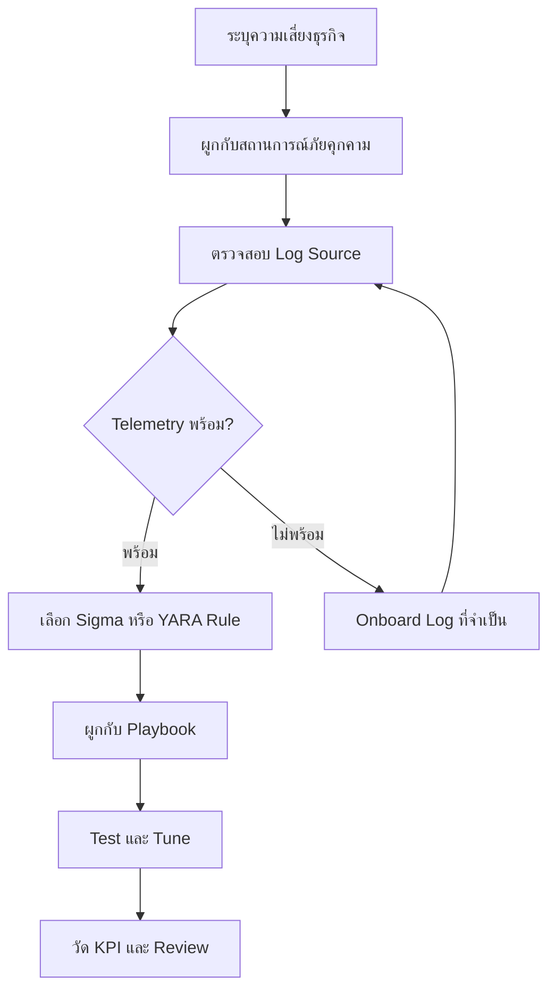

# คลัง Use Case สำหรับ SOC (SOC Use Case Library)

**Document ID**: DET-UC-001
**Version**: 1.0
**Last Updated**: 2026-04-26
**Owner**: SOC Lead / Detection Engineer

---

## 1. วัตถุประสงค์ (Purpose)

กำหนดคลัง use case สำหรับเลือก ลำดับความสำคัญ สร้าง และวัดผล detection ของ SOC อย่างเป็นระบบ ใช้เอกสารนี้เพื่อตัดสินใจว่า use case ใดควรทำก่อน ต้องใช้ log source อะไร ต้องผูกกับ playbook ใด และจะวัดคุณค่าทางปฏิบัติการอย่างไร

---

## 2. กระบวนการเลือก Use Case (Use Case Selection Flow)

---

## 3. ระดับของ Use Case (Use Case Tiers)

| Tier | Maturity | เป้าหมาย | ตัวอย่าง Use Case |
|:---|:---|:---|:---|
| Tier 1 | Foundational | ตรวจจับภัยคุกคามทั่วไปที่ analyst ตัดสินใจได้มั่นใจ | Phishing, brute force, malware execution, suspicious PowerShell |
| Tier 2 | Operational | ตรวจจับการเคลื่อนตัวของ attacker ข้าม identity, endpoint, network และ cloud | Lateral movement, privilege escalation, impossible travel, data exfiltration |
| Tier 3 | Advanced | ตรวจจับภัยคุกคาม signal ต่ำแต่ impact สูง หรือเฉพาะธุรกิจ | Insider threat, supply chain compromise, AI abuse, cloud cryptojacking |

---

## 4. Foundational Use Cases

| Use Case | Log หลัก | Detection Rule | Playbook | KPI |
|:---|:---|:---|:---|:---|
| Phishing attachment หรือ link execution | Email, endpoint process, DNS, proxy | `proc_office_spawn_powershell.yml` | [PB-01 Phishing](../05_Incident_Response/Playbooks/Phishing.th.md) | เวลาจาก report ถึง containment |
| Ransomware file activity | Endpoint, file audit, EDR telemetry | `file_bulk_renaming_ransomware.yml` | [PB-02 Ransomware](../05_Incident_Response/Playbooks/Ransomware.th.md) | Host ที่ isolate ได้ตาม SLA |
| Malware execution จาก path ที่ user เขียนได้ | Endpoint process, file creation | `proc_temp_folder_execution.yml` | [PB-03 Malware Infection](../05_Incident_Response/Playbooks/Malware_Infection.th.md) | True positive rate |
| Multiple failed logins | Identity provider, Windows security logs, VPN | `win_multiple_failed_logins.yml` | [PB-04 Brute Force](../05_Incident_Response/Playbooks/Brute_Force.th.md) | False positive rate |
| Suspicious script execution | Endpoint process, command line, script block logs | `proc_powershell_encoded.yml` | [PB-11 Suspicious Script](../05_Incident_Response/Playbooks/Suspicious_Script.th.md) | Alert-to-triage time |

---

## 5. Operational Use Cases

| Use Case | Log หลัก | Detection Rule | Playbook | KPI |
|:---|:---|:---|:---|:---|
| Impossible travel หรือ anomalous login | Identity provider, VPN, cloud audit | `cloud_impossible_travel.yml` | [PB-06 Impossible Travel](../05_Incident_Response/Playbooks/Impossible_Travel.th.md) | เวลาควบคุมบัญชี |
| Privilege escalation | Directory audit, admin group changes | `win_domain_admin_group_add.yml` | [PB-07 Privilege Escalation](../05_Incident_Response/Playbooks/Privilege_Escalation.th.md) | การเปลี่ยนสิทธิ์ admin ที่ rollback ได้ |
| Data exfiltration | Proxy, firewall, DLP, file audit | `net_large_upload.yml` | [PB-08 Data Exfiltration](../05_Incident_Response/Playbooks/Data_Exfiltration.th.md) | ปริมาณข้อมูลที่ยืนยันว่าเสี่ยง |
| Lateral movement ผ่าน admin shares | Windows security, endpoint, network flow | `win_admin_share_access.yml` | [PB-12 Lateral Movement](../05_Incident_Response/Playbooks/Lateral_Movement.th.md) | จำนวน host ที่ระบุขอบเขตได้ |
| C2 beaconing | DNS, proxy, firewall, network flow | `net_beaconing.yml` | [PB-13 C2 Communication](../05_Incident_Response/Playbooks/C2_Communication.th.md) | Beacon dwell time |
| Cloud storage exposure | Cloud audit, storage access logs | `cloud_storage_public_access.yml` | [PB-27 Cloud Storage Exposure](../05_Incident_Response/Playbooks/Cloud_Storage_Exposure.th.md) | ระยะเวลาที่ storage เปิด public |

---

## 6. Advanced Use Cases

| Use Case | Log หลัก | Detection Rule | Playbook | KPI |
|:---|:---|:---|:---|:---|
| Insider data staging | File audit, DLP, proxy, HR risk signals | `win_data_collection_staging.yml` | [PB-14 Insider Threat](../05_Incident_Response/Playbooks/Insider_Threat.th.md) | เคสเสี่ยงที่ review แล้ว |
| Supply chain compromise | CI/CD, package manager, cloud audit | `cloud_supply_chain_compromise.yml` | [PB-32 Supply Chain Attack](../05_Incident_Response/Playbooks/Supply_Chain_Attack.th.md) | Dependency ที่ได้รับผลกระทบ |
| Cloud cryptojacking | Cloud billing, instance inventory, audit logs | `cloud_cryptojacking.yml` | [PB-47 Cloud Cryptojacking](../05_Incident_Response/Playbooks/Cloud_Cryptojacking.th.md) | Cost spike ที่ควบคุมได้ |
| Deepfake social engineering | Email, collaboration, ticketing, financial workflow | `net_deepfake_social.yml` | [PB-48 Deepfake Social Engineering](../05_Incident_Response/Playbooks/Deepfake_Social_Engineering.th.md) | คำขอเสี่ยงสูงที่ verify แล้ว |
| AI prompt injection | Application logs, AI gateway logs, tool execution logs | `ai_prompt_injection.yml` | [PB-51 AI Prompt Injection](../05_Incident_Response/Playbooks/AI_Prompt_Injection.th.md) | Unsafe tool call ที่ block ได้ |
| LLM data poisoning | Data pipeline, RAG index, model evaluation logs | `ai_data_poisoning.yml` | [PB-52 LLM Data Poisoning](../05_Incident_Response/Playbooks/LLM_Data_Poisoning.th.md) | Poisoned record ที่ลบได้ |
| AI model theft | API logs, repository audit, storage access logs | `ai_model_theft.yml` | [PB-53 AI Model Theft](../05_Incident_Response/Playbooks/AI_Model_Theft.th.md) | การ extract ที่หยุดได้ |

---

## 7. Checklist สำหรับรับ Use Case ใหม่ (Intake Checklist)

-   [ ] **Business risk**: ระบุ asset, process หรือ user group ที่ use case นี้ปกป้อง
-   [ ] **Threat mapping**: ผูกสถานการณ์กับ MITRE ATT&CK tactic และ technique ที่เกี่ยวข้อง
-   [ ] **Telemetry**: ยืนยันว่า log ที่ต้องใช้ถูก collect, parse, retain และ search ได้
-   [ ] **Detection logic**: เลือกหรือเขียน Sigma, YARA หรือ SIEM-native rule
-   [ ] **Response path**: ผูก alert กับ incident response playbook ที่ถูกต้อง
-   [ ] **Tuning plan**: ระบุ false positive ที่คาดไว้ exclusion และรอบ review
-   [ ] **Metric**: กำหนด KPI อย่างน้อย 1 ตัวเพื่อพิสูจน์คุณค่าของ use case

---

## 8. โมเดลจัดลำดับความสำคัญ (Prioritization Model)

ให้คะแนน use case แต่ละรายการจาก 1 ถึง 5

| Factor | คำถาม | Weight |
|:---|:---|:---:|
| Business Impact | หากตรวจจับไม่ได้ จะกระทบ operation สำคัญ regulated data หรือ executive risk หรือไม่ | 30% |
| Threat Likelihood | ภัยนี้พบบ่อยใน sector หรือ threat landscape ปัจจุบันหรือไม่ | 25% |
| Telemetry Readiness | Log ที่ต้องใช้พร้อมและน่าเชื่อถือหรือไม่ | 20% |
| Response Readiness | มี playbook และ owner ที่ทดสอบแล้วหรือไม่ | 15% |
| Tuning Cost | ทีมรองรับ alert volume ที่คาดไว้ได้หรือไม่ | 10% |

Use case ที่ได้คะแนน **4.0+** ควรทำก่อน ส่วน use case ต่ำกว่า **3.0** ควรเลื่อนออกไป ยกเว้นจำเป็นจาก compliance, audit หรือคำสั่งผู้บริหาร

---

## 9. รอบการ Review (Review Cadence)

| Cadence | กิจกรรม | Owner |
|:---|:---|:---|
| Weekly | Review alert ที่ noise สูงและ false positive | Detection Engineer |
| Monthly | เทียบ use case กับ incident trend และ threat intelligence | SOC Lead |
| Quarterly | Update MITRE coverage, retired rules และ control mappings | SOC Manager |
| Annually | Re-score use case ทั้งหมดตาม business risk | CISO / Risk Owner |

---

## เอกสารที่เกี่ยวข้อง (Related Documents)

-   [ตาราง Detection Coverage](Coverage_Matrix.th.md)
-   [ดัชนี Detection Rules](README.th.md)
-   [Use Case Prioritization](../01_SOC_Fundamentals/Use_Case_Prioritization.th.md)
-   [Detection Rule Testing SOP](../06_Operations_Management/Detection_Rule_Testing.th.md)
-   [Log Source Matrix](../06_Operations_Management/Log_Source_Matrix.th.md)
-   [SOC Metrics & KPIs](../06_Operations_Management/SOC_Metrics.th.md)

## References

-   [MITRE ATT&CK Enterprise Matrix](https://attack.mitre.org/matrices/enterprise/)
-   [NIST SP 800-61r2 Computer Security Incident Handling Guide](https://csrc.nist.gov/publications/detail/sp/800-61/rev-2/final)
-   [CISA Known Exploited Vulnerabilities Catalog](https://www.cisa.gov/known-exploited-vulnerabilities-catalog)
-   [Sigma Specification](https://sigmahq.io/docs/basics/rules.html)
