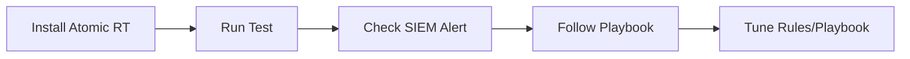

# Atomic Red Team Mapping (Validation)

This document maps our **Standard SOC Playbooks** to specific **Atomic Red Team** tests (MITRE ATT&CK). use these tests to validate your detection rules and response procedures.

| Playbook ID | Playbook Name | MITRE ID | Atomic Test (Attack Simulation) |
| :--- | :--- | :--- | :--- |
| **PB-01** | Phishing | T1059.001 | `Powershell - Spearphishing Attachment` |
| **PB-02** | Ransomware | T1486 | `Data Encrypted for Impact` (Mock Encryption) |
| **PB-03** | Malware Infection | T1204.002 | `Malicious File Execution` |
| **PB-04** | Brute Force | T1110.001 | `Password Guessing` |
| **PB-05** | Account Compromise | T1078 | `Valid Accounts: Local Accounts` |
| **PB-06** | Impossible Travel | T1078.004 | `Cloud Accounts` (Simulate login via VPN) |
| **PB-07** | Privilege Escalation | T1098 | `Account Manipulation: Add to Admin Group` |
| **PB-08** | Data Exfiltration | T1048 | `Exfiltration Over Alternative Protocol` |
| **PB-09** | DDoS Attack | T1498 | `Network Denial of Service` (Simulate High Load) |
| **PB-10** | Web App Attack | T1190 | `Exploit Public-Facing Application` (Simulate SQLi) |
| **PB-11** | Suspicious Script | T1059.001 | `PowerShell: Encoded Command` |
| **PB-12** | Lateral Movement | T1021.002 | `SMB/Windows Admin Shares` |
| **PB-13** | C2 Communication | T1071.001 | `Web Protocols` (Curl to known bad domain) |
| **PB-14** | Insider Threat | T1052.001 | `Exfiltration over Physical Medium` (USB Copy) |
| **PB-15** | Rogue Admin | T1136.001 | `Create Account: Local Account` |
| **PB-16** | Cloud IAM Anomaly | T1078 | `Valid Accounts: Cloud Accounts` |
| **PB-17** | BEC | T1114.003 | `Email Collection: Email Forwarding Rule` |
| **PB-18** | Exploit | T1210 | `Exploitation of Remote Services` |
| **PB-19** | Lost Device | T1098 | `Account Manipulation` (Simulate Access after Revocation) |
| **PB-20** | Log Clearing | T1070.001 | `Indicator Removal: Clear Windows Event Logs` |

## How to use

1.  Install [Atomic Red Team](https://github.com/redcanaryco/atomic-red-team) on a **TEST MACHINE**.
2.  Run the test: `Invoke-AtomicTest T1059.001`
3.  Check your SIEM: Did the alert trigger?
4.  Follow the Playbook: Did the steps work?

## Related Documents
-   [Simulation & Purple Teaming Guide](Simulation_Guide.en.md)
-   [Incident Response Framework](../05_Incident_Response/Framework.en.md)
-   [PB-01 Phishing](../05_Incident_Response/Playbooks/Phishing.en.md)

## References
-   [Atomic Red Team](https://github.com/redcanaryco/atomic-red-team)
-   [MITRE ATT&CK Techniques](https://attack.mitre.org/techniques/enterprise/)
