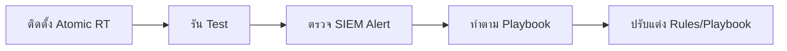

# ตาราง Atomic Red Team Mapping (ทดสอบ)

เอกสารนี้จับคู่ **Playbooks** กับ **Atomic Red Team** tests (MITRE ATT&CK) ใช้สำหรับทดสอบ detection rules และ response procedures

| Playbook | ชื่อ | MITRE ID | Atomic Test |
| :--- | :--- | :--- | :--- |
| **PB-01** | Phishing | T1059.001 | `PowerShell - Spearphishing Attachment` |
| **PB-02** | Ransomware | T1486 | `Data Encrypted for Impact` |
| **PB-03** | Malware Infection | T1204.002 | `Malicious File Execution` |
| **PB-04** | Brute Force | T1110.001 | `Password Guessing` |
| **PB-05** | Account Compromise | T1078 | `Valid Accounts: Local Accounts` |
| **PB-06** | Impossible Travel | T1078.004 | `Cloud Accounts` |
| **PB-07** | Privilege Escalation | T1098 | `Account Manipulation: Add to Admin` |
| **PB-08** | Data Exfiltration | T1048 | `Exfil Over Alternative Protocol` |
| **PB-09** | DDoS Attack | T1498 | `Network Denial of Service` |
| **PB-10** | Web App Attack | T1190 | `Exploit Public-Facing App` |
| **PB-11** | Suspicious Script | T1059.001 | `PowerShell: Encoded Command` |
| **PB-12** | Lateral Movement | T1021.002 | `SMB/Windows Admin Shares` |
| **PB-13** | C2 Communication | T1071.001 | `Web Protocols` |
| **PB-14** | Insider Threat | T1052.001 | `Exfil over Physical Medium` |
| **PB-15** | Rogue Admin | T1136.001 | `Create Account: Local` |
| **PB-16** | Cloud IAM Anomaly | T1078 | `Valid Accounts: Cloud` |
| **PB-17** | BEC | T1114.003 | `Email Forwarding Rule` |
| **PB-18** | Exploit | T1210 | `Exploitation of Remote Services` |
| **PB-19** | Lost Device | T1098 | `Account Manipulation` |
| **PB-20** | Log Clearing | T1070.001 | `Clear Windows Event Logs` |

## วิธีใช้

1. ติดตั้ง [Atomic Red Team](https://github.com/redcanaryco/atomic-red-team) ใน **เครื่องทดสอบ**
2. รัน test: `Invoke-AtomicTest T1059.001`
3. ตรวจ SIEM: Alert trigger ไหม?
4. ทำตาม Playbook: ขั้นตอนทำงานไหม?

## เอกสารที่เกี่ยวข้อง
- [คู่มือ Simulation & Purple Teaming](Simulation_Guide.th.md)
- [IR Framework](../05_Incident_Response/Framework.th.md)

## อ้างอิง
- [Atomic Red Team](https://github.com/redcanaryco/atomic-red-team)
- [MITRE ATT&CK](https://attack.mitre.org/techniques/enterprise/)
