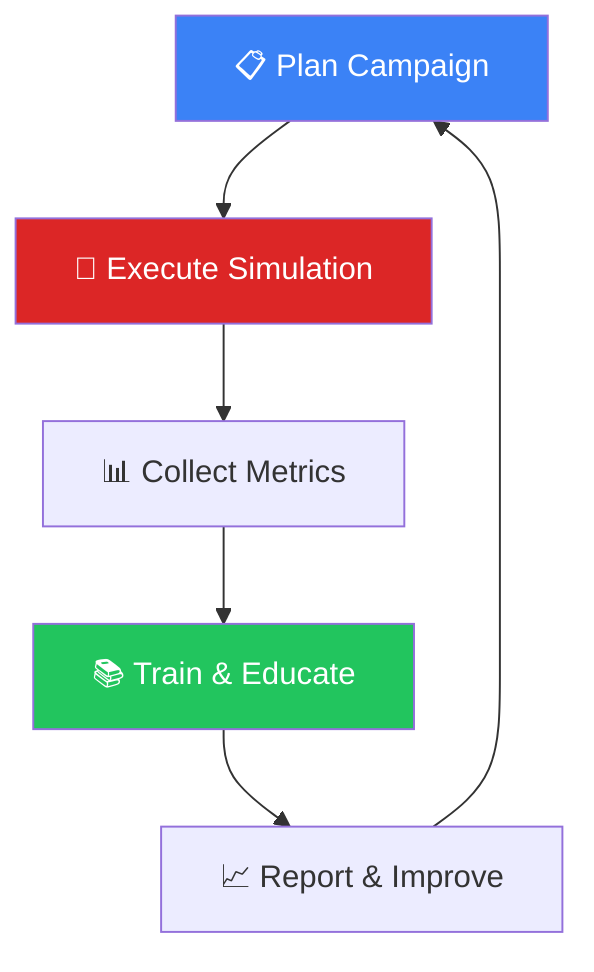
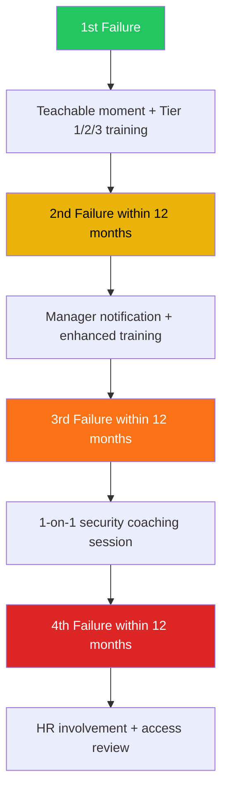

# Security Awareness & Phishing Simulation Program

**Document ID**: OPS-SOP-021
**Version**: 1.0
**Classification**: Internal
**Last Updated**: 2026-02-15

> A structured program for **testing employee resilience** against social engineering attacks through realistic phishing simulations, measuring results, providing targeted training, and reducing human risk over time.

---

## Program Overview



---

## Phishing Simulation Types

| Type | Difficulty | Description | Frequency |
|:---|:---:|:---|:---:|
| **Mass campaign** | 🟢 Easy–Medium | Same template sent to all employees | Monthly |
| **Targeted spear-phish** | 🟠 Hard | Customized per department/role | Quarterly |
| **Vishing (voice)** | 🟠 Hard | Phone-based social engineering | Semi-annual |
| **Smishing (SMS)** | 🟡 Medium | SMS/messaging-based | Semi-annual |
| **USB drop** | 🔴 Very Hard | Malicious USB left in common areas | Annual |
| **QR code phish** | 🟡 Medium | Malicious QR in poster/email | Quarterly |
| **BEC simulation** | 🔴 Very Hard | Fake CEO/CFO wire transfer request | Quarterly |

---

## Campaign Planning

### Pre-Campaign Checklist

- [ ] Define campaign objective and KPIs
- [ ] Select target groups (all employees, department, VIPs)
- [ ] Choose simulation type and difficulty
- [ ] Design email template (brand-aligned, realistic)
- [ ] Set up landing page (credential harvest / file download)
- [ ] Configure tracking (open, click, submit, report)
- [ ] Get management approval
- [ ] Coordinate with IT (whitelist simulation IPs/domains)
- [ ] Set campaign duration (typically 72 hours)
- [ ] Prepare training content for failures

### Template Categories

| Category | Example Lure | Risk Level | Target |
|:---|:---|:---:|:---|
| **IT/Helpdesk** | "Password expiring, click to reset" | 🟡 Medium | All employees |
| **HR/Benefits** | "Open enrollment deadline — review benefits" | 🟡 Medium | All employees |
| **Finance/Invoice** | "Invoice #9384 attached — please review" | 🟠 High | Finance team |
| **CEO/Executive** | "Urgent wire transfer needed" | 🔴 Very High | Finance/exec assistants |
| **Package delivery** | "Your package couldn't be delivered" | 🟢 Low | All employees |
| **Cloud/SaaS** | "Shared document — click to view" | 🟡 Medium | All employees |
| **Seasonal** | "Holiday bonus — confirm your details" | 🟡 Medium | All employees |
| **Current events** | "COVID/tax season update — action required" | 🟠 High | All employees |

---

## Metrics Collection

### Per-Campaign Metrics

| Metric | Definition | Target |
|:---|:---|:---:|
| **Delivery rate** | Emails delivered / sent | ≥ 98% |
| **Open rate** | Unique opens / delivered | Baseline only |
| **Click rate** | Unique clicks / delivered | < 10% |
| **Submission rate** | Credentials submitted / delivered | < 3% |
| **Report rate** | Reported as phishing / delivered | > 30% |
| **Time to first click** | Time from send to first click | Tracking only |
| **Time to first report** | Time from send to first report | Tracking only |
| **Repeat offender rate** | Users who clicked in 2+ campaigns | < 5% |

### Department Leaderboard

| Department | Employees | Click Rate | Submit Rate | Report Rate | Risk Score |
|:---|:---:|:---:|:---:|:---:|:---:|
| Engineering | _____ | ___% | ___% | ___% | ___/100 |
| Finance | _____ | ___% | ___% | ___% | ___/100 |
| HR | _____ | ___% | ___% | ___% | ___/100 |
| Sales | _____ | ___% | ___% | ___% | ___/100 |
| Marketing | _____ | ___% | ___% | ___% | ___/100 |
| Executive | _____ | ___% | ___% | ___% | ___/100 |
| IT | _____ | ___% | ___% | ___% | ___/100 |
| **Average** | **_____** | **___%** | **___%** | **___%** | **___/100** |

### Risk Score Calculation

```
Risk Score = (Click Rate × 3) + (Submit Rate × 5) − (Report Rate × 2)
```

| Risk Level | Score | Action |
|:---|:---:|:---|
| 🟢 Low | 0–20 | Standard training |
| 🟡 Medium | 21–40 | Enhanced awareness training |
| 🟠 High | 41–60 | Mandatory remedial training + retest |
| 🔴 Critical | 61+ | 1-on-1 coaching + manager notification |

---

## Post-Simulation Training

### Training Tiers

| Tier | Trigger | Training Content | Delivery | Completion SLA |
|:---|:---|:---|:---|:---:|
| **Tier 0** | All employees (baseline) | Annual security awareness course | LMS | Annual |
| **Tier 1** | Opened phishing email | 5-minute micro-learning module | Auto-email | 7 days |
| **Tier 2** | Clicked phishing link | 15-minute interactive training | LMS assignment | 5 days |
| **Tier 3** | Submitted credentials | 30-minute deep-dive + quiz | LMS + manager notify | 3 days |
| **Tier 4** | Repeat offender (3+ times) | 1-on-1 with security team | In-person/virtual | 5 days |

### Teachable Moment Content

Displayed immediately after user clicks phishing link:

| Element | Content |
|:---|:---|
| **Header** | "⚠️ This was a phishing simulation" |
| **What happened** | "You clicked a simulated phishing link in an email from [sender]" |
| **Red flags** | 3-5 specific indicators they should have noticed |
| **What to do next** | "Complete the training module sent to your inbox" |
| **Real attack** | "If this was real, your credentials could be compromised" |
| **Report button** | "Report suspicious emails using the [Phish Alert Button]" |

---

## Annual Campaign Calendar

| Month | Campaign Type | Template | Difficulty | Target |
|:---|:---|:---|:---:|:---|
| Jan | Mass | IT: Password reset | 🟢 Easy | All |
| Feb | Targeted | Finance: Invoice | 🟠 Hard | Finance |
| Mar | Mass | HR: Benefits enrollment | 🟡 Medium | All |
| Apr | Mass | Tax season | 🟠 High | All |
| May | QR Code | WiFi QR poster | 🟡 Medium | Office staff |
| Jun | BEC Simulation | CEO wire transfer | 🔴 Very Hard | Finance + EA |
| Jul | Mass | Cloud: Shared document | 🟡 Medium | All |
| Aug | Vishing | IT helpdesk call | 🟠 Hard | Random sample |
| Sep | Mass | Package delivery | 🟢 Easy | All |
| Oct | Targeted + USB | Cybersecurity month special | 🔴 Very Hard | Random |
| Nov | Mass | Holiday bonus | 🟡 Medium | All |
| Dec | Smishing | End-of-year benefits SMS | 🟡 Medium | All |

---

## Repeat Offender Program

### Escalation Ladder



### Repeat Offender Tracker

| Employee | Dept | Failures (12mo) | Last Failure | Training | Status |
|:---|:---|:---:|:---|:---|:---|
| ____________ | ____ | _____ | ____-__-__ | __________ | Active/Resolved |

---

## Phish Alert Button (PAB)

### Implementation

| Aspect | Detail |
|:---|:---|
| **Tool** | KnowBe4 PAB / Microsoft Report Message / custom add-in |
| **Location** | Outlook/Gmail toolbar — always visible |
| **Action when clicked** | Forward to `phishing@company.com` + auto-delete from inbox |
| **SOC workflow** | Auto-classify → if simulation: mark as reported; if real: triage |
| **User feedback** | Automated reply: "Thanks for reporting! This is being reviewed." |

### PAB Metrics

| Metric | Target |
|:---|:---:|
| PAB installation rate | ≥ 95% of employees |
| Report rate (simulated phishing) | ≥ 30% |
| Report rate (real phishing) | Tracking only |
| False report rate (legitimate email) | < 5% |
| Time from report to SOC review | < 15 minutes |

---

## Program Metrics (Annual)

| Metric | Target | Formula |
|:---|:---:|:---|
| Annual average click rate | < 10% | Mean of all campaigns |
| Annual average submit rate | < 3% | Mean of all campaigns |
| Annual average report rate | > 30% | Mean of all campaigns |
| Repeat offender rate | < 5% | Users failed 2+ / total |
| Training completion rate | ≥ 95% | Completed / assigned |
| Year-over-year click reduction | > 20% | (Y1 − Y2) / Y1 |
| Security awareness quiz score | ≥ 80% | Annual quiz average |

---

## Legal & Communication Considerations

| Topic | Guidance |
|:---|:---|
| **Employee notification** | Inform employees that simulations may occur (via policy, not timing) |
| **No punitive action** | Simulations are educational, not disciplinary (until repeat offender) |
| **Data privacy** | Individual results are confidential; share only aggregated data publicly |
| **Manager reporting** | Managers receive department-level stats, not individual names (except repeat offenders) |
| **PDPA compliance** | Processing of simulation data is disclosed in employee privacy notice |
| **Positive reinforcement** | Recognize employees/departments with highest report rates |

---

## Related Documents

-   [Insider Threat Program](Insider_Threat_Program.en.md) — Human risk reduction
-   [Escalation Matrix](../05_Incident_Response/Escalation_Matrix.en.md) — Real phishing escalation
-   [SOC Automation Catalog](SOC_Automation_Catalog.en.md) — Phishing auto-triage
-   [KPI Dashboard Template](KPI_Dashboard_Template.en.md) — Awareness metrics
-   [Incident Classification](../05_Incident_Response/Incident_Classification.en.md) — Phishing classification
