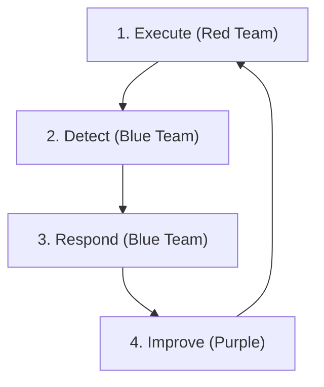

# Simulation & Purple Teaming Guide

This guide explains how to conduct a **Purple Team Exercise** (Red Team Attacks + Blue Team Defends) to validate the SOC's readiness using the provided Playbooks and Detection Rules.

## Prerequisites
1.  **Test Environment**: A dedicated VM or Lab (Do NOT run in Production).
2.  **Tools**:
    -   **Atomic Red Team**: For executing attacks.
    -   **Caldera** (Optional): For automated campaigns.
    -   **SIEM**: To view alerts.

## Execution Workflow (The Feedback Loop)



### Step 1: Execute (Red)
Run the Atomic Test corresponding to the Playbook you want to test.
*Example (Phishing)*:
```powershell
Invoke-AtomicTest T1059.001
```

### Step 2: Detect (Blue)
Check the SIEM Dashboard.
-   **Did the alert trigger?** (Check `proc_office_spawn_powershell.yml` logic).
-   **Was the severity correct?**
-   **Was all context captured?** (User, Host, Command Line).

### Step 3: Respond (Blue)
Open the Playbook (**PB-01 Phishing**).
-   Follow the steps: Analyze -> Contain -> Eradicate.
-   **Gap Analysis**: Did the playbook miss any steps? Was the containment tool (EDR) effective?

### Step 4: Improve (Purple)
-   **Tune Rule**: If alert didn't fire, adjust the Sigma rule.
-   **Update Playbook**: Add missing steps found during the drill.

## Schedule
Recommended Validation Schedule:
-   **Weekly**: Test 1 high-priority Playbook (Ransomware, Phishing).
-   **Monthly**: Test 3-5 random Playbooks.
-   **Quarterly**: Full Chain simulation (Phishing -> Lateral Mov -> Exfil).

## Related Documents
-   [Atomic Test Map](Atomic_Test_Map.en.md)
-   [Incident Response Framework](../05_Incident_Response/Framework.en.md)
-   [Detection Engineering Lifecycle](../03_User_Guides/Content_Management.en.md)

## References
-   [Atomic Red Team](https://github.com/redcanaryco/atomic-red-team)
-   [MITRE ATT&CK](https://attack.mitre.org/)
