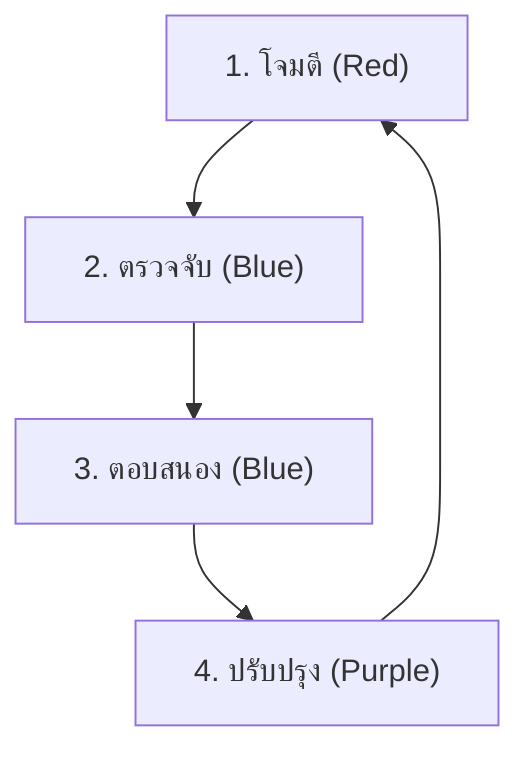

# คู่มือ Simulation & Purple Teaming

คู่มือนี้อธิบายวิธีทำ **Purple Team Exercise** (Red Team โจมตี + Blue Team ป้องกัน) เพื่อทดสอบความพร้อมของ SOC

## สิ่งที่ต้องมี
1. **สภาพแวดล้อมทดสอบ**: VM หรือ Lab เฉพาะ (ห้ามรันใน Production)
2. **เครื่องมือ**:
   - **Atomic Red Team**: สำหรับจำลองการโจมตี
   - **Caldera** (ตัวเลือก): สำหรับ campaign อัตโนมัติ
   - **SIEM**: สำหรับดู alert

## วงจรการทำงาน (Feedback Loop)



### ขั้นตอน 1: โจมตี (Red)
รัน Atomic Test ที่ตรงกับ Playbook ที่ต้องการทดสอบ
```powershell
Invoke-AtomicTest T1059.001
```

### ขั้นตอน 2: ตรวจจับ (Blue)
ตรวจ SIEM Dashboard:
- Alert trigger ไหม?
- Severity ถูกต้องไหม?
- มี context ครบไหม? (User, Host, Command Line)

### ขั้นตอน 3: ตอบสนอง (Blue)
เปิด Playbook แล้วทำตาม:
- วิเคราะห์ → Contain → กำจัด
- **Gap Analysis**: Playbook ขาดขั้นตอนอะไรไหม?

### ขั้นตอน 4: ปรับปรุง (Purple)
- **Tune Rule**: ถ้า alert ไม่ fire → ปรับ Sigma rule
- **Update Playbook**: เพิ่มขั้นตอนที่พบว่าขาด

## ตารางเวลาแนะนำ
- **รายสัปดาห์**: ทดสอบ 1 Playbook สำคัญ (Ransomware, Phishing)
- **รายเดือน**: ทดสอบ 3–5 Playbooks แบบสุ่ม
- **รายไตรมาส**: จำลอง full chain (Phishing → Lateral Mov → Exfil)

## เอกสารที่เกี่ยวข้อง
- [Atomic Test Map](Atomic_Test_Map.en.md)
- [IR Framework](../05_Incident_Response/Framework.th.md)
- [Detection Engineering](../03_User_Guides/Content_Management.th.md)
