# Atomic Red Team Mapping (Validation)

This document maps our **SOC Playbooks** to specific **Atomic Red Team** tests aligned with the MITRE ATT&CK framework. Use these tests to validate detection rules and response procedures on a regular cadence.

---

## Validation Matrix

### Initial Access & Execution

| PB | Playbook Name | MITRE ID | Atomic Test | Expected Detection | Last Tested | Result |
|:---|:---|:---|:---|:---|:---|:---:|
| PB-01 | Phishing | T1566.001 | Spearphishing Attachment | Email gateway + SIEM | | 🟢🔴 |
| PB-03 | Malware Infection | T1204.002 | Malicious File Execution | EDR + SIEM | | |
| PB-10 | Web App Attack | T1190 | Exploit Public-Facing App (SQLi) | WAF + SIEM | | |
| PB-11 | Suspicious Script | T1059.001 | PowerShell Encoded Command | EDR + SIEM | | |
| PB-18 | Exploit | T1210 | Exploitation of Remote Services | IDS + SIEM | | |

### Persistence & Privilege Escalation

| PB | Playbook Name | MITRE ID | Atomic Test | Expected Detection | Last Tested | Result |
|:---|:---|:---|:---|:---|:---|:---:|
| PB-05 | Account Compromise | T1078 | Valid Accounts: Local Accounts | AD + SIEM | | |
| PB-07 | Privilege Escalation | T1098 | Account Manipulation: Admin Group Add | AD + SIEM | | |
| PB-15 | Rogue Admin | T1136.001 | Create Account: Local Account | EDR + SIEM | | |
| PB-16 | Cloud IAM Anomaly | T1078.004 | Valid Accounts: Cloud | Cloud SIEM | | |

### Credential Access & Defense Evasion

| PB | Playbook Name | MITRE ID | Atomic Test | Expected Detection | Last Tested | Result |
|:---|:---|:---|:---|:---|:---|:---:|
| PB-04 | Brute Force | T1110.001 | Password Guessing | AD + SIEM | | |
| PB-06 | Impossible Travel | T1078.004 | Cloud Accounts (VPN Simulation) | Cloud + UEBA | | |
| PB-20 | Log Clearing | T1070.001 | Clear Windows Event Logs | EDR + SIEM | | |
| PB-33 | MFA Bypass | T1556.006 | MFA Modification | IAM + SIEM | | |

### Discovery & Lateral Movement

| PB | Playbook Name | MITRE ID | Atomic Test | Expected Detection | Last Tested | Result |
|:---|:---|:---|:---|:---|:---|:---:|
| PB-12 | Lateral Movement | T1021.002 | SMB/Windows Admin Shares | EDR + SIEM | | |
| PB-34 | Network Discovery | T1046 | Network Service Scanning (nmap) | IDS + SIEM | | |
| PB-34 | Network Discovery | T1135 | Network Share Discovery | EDR + SIEM | | |

### Collection, C2 & Exfiltration

| PB | Playbook Name | MITRE ID | Atomic Test | Expected Detection | Last Tested | Result |
|:---|:---|:---|:---|:---|:---|:---:|
| PB-35 | Data Collection | T1560.001 | Archive via Utility (7z, rar) | EDR + DLP | | |
| PB-13 | C2 Communication | T1071.001 | Web Protocols (curl to bad domain) | Proxy + SIEM | | |
| PB-08 | Data Exfiltration | T1048 | Exfiltration Over Alt Protocol | DLP + SIEM | | |
| PB-14 | Insider Threat | T1052.001 | Exfiltration via USB | DLP + EDR | | |
| PB-17 | BEC | T1114.003 | Email Forwarding Rule | Email + SIEM | | |

### Impact

| PB | Playbook Name | MITRE ID | Atomic Test | Expected Detection | Last Tested | Result |
|:---|:---|:---|:---|:---|:---|:---:|
| PB-02 | Ransomware | T1486 | Data Encrypted for Impact (Mock) | EDR + SIEM | | |
| PB-09 | DDoS Attack | T1498 | Network Denial of Service | Network + SIEM | | |

### Cloud-Specific

| PB | Playbook Name | MITRE ID | Atomic Test | Expected Detection | Last Tested | Result |
|:---|:---|:---|:---|:---|:---|:---:|
| PB-21 | AWS EC2 Compromise | T1078.004 | Cloud Account Access | CloudTrail | | |
| PB-22 | AWS S3 Exposure | T1530 | Data from Cloud Storage | CloudTrail | | |
| PB-23 | Azure AD Compromise | T1078.004 | Cloud Accounts | Azure AD | | |
| PB-30 | DNS Tunneling | T1071.004 | DNS Protocol | DNS + SIEM | | |

---

## Testing Workflow

```mermaid
graph LR
    Plan["📋 1. Select Tests"] --> Prepare["🔧 2. Prep Test Machine"]
    Prepare --> Execute["▶️ 3. Execute Atomic Test"]
    Execute --> Validate["🔍 4. Validate Detection"]
    Validate --> Gap{Gap Found?}
    Gap -->|Yes| Tune["⚙️ 5a. Tune Rule / Create New"]
    Gap -->|No| Document["📝 5b. Record Pass"]
    Tune --> Retest["🔄 6. Retest"]
    Retest --> Document
    Document --> Report["📊 7. Update Test Map"]
```



## How to Run

### Prerequisites
```bash
# Install Atomic Red Team (PowerShell)
IEX (IWR 'https://raw.githubusercontent.com/redcanaryco/invoke-atomicredteam/master/install-atomicredteam.ps1' -UseBasicParsing)
Install-AtomicRedTeam -getAtomics
```

### Execute a Test
```powershell
# Run a specific test
Invoke-AtomicTest T1059.001 -TestNumbers 1

# Run all tests for a technique
Invoke-AtomicTest T1059.001

# Cleanup after test
Invoke-AtomicTest T1059.001 -Cleanup
```

### Validate Detection
1. Check SIEM for corresponding alert within 5 minutes
2. Verify alert severity and category match expectations
3. Confirm playbook steps are actionable
4. Record result in the "Result" column: 🟢 Pass / 🔴 Fail

---

## Testing Cadence

| Frequency | Scope | Owner |
|:---|:---|:---|
| **Monthly** | Top 5 critical playbooks | SOC Lead |
| **Quarterly** | All playbooks in matrix | Detection Engineer |
| **After rule change** | Affected playbooks | Rule author |
| **After major incident** | Related technique | IR Lead |

---

## Scoring Summary

| Metric | Value |
|:---|:---|
| **Total Tests Mapped** | 28 |
| **Last Full Test Run** | YYYY-MM-DD |
| **Pass Rate** | ___% |
| **Gaps Identified** | ___ |
| **Gaps Remediated** | ___ |

---

## Testing Frequency Matrix

| ATT&CK Tactic | Testing Frequency | Priority | Rationale |
|:---|:---|:---:|:---|
| Initial Access (TA0001) | Monthly | 🔴 High | Primary entry point, most common attacks |
| Execution (TA0002) | Monthly | 🔴 High | Critical for detecting payload execution |
| Persistence (TA0003) | Quarterly | 🟠 Medium | Validates long-term threat detection |
| Privilege Escalation (TA0004) | Quarterly | 🟠 Medium | Critical for detecting lateral movement prep |
| Defense Evasion (TA0005) | Monthly | 🔴 High | Adversaries constantly evolving evasion |
| Credential Access (TA0006) | Monthly | 🔴 High | Directly leads to compromise |
| Discovery (TA0007) | Quarterly | 🟡 Low | Often generates noise, lower priority |
| Lateral Movement (TA0008) | Monthly | 🔴 High | Key indicator of advanced attacks |
| Collection (TA0009) | Quarterly | 🟠 Medium | Pre-exfiltration activity |
| Exfiltration (TA0010) | Monthly | 🔴 High | Data loss prevention validation |
| Command & Control (TA0011) | Monthly | 🔴 High | Critical for detecting ongoing compromise |
| Impact (TA0040) | Quarterly | 🟠 Medium | Ransomware/destruction scenarios |

## Test Result Tracking

| Test ID | Technique | Date | Result | Gap Identified | Action Taken |
|:---|:---|:---|:---:|:---|:---|
| AT-001 | T1566.001 | YYYY-MM-DD | ✅/❌ | [Description] | [Rule created/tuned] |
| AT-002 | T1059.001 | YYYY-MM-DD | ✅/❌ | [Description] | [Rule created/tuned] |
| AT-003 | T1053.005 | YYYY-MM-DD | ✅/❌ | [Description] | [Rule created/tuned] |

> **Tracking Rule**: Every failed test (❌) must result in a detection rule created within 2 weeks.

## Related Documents

- [Simulation & Purple Teaming Guide](Simulation_Guide.en.md)
- [Purple Team Exercise Guide](Purple_Team_Exercise.en.md)
- [IR Framework](../05_Incident_Response/Framework.en.md)
- [Detection Rule Testing SOP](../06_Operations_Management/Detection_Rule_Testing.en.md)
- [Alert Tuning SOP](../06_Operations_Management/Alert_Tuning.en.md)

## References

- [Atomic Red Team](https://github.com/redcanaryco/atomic-red-team)
- [MITRE ATT&CK Techniques](https://attack.mitre.org/techniques/enterprise/)
- [Invoke-AtomicRedTeam](https://github.com/redcanaryco/invoke-atomicredteam)
