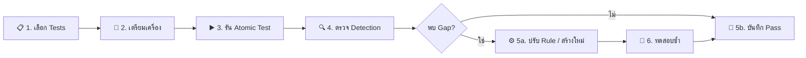

# ตาราง Atomic Red Team Mapping (การทดสอบตรวจจับ)

เอกสารนี้จับคู่ **SOC Playbooks** กับ **Atomic Red Team** tests ตาม MITRE ATT&CK ใช้ทดสอบ detection rules และ response procedures เป็นประจำ

---

## ตารางทดสอบ

### Initial Access & Execution

| PB | ชื่อ | MITRE ID | Atomic Test | Detective ที่คาดหวัง | ทดสอบล่าสุด | ผล |
|:---|:---|:---|:---|:---|:---|:---:|
| PB-01 | Phishing | T1566.001 | Spearphishing Attachment | Email gateway + SIEM | | 🟢🔴 |
| PB-03 | Malware | T1204.002 | Malicious File Execution | EDR + SIEM | | |
| PB-10 | Web Attack | T1190 | Exploit Public-Facing App (SQLi) | WAF + SIEM | | |
| PB-11 | Suspicious Script | T1059.001 | PowerShell Encoded Command | EDR + SIEM | | |

### Persistence & Privilege Escalation

| PB | ชื่อ | MITRE ID | Atomic Test | Detection ที่คาดหวัง | ทดสอบล่าสุด | ผล |
|:---|:---|:---|:---|:---|:---|:---:|
| PB-05 | Account Compromise | T1078 | Valid Accounts: Local | AD + SIEM | | |
| PB-07 | Privilege Escalation | T1098 | Admin Group Add | AD + SIEM | | |
| PB-15 | Rogue Admin | T1136.001 | Create Local Account | EDR + SIEM | | |

### Credential Access & Defense Evasion

| PB | ชื่อ | MITRE ID | Atomic Test | Detection ที่คาดหวัง | ทดสอบล่าสุด | ผล |
|:---|:---|:---|:---|:---|:---|:---:|
| PB-04 | Brute Force | T1110.001 | Password Guessing | AD + SIEM | | |
| PB-20 | Log Clearing | T1070.001 | Clear Windows Event Logs | EDR + SIEM | | |
| PB-33 | MFA Bypass | T1556.006 | MFA Modification | IAM + SIEM | | |

### Discovery & Lateral Movement

| PB | ชื่อ | MITRE ID | Atomic Test | Detection ที่คาดหวัง | ทดสอบล่าสุด | ผล |
|:---|:---|:---|:---|:---|:---|:---:|
| PB-12 | Lateral Movement | T1021.002 | SMB/Windows Admin Shares | EDR + SIEM | | |
| PB-34 | Network Discovery | T1046 | Network Scanning (nmap) | IDS + SIEM | | |
| PB-35 | Data Collection | T1560.001 | Archive via Utility | EDR + DLP | | |

### C2 & Exfiltration

| PB | ชื่อ | MITRE ID | Atomic Test | Detection ที่คาดหวัง | ทดสอบล่าสุด | ผล |
|:---|:---|:---|:---|:---|:---|:---:|
| PB-13 | C2 | T1071.001 | Web Protocols | Proxy + SIEM | | |
| PB-08 | Data Exfil | T1048 | Exfil Over Alt Protocol | DLP + SIEM | | |
| PB-14 | Insider Threat | T1052.001 | Exfil via USB | DLP + EDR | | |

### Impact

| PB | ชื่อ | MITRE ID | Atomic Test | Detection ที่คาดหวัง | ทดสอบล่าสุด | ผล |
|:---|:---|:---|:---|:---|:---|:---:|
| PB-02 | Ransomware | T1486 | Data Encrypted for Impact | EDR + SIEM | | |
| PB-09 | DDoS | T1498 | Network Denial of Service | Network + SIEM | | |

---

## ขั้นตอนการทดสอบ



## วิธีรัน

```powershell
# ติดตั้ง Atomic Red Team
IEX (IWR 'https://raw.githubusercontent.com/redcanaryco/invoke-atomicredteam/master/install-atomicredteam.ps1' -UseBasicParsing)
Install-AtomicRedTeam -getAtomics

# รัน test
Invoke-AtomicTest T1059.001 -TestNumbers 1

# Cleanup
Invoke-AtomicTest T1059.001 -Cleanup
```

---

## ความถี่การทดสอบ

| ความถี่ | ขอบเขต | ผู้รับผิดชอบ |
|:---|:---|:---|
| **รายเดือน** | Top 5 critical playbooks | SOC Lead |
| **รายไตรมาส** | ทุก playbook ในตาราง | Detection Engineer |
| **หลังแก้กฎ** | Playbooks ที่เกี่ยวข้อง | ผู้เขียนกฎ |
| **หลัง incident สำคัญ** | Technique ที่เกี่ยวข้อง | IR Lead |

---

## เอกสารที่เกี่ยวข้อง

- [คู่มือ Simulation & Purple Teaming](Simulation_Guide.th.md)
- [กรอบ IR](../05_Incident_Response/Framework.th.md)
- [SOP ทดสอบ Rule](../06_Operations_Management/Detection_Rule_Testing.th.md)

## Atomic Test Execution Guide

### Test Environment Setup

| Component | Requirements | เตรียมล่วงหน้า |
|:---|:---|:---|
| VM (Windows) | Win 10/11 + Sysmon | Snapshot ก่อนทดสอบ |
| VM (Linux) | Ubuntu 22.04 | auditd configured |
| Network | Isolated VLAN | Monitor traffic |
| SIEM | Log collection active | Baseline alerts |

### Test Result Tracking

| Test ID | Technique | ผลลัพธ์ | Detection Status |
|:---|:---|:---|:---|
| AT-001 | T1566.001 | ✅ Success | ✅ Detected |
| AT-002 | T1059.001 | ✅ Success | ⚠️ Partial |
| AT-003 | T1003 | ✅ Success | ❌ Not detected |

### Test Scheduling Calendar

| เดือน | Focus Area | Techniques | Status |
|:---|:---|:---|:---|
| ม.ค. | Initial Access | T1566, T1078 | ☐ |
| มี.ค. | Execution | T1059, T1204 | ☐ |
| พ.ค. | Persistence | T1053, T1547 | ☐ |
| ก.ค. | Defense Evasion | T1070, T1036 | ☐ |
| ก.ย. | Credential Access | T1003, T1110 | ☐ |
| พ.ย. | Lateral Movement | T1021, T1080 | ☐ |

### Lab Reset Procedures

| Step | Action | Time |
|:---|:---|:---|
| 1 | Revert VM snapshots | 5 min |
| 2 | Clear SIEM test data | 2 min |
| 3 | Reset network configs | 3 min |
| 4 | Verify clean state | 5 min |

## อ้างอิง

- [Atomic Red Team](https://github.com/redcanaryco/atomic-red-team)
- [MITRE ATT&CK](https://attack.mitre.org/techniques/enterprise/)
