# ตาราง Atomic Red Team Mapping (การทดสอบตรวจจับ)

เอกสารนี้จับคู่ **SOC Playbooks** กับ **Atomic Red Team** tests ตาม MITRE ATT&CK ใช้ทดสอบ detection rules และ response procedures เป็นประจำ

---

## ตารางทดสอบ

### Initial Access & Execution

| PB | ชื่อ | MITRE ID | Atomic Test | Detective ที่คาดหวัง | ทดสอบล่าสุด | ผล |
|:---|:---|:---|:---|:---|:---|:---:|
| PB-01 | Phishing | T1566.001 | Spearphishing Attachment | Email gateway + SIEM | | 🟢🔴 |
| PB-03 | Malware | T1204.002 | Malicious File Execution | EDR + SIEM | | |
| PB-10 | Web Attack | T1190 | Exploit Public-Facing App (SQLi) | WAF + SIEM | | |
| PB-11 | Suspicious Script | T1059.001 | PowerShell Encoded Command | EDR + SIEM | | |

### Persistence & Privilege Escalation

| PB | ชื่อ | MITRE ID | Atomic Test | Detection ที่คาดหวัง | ทดสอบล่าสุด | ผล |
|:---|:---|:---|:---|:---|:---|:---:|
| PB-05 | Account Compromise | T1078 | Valid Accounts: Local | AD + SIEM | | |
| PB-07 | Privilege Escalation | T1098 | Admin Group Add | AD + SIEM | | |
| PB-15 | Rogue Admin | T1136.001 | Create Local Account | EDR + SIEM | | |

### Credential Access & Defense Evasion

| PB | ชื่อ | MITRE ID | Atomic Test | Detection ที่คาดหวัง | ทดสอบล่าสุด | ผล |
|:---|:---|:---|:---|:---|:---|:---:|
| PB-04 | Brute Force | T1110.001 | Password Guessing | AD + SIEM | | |
| PB-20 | Log Clearing | T1070.001 | Clear Windows Event Logs | EDR + SIEM | | |
| PB-33 | MFA Bypass | T1556.006 | MFA Modification | IAM + SIEM | | |

### Discovery & Lateral Movement

| PB | ชื่อ | MITRE ID | Atomic Test | Detection ที่คาดหวัง | ทดสอบล่าสุด | ผล |
|:---|:---|:---|:---|:---|:---|:---:|
| PB-12 | Lateral Movement | T1021.002 | SMB/Windows Admin Shares | EDR + SIEM | | |
| PB-34 | Network Discovery | T1046 | Network Scanning (nmap) | IDS + SIEM | | |
| PB-35 | Data Collection | T1560.001 | Archive via Utility | EDR + DLP | | |

### C2 & Exfiltration

| PB | ชื่อ | MITRE ID | Atomic Test | Detection ที่คาดหวัง | ทดสอบล่าสุด | ผล |
|:---|:---|:---|:---|:---|:---|:---:|
| PB-13 | C2 | T1071.001 | Web Protocols | Proxy + SIEM | | |
| PB-08 | Data Exfil | T1048 | Exfil Over Alt Protocol | DLP + SIEM | | |
| PB-14 | Insider Threat | T1052.001 | Exfil via USB | DLP + EDR | | |

### Impact

| PB | ชื่อ | MITRE ID | Atomic Test | Detection ที่คาดหวัง | ทดสอบล่าสุด | ผล |
|:---|:---|:---|:---|:---|:---|:---:|
| PB-02 | Ransomware | T1486 | Data Encrypted for Impact | EDR + SIEM | | |
| PB-09 | DDoS | T1498 | Network Denial of Service | Network + SIEM | | |

---

## ขั้นตอนการทดสอบ

```mermaid
graph LR
    Plan["📋 1. เลือก Tests"] --> Prepare["🔧 2. เตรียมเครื่อง"]
    Prepare --> Execute["▶️ 3. รัน Atomic Test"]
    Execute --> Validate["🔍 4. ตรวจ Detection"]
    Validate --> Gap{พบ Gap?}
    Gap -->|ใช่| Tune["⚙️ 5a. ปรับ Rule / สร้างใหม่"]
    Gap -->|ไม่| Document["📝 5b. บันทึก Pass"]
    Tune --> Retest["🔄 6. ทดสอบซ้ำ"]
    Retest --> Document
```



## วิธีรัน

```powershell
# ติดตั้ง Atomic Red Team
IEX (IWR 'https://raw.githubusercontent.com/redcanaryco/invoke-atomicredteam/master/install-atomicredteam.ps1' -UseBasicParsing)
Install-AtomicRedTeam -getAtomics

# รัน test
Invoke-AtomicTest T1059.001 -TestNumbers 1

# Cleanup
Invoke-AtomicTest T1059.001 -Cleanup
```

---

## ความถี่การทดสอบ

| ความถี่ | ขอบเขต | ผู้รับผิดชอบ |
|:---|:---|:---|
| **รายเดือน** | Top 5 critical playbooks | SOC Lead |
| **รายไตรมาส** | ทุก playbook ในตาราง | Detection Engineer |
| **หลังแก้กฎ** | Playbooks ที่เกี่ยวข้อง | ผู้เขียนกฎ |
| **หลัง incident สำคัญ** | Technique ที่เกี่ยวข้อง | IR Lead |

---

## เอกสารที่เกี่ยวข้อง

- [คู่มือ Simulation & Purple Teaming](Simulation_Guide.th.md)
- [กรอบ IR](../05_Incident_Response/Framework.th.md)
- [SOP ทดสอบ Rule](../06_Operations_Management/Detection_Rule_Testing.th.md)

## อ้างอิง

- [Atomic Red Team](https://github.com/redcanaryco/atomic-red-team)
- [MITRE ATT&CK](https://attack.mitre.org/techniques/enterprise/)
