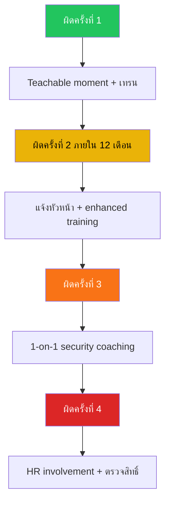

# Security Awareness & Phishing Simulation Program / โปรแกรมจำลอง Phishing

**รหัสเอกสาร**: OPS-SOP-021
**เวอร์ชัน**: 1.0
**การจัดชั้นความลับ**: ใช้ภายใน
**อัปเดตล่าสุด**: 2026-02-15

> โปรแกรมสำหรับ **ทดสอบการตอบสนองของพนักงาน** ต่อ social engineering ผ่านจำลอง phishing จริง, วัดผล, ฝึกอบรมเป้าหมาย, และลดความเสี่ยงมนุษย์

---

## ประเภทการจำลอง

| ประเภท | ความยาก | คำอธิบาย | ความถี่ |
|:---|:---:|:---|:---:|
| **Mass campaign** | 🟢 ง่าย–กลาง | template เดียวส่งทุกคน | รายเดือน |
| **Targeted spear-phish** | 🟠 ยาก | ปรับแต่งตามแผนก/ตำแหน่ง | รายไตรมาส |
| **Vishing (โทรศัพท์)** | 🟠 ยาก | Social engineering ผ่านโทรศัพท์ | ปีละ 2 ครั้ง |
| **Smishing (SMS)** | 🟡 กลาง | SMS/messaging | ปีละ 2 ครั้ง |
| **USB drop** | 🔴 ยากมาก | USB ทิ้งในพื้นที่ส่วนกลาง | รายปี |
| **QR code phish** | 🟡 กลาง | QR ปลอมบนโปสเตอร์/email | รายไตรมาส |
| **BEC simulation** | 🔴 ยากมาก | ปลอม CEO/CFO ขอโอนเงิน | รายไตรมาส |

---

## Checklist ก่อนทำ Campaign

- [ ] กำหนดวัตถุประสงค์และ KPIs
- [ ] เลือกกลุ่มเป้าหมาย
- [ ] เลือกประเภทและความยาก
- [ ] ออกแบบ email template (สมจริง)
- [ ] ตั้งค่า landing page (credential harvest / file download)
- [ ] ตั้งค่า tracking (เปิด, คลิก, กรอก, รายงาน)
- [ ] ได้รับอนุมัติจากผู้บริหาร
- [ ] ประสาน IT (whitelist simulation IPs/domains)
- [ ] กำหนดระยะเวลา (72 ชม.)

---

## ตัวชี้วัดต่อ Campaign

| ตัวชี้วัด | นิยาม | เป้าหมาย |
|:---|:---|:---:|
| **Delivery rate** | ส่งถึง / ส่งทั้งหมด | ≥ 98% |
| **Click rate** | คลิก / ส่งถึง | < 10% |
| **Submission rate** | กรอก credentials / ส่งถึง | < 3% |
| **Report rate** | รายงานเป็น phishing / ส่งถึง | > 30% |
| **Repeat offender rate** | คลิกใน 2+ campaigns | < 5% |

### การคำนวณ Risk Score

```
Risk Score = (Click Rate × 3) + (Submit Rate × 5) − (Report Rate × 2)
```

| ระดับ | Score | Action |
|:---|:---:|:---|
| 🟢 ต่ำ | 0–20 | เทรน standard |
| 🟡 กลาง | 21–40 | Enhanced awareness training |
| 🟠 สูง | 41–60 | บังคับเทรนเพิ่ม + ทดสอบซ้ำ |
| 🔴 วิกฤต | 61+ | 1-on-1 coaching + แจ้งหัวหน้า |

---

## การฝึกอบรมหลังจำลอง

| Tier | เงื่อนไข | เนื้อหา | ระยะ SLA |
|:---|:---|:---|:---:|
| **Tier 0** | พนักงานทุกคน | หลักสูตร awareness ประจำปี | รายปี |
| **Tier 1** | เปิด phishing email | Micro-learning 5 นาที | 7 วัน |
| **Tier 2** | คลิก phishing link | Interactive training 15 นาที | 5 วัน |
| **Tier 3** | กรอก credentials | Deep-dive 30 นาที + quiz | 3 วัน |
| **Tier 4** | ทำผิดซ้ำ (3+ ครั้ง) | 1-on-1 กับทีม security | 5 วัน |

---

## ปฏิทิน Campaign รายปี

| เดือน | ประเภท | Template | ความยาก | เป้าหมาย |
|:---|:---|:---|:---:|:---|
| ม.ค. | Mass | IT: Password reset | 🟢 ง่าย | ทุกคน |
| ก.พ. | Targeted | Finance: Invoice | 🟠 ยาก | Finance |
| มี.ค. | Mass | HR: สวัสดิการ | 🟡 กลาง | ทุกคน |
| เม.ย. | Mass | ภาษี | 🟠 ยาก | ทุกคน |
| พ.ค. | QR Code | QR WiFi poster | 🟡 กลาง | พนักงาน office |
| มิ.ย. | BEC | CEO wire transfer | 🔴 ยากมาก | Finance + EA |
| ก.ค. | Mass | Cloud: Shared document | 🟡 กลาง | ทุกคน |
| ส.ค. | Vishing | IT helpdesk call | 🟠 ยาก | สุ่ม |
| ก.ย. | Mass | Package delivery | 🟢 ง่าย | ทุกคน |
| ต.ค. | Targeted + USB | Cybersecurity month | 🔴 ยากมาก | สุ่ม |
| พ.ย. | Mass | Holiday bonus | 🟡 กลาง | ทุกคน |
| ธ.ค. | Smishing | สวัสดิการสิ้นปี SMS | 🟡 กลาง | ทุกคน |

---

## Repeat Offender Program

### บันไดการ Escalate



---

## Phish Alert Button (PAB)

| ด้าน | รายละเอียด |
|:---|:---|
| **เครื่องมือ** | KnowBe4 PAB / Microsoft Report Message |
| **ตำแหน่ง** | Outlook/Gmail toolbar — เห็นตลอด |
| **เมื่อคลิก** | Forward ไป `phishing@company.com` + ลบ auto |
| **SOC workflow** | ถ้าจำลอง: mark reported, ถ้าจริง: triage |
| **Feedback** | ตอบกลับอัตโนมัติ: "ขอบคุณที่แจ้ง กำลังตรวจสอบ" |

### PAB Metrics

| ตัวชี้วัด | เป้าหมาย |
|:---|:---:|
| PAB installation rate | ≥ 95% |
| Report rate (จำลอง) | ≥ 30% |
| False report rate | < 5% |
| เวลาจาก report ถึง SOC review | < 15 นาที |

---

## เป้าหมายรายปี

| ตัวชี้วัด | เป้าหมาย |
|:---|:---:|
| Click rate เฉลี่ยรายปี | < 10% |
| Submit rate เฉลี่ยรายปี | < 3% |
| Report rate เฉลี่ยรายปี | > 30% |
| Repeat offender rate | < 5% |
| Training completion rate | ≥ 95% |
| ลดลง YoY click rate | > 20% |

---

## ข้อพิจารณาทางกฎหมาย

| หัวข้อ | แนวทาง |
|:---|:---|
| **แจ้งพนักงาน** | แจ้งว่าอาจมีจำลอง (ผ่านนโยบาย ไม่แจ้งเวลา) |
| **ไม่ลงโทษ** | จำลองเพื่อการศึกษา ไม่ใช่ทางวินัย (ยกเว้นทำซ้ำ) |
| **ความเป็นส่วนตัว** | ผลรายบุคคลเป็นความลับ, แชร์เฉพาะรวม |
| **PDPA** | การประมวลผลข้อมูลจำลองแจ้งใน privacy notice |
| **เสริมแรงเชิงบวก** | ชมเชยแผนกที่ report rate สูงสุด |

---

## เทมเพลต Phishing Email

### ระดับ 1 — ง่าย (สังเกตได้ชัด)

| ส่วน | เนื้อหา |
|:---|:---|
| **From** | IT-Support@comp4ny.com (สะกดผิด) |
| **Subject** | ⚠️ รหัสผ่านของคุณจะหมดอายุวันนี้! |
| **Body** | กรุณาคลิกลิงก์ด้านล่างเพื่ออัปเดตรหัสผ่าน |
| **Link** | `http://update-password.fake-domain.com` |
| **Indicators** | Domain ผิด, URL ไม่ใช่ HTTPS, urgency |

### ระดับ 2 — ปานกลาง

| ส่วน | เนื้อหา |
|:---|:---|
| **From** | hr@company-benefits.com (domain คล้าย) |
| **Subject** | อัปเดตสวัสดิการประจำปี 2026 |
| **Body** | เอกสารแนบสำหรับทบทวนสิทธิ์สวัสดิการ |
| **Attachment** | Benefits_2026.pdf.exe (double extension) |
| **Indicators** | External domain, double extension |

### ระดับ 3 — ยาก (Spear Phishing)

| ส่วน | เนื้อหา |
|:---|:---|
| **From** | [ชื่อ CEO]@company.com (spoofed) |
| **Subject** | Re: ด่วน — โอนเงินให้ vendor |
| **Body** | ข้อความต่อจาก thread จริง, มีรายละเอียดบริษัท |
| **Link** | `https://company-portal.attacker.com` |
| **Indicators** | Reply-to ต่าง, unusual request |

## Metrics Dashboard

| ตัวชี้วัด | เดือนที่แล้ว | เดือนนี้ | เป้าหมาย |
|:---|:---:|:---:|:---:|
| Click Rate | [XX]% | [XX]% | < 5% |
| Report Rate | [XX]% | [XX]% | > 60% |
| Credential Submit Rate | [XX]% | [XX]% | < 2% |
| ผ่าน Training | [XX]% | [XX]% | > 90% |

## กำหนดการ Simulation ประจำปี

| เดือน | ระดับ | กลุ่มเป้าหมาย | หัวข้อ |
|:---|:---:|:---|:---|
| ม.ค. | 1 | ทุกคน | Password expiry |
| มี.ค. | 2 | Finance + HR | Invoice/Benefits fraud |
| พ.ค. | 2 | IT + Developer | Malicious repo/package |
| ก.ค. | 3 | C-level + Executives | CEO fraud / BEC |
| ก.ย. | 2 | ทุกคน | Seasonal (tax/bonus) |
| พ.ย. | 3 | High-risk users | Targeted spear phishing |

## เอกสารที่เกี่ยวข้อง

-   [Insider Threat Program](../06_Operations_Management/Insider_Threat_Program.en.md) — ลดความเสี่ยงมนุษย์
-   [Escalation Matrix](../05_Incident_Response/Escalation_Matrix.en.md) — Escalation phishing จริง
-   [SOC Automation Catalog](../06_Operations_Management/SOC_Automation_Catalog.en.md) — Phishing auto-triage
