# Purple Team Exercise Guide

**Document ID**: SIM-SOP-002
**Version**: 1.0
**Classification**: Confidential
**Last Updated**: 2026-02-15

> A **structured guide** for planning, executing, and learning from purple team exercises. Purple teaming combines offensive (Red) and defensive (Blue) teams working **collaboratively** to improve detection, response, and overall security posture.

---

## Purple vs Red vs Blue

| Aspect | Red Team | Blue Team | Purple Team |
|:---|:---|:---|:---|
| **Goal** | Find weaknesses | Defend & detect | Improve together |
| **Approach** | Adversarial, covert | Defensive, reactive | Collaborative, open |
| **Communication** | Minimal (stealth) | After-the-fact | Real-time |
| **Output** | Vulnerability report | Incident reports | Detection improvements |
| **Frequency** | Annual | Continuous | Quarterly |
| **Value** | Realistic testing | Operational defense | Measurable improvement |

---

## Exercise Types

| Type | Duration | Scope | Collaboration | Best For |
|:---|:---:|:---|:---:|:---|
| **Atomic Test** | 1–2 hours | Single technique | Full | Testing one detection rule |
| **Technique Chain** | Half day | 3–5 techniques in sequence | Full | Testing kill chain visibility |
| **Scenario-Based** | 1–2 days | Full attack scenario (APT sim) | Partial/Full | Testing end-to-end detection |
| **Tabletop** | 2–4 hours | Hypothetical discussion | Full | Process & communication testing |
| **Full Simulation** | 1–2 weeks | Enterprise-wide, multi-phase | Minimal (Red covert) | Comprehensive assessment |

---

## Exercise Planning

### Planning Timeline

### Scope Definition Template

| Field | Value |
|:---|:---|
| **Exercise Name** | ______________ |
| **Date** | ____-__-__ |
| **Duration** | _____ hours/days |
| **Type** | Atomic / Chain / Scenario / Tabletop |
| **Objective** | ________________________________________________ |
| **Target Systems** | ________________________________________________ |
| **Out of Scope** | ________________________________________________ |
| **Red Team Lead** | ______________ |
| **Blue Team Lead** | ______________ |
| **Exercise Coordinator** | ______________ |
| **Threat Actor Emulated** | ______________ (APT group or generic) |
| **MITRE Techniques** | T______, T______, T______ |
| **Success Criteria** | ________________________________________________ |
| **Risk Mitigation** | ________________________________________________ |

### Pre-Exercise Checklist

- [ ] Scope and objectives documented and approved
- [ ] MITRE ATT&CK techniques selected
- [ ] Attack infrastructure prepared (C2, payloads, accounts)
- [ ] Test environment validated (staging or isolated prod)
- [ ] Blue team briefed on exercise window (not TTPs)
- [ ] Deconfliction process defined (how to distinguish exercise from real attack)
- [ ] Emergency stop procedure defined
- [ ] Legal/compliance approval (if needed)
- [ ] Baseline detection coverage documented

---

## Technique Selection

### By ATT&CK Tactic (Sample Exercise Plan)

| Round | Tactic | Technique | Procedure | Expected Detection | Tool |
|:---:|:---|:---|:---|:---|:---|
| 1 | Initial Access | T1566.001 Spearphishing | Send email with macro doc | Email gateway + Sysmon event | Gophish |
| 2 | Execution | T1059.001 PowerShell | Encoded PowerShell download cradle | Sysmon 1 + cmdline logging | Manual |
| 3 | Persistence | T1053.005 Scheduled Task | Create scheduled task for persistence | Sysmon 1 + Event 4698 | Manual |
| 4 | Defense Evasion | T1055.001 Process Injection | DLL injection into explorer.exe | Sysmon 8, 10 + EDR | Custom tool |
| 5 | Credential Access | T1003.001 LSASS Dump | Dump LSASS with ProcDump | Sysmon 10 + EDR alert | ProcDump |
| 6 | Discovery | T1087.002 Domain Account | query domain admins via net group | Sysmon 1 + cmdline | Manual |
| 7 | Lateral Movement | T1021.002 SMB/Admin Share | Copy file to remote admin share | SMB logging + EDR | Manual |
| 8 | Collection | T1560.001 Archive Data | Compress sensitive files with 7zip | Sysmon 1 + file monitoring | 7zip |
| 9 | Exfiltration | T1567.002 Cloud Storage | Upload to cloud storage service | Proxy/firewall + DLP | rclone |
| 10 | Impact | T1486 Data Encryption | Encrypt test files (ransomware sim) | EDR + file monitoring | SafeRansomSim |

### Prioritization Matrix

| Priority | Criteria | Example |
|:---:|:---|:---|
| 🔴 **P1** | Techniques used by threat actors targeting your industry | APT groups from threat landscape report |
| 🟠 **P2** | Techniques with no current detection coverage | ATT&CK Navigator gaps |
| 🟡 **P3** | Techniques with partial/untested detection | Rules exist but never validated |
| 🟢 **P4** | Techniques for general awareness | Emerging TTPs from advisories |

---

## Execution Framework

### Round-by-Round Format

```mermaid
sequenceDiagram
    participant Red as 🔴 Red Team
    participant Coord as 🟣 Coordinator
    participant Blue as 🔵 Blue Team

    Coord->>Red: Brief: Execute Technique T1059.001
    Red->>Red: Execute attack procedure
    Coord->>Blue: "Did you see anything?" (wait 5 min)
    
    alt Detected
        Blue->>Coord: Yes — alert fired, analyst investigated
        Coord->>Coord: Record: ✅ Detected
    else Partially Detected
        Blue->>Coord: Event logged but no alert
        Coord->>Coord: Record: ⚠️ Partial
        Red->>Blue: Show exact procedure & artifacts
        Blue->>Blue: Create/tune detection rule
    else Not Detected
        Blue->>Coord: Nothing seen
        Coord->>Coord: Record: ❌ Missed
        Red->>Blue: Show exact procedure & artifacts
        Blue->>Blue: Create new detection rule
    end
    
    Coord->>Coord: Move to next round
```

### Execution Log Template

| Round | Time | Technique | Procedure | Red Team Action | Blue Team Result | Detection Status | Notes |
|:---:|:---|:---|:---|:---|:---|:---:|:---|
| 1 | __:__ | T______.___ | ____________ | ____________ | ____________ | ✅/⚠️/❌ | ____________ |
| 2 | __:__ | T______.___ | ____________ | ____________ | ____________ | ✅/⚠️/❌ | ____________ |
| 3 | __:__ | T______.___ | ____________ | ____________ | ____________ | ✅/⚠️/❌ | ____________ |

### Detection Status Definitions

| Status | Meaning | Action Required |
|:---:|:---|:---|
| ✅ **Detected** | Alert fired, analyst correctly triaged | Document as validated detection |
| ⚠️ **Partial** | Event logged but no alert, or alert with wrong severity | Tune existing rule or create new alert |
| ❌ **Missed** | No log, no event, no alert | Create new log source + detection rule |
| 🔄 **Bypassed** | Detection exists but was evaded | Research evasion technique, improve rule |

---

## Tools & Infrastructure

### Red Team Tools (Open Source)

| Tool | Purpose | ATT&CK Mapping |
|:---|:---|:---|
| **Atomic Red Team** | Pre-built atomic tests for each technique | All tactics |
| **CALDERA** | Automated adversary emulation platform | All tactics |
| **Sliver** | Open source C2 framework | C2, Execution |
| **Impacket** | Network protocol attacks | Lateral Movement, Credential Access |
| **Mimikatz** | Credential dumping | Credential Access |
| **BloodHound** | AD attack path mapping | Discovery |
| **CrackMapExec** | Active Directory exploitation | Multiple |
| **Gophish** | Phishing simulation | Initial Access |

### Blue Team Tools

| Tool | Purpose |
|:---|:---|
| **SIEM** | Alert monitoring, log analysis |
| **EDR Console** | Endpoint detection review |
| **ATT&CK Navigator** | Coverage mapping & gap tracking |
| **Sigma** | Detection rule library |
| **Velociraptor** | Live forensics during exercise |

### Safety Controls

| Control | Description |
|:---|:---|
| **Deconfliction code** | Unique tag in all exercise traffic/files for identification |
| **Emergency stop** | Coordinator can halt exercise immediately |
| **Scope limits** | No production data destruction, no external egress |
| **Test accounts** | Dedicated accounts for exercise only |
| **Rollback plan** | How to undo all changes post-exercise |

---

## Post-Exercise Analysis

### Results Summary Template

| Metric | Value |
|:---|:---:|
| **Total techniques tested** | _____ |
| **Detected (✅)** | _____ (___%) |
| **Partially detected (⚠️)** | _____ (___%) |
| **Missed (❌)** | _____ (___%) |
| **Bypassed (🔄)** | _____ (___%) |
| **New detection rules created** | _____ |
| **Existing rules tuned** | _____ |
| **Log source gaps identified** | _____ |
| **MTTR during exercise** | ___ min |

### Detection Coverage: Before vs After

| Tactic | Before (%) | After (%) | Improvement |
|:---|:---:|:---:|:---:|
| Initial Access | ___% | ___% | +___% |
| Execution | ___% | ___% | +___% |
| Persistence | ___% | ___% | +___% |
| Privilege Escalation | ___% | ___% | +___% |
| Defense Evasion | ___% | ___% | +___% |
| Credential Access | ___% | ___% | +___% |
| Discovery | ___% | ___% | +___% |
| Lateral Movement | ___% | ___% | +___% |
| Collection | ___% | ___% | +___% |
| C2 | ___% | ___% | +___% |
| Exfiltration | ___% | ___% | +___% |
| Impact | ___% | ___% | +___% |

### Action Items

| # | Finding | Technique | Action | Owner | Due Date | Status |
|:---:|:---|:---|:---|:---|:---:|:---:|
| 1 | ______________ | T______ | Create detection rule | ____________ | ____-__-__ | ⬜ |
| 2 | ______________ | T______ | Add log source | ____________ | ____-__-__ | ⬜ |
| 3 | ______________ | T______ | Tune existing rule | ____________ | ____-__-__ | ⬜ |

---

## Exercise Schedule

| Quarter | Exercise Type | Threat Actor / Focus | Techniques |
|:---:|:---|:---|:---:|
| Q1 | Technique Chain | Ransomware Kill Chain | 8–10 |
| Q2 | Scenario-Based | APT targeting your industry | 10–15 |
| Q3 | Atomic Tests | Detection gap remediation | 15–20 |
| Q4 | Full Simulation | Annual comprehensive assessment | 20+ |

> Each exercise should build on findings from the previous one.

---

## Metrics & Maturity

| Metric | Level 1 | Level 3 | Level 5 |
|:---|:---|:---|:---|
| Exercise frequency | Annual | Quarterly | Monthly |
| Detection rate | < 30% | 50–70% | > 85% |
| Time to create new detection | > 1 week | < 3 days | < 4 hours |
| SOC analysts involved | 1–2 | Full shift | All tiers |
| Automation of testing | None | Some (Atomic RT) | Full (CALDERA + BAS) |

---

## Related Documents

-   [Simulation & Testing Guide](../08_Simulation_Testing/Simulation_Guide.en.md) — Testing procedures
-   [Detection Rule Testing](../06_Operations_Management/Detection_Rule_Testing.en.md) — Rule validation
-   [Alert Tuning SOP](../06_Operations_Management/Alert_Tuning.en.md) — Tuning methodology
-   [SOC Maturity Assessment](../06_Operations_Management/SOC_Maturity_Assessment.en.md) — Detection maturity
-   [Threat Hunting Playbook](../05_Incident_Response/Threat_Hunting_Playbook.en.md) — Proactive hunting
-   [SOC Automation Catalog](../06_Operations_Management/SOC_Automation_Catalog.en.md) — Automation
-   [Threat Landscape Report](../06_Operations_Management/Threat_Landscape_Report.en.md) — Threat context
