# Purple Team Exercise Guide / คู่มือ Purple Team Exercise

**รหัสเอกสาร**: SIM-SOP-002
**เวอร์ชัน**: 1.0
**การจัดชั้นความลับ**: ลับ
**อัปเดตล่าสุด**: 2026-02-15

> คู่มือสำหรับวางแผน, ดำเนินการ, และเรียนรู้จาก purple team exercises ซึ่งรวมทีมบุกรุก (Red) และทีมป้องกัน (Blue) ทำงาน **ร่วมกัน** เพื่อพัฒนา detection, response, และ security posture

---

## Purple vs Red vs Blue

| ด้าน | Red Team | Blue Team | Purple Team |
|:---|:---|:---|:---|
| **เป้าหมาย** | หาจุดอ่อน | ป้องกัน & ตรวจจับ | พัฒนาร่วมกัน |
| **แนวทาง** | โจมตี, ลับ | ป้องกัน, reactive | ร่วมมือ, เปิดเผย |
| **สื่อสาร** | น้อยที่สุด | หลังเกิดเหตุ | Real-time |
| **ความถี่** | รายปี | ต่อเนื่อง | รายไตรมาส |

---

## ประเภท Exercise

| ประเภท | ระยะเวลา | ขอบเขต | ความร่วมมือ | เหมาะกับ |
|:---|:---:|:---|:---:|:---|
| **Atomic Test** | 1–2 ชม. | Technique เดียว | เต็มที่ | ทดสอบ detection rule เดียว |
| **Technique Chain** | ครึ่งวัน | 3–5 techniques ต่อเนื่อง | เต็มที่ | ทดสอบ kill chain visibility |
| **Scenario-Based** | 1–2 วัน | สถานการณ์โจมตีเต็มรูปแบบ | บางส่วน/เต็มที่ | ทดสอบ detection ครบวงจร |
| **Tabletop** | 2–4 ชม. | อภิปรายสถานการณ์สมมติ | เต็มที่ | ทดสอบกระบวนการ & สื่อสาร |
| **Full Simulation** | 1–2 สัปดาห์ | ทั้งองค์กร, หลายเฟส | น้อย (Red ลับ) | ประเมินครอบคลุม |

---

## การวางแผน

### Template กำหนดขอบเขต

| ฟิลด์ | ค่า |
|:---|:---|
| **ชื่อ Exercise** | ______________ |
| **วันที่** | ____-__-__ |
| **ระยะเวลา** | _____ ชม./วัน |
| **ประเภท** | Atomic / Chain / Scenario / Tabletop |
| **วัตถุประสงค์** | ________________________________________________ |
| **ระบบเป้าหมาย** | ________________________________________________ |
| **นอกขอบเขต** | ________________________________________________ |
| **Red Team Lead** | ______________ |
| **Blue Team Lead** | ______________ |
| **MITRE Techniques** | T______, T______, T______ |

### Checklist ก่อน Exercise

- [ ] ขอบเขตและวัตถุประสงค์ได้รับอนุมัติ
- [ ] เลือก ATT&CK techniques แล้ว
- [ ] เตรียม infrastructure สำหรับโจมตี
- [ ] แจ้ง Blue team เรื่องช่วงเวลา (ไม่บอก TTPs)
- [ ] กำหนดกระบวนการแยกแยะ exercise กับ attack จริง
- [ ] กำหนดวิธีหยุดฉุกเฉิน
- [ ] อนุมัติจากกฎหมาย/compliance (ถ้าจำเป็น)

---

## การเลือก Technique

### แผน Exercise ตัวอย่าง (10 รอบ)

| รอบ | Tactic | Technique | เครื่องมือ | Detection ที่คาดหวัง |
|:---:|:---|:---|:---|:---|
| 1 | Initial Access | T1566.001 Phishing | Gophish | Email gateway + Sysmon |
| 2 | Execution | T1059.001 PowerShell | Manual | Sysmon 1 + cmdline |
| 3 | Persistence | T1053.005 Scheduled Task | Manual | Sysmon 1 + Event 4698 |
| 4 | Defense Evasion | T1055.001 Process Injection | Custom | Sysmon 8, 10 + EDR |
| 5 | Credential Access | T1003.001 LSASS Dump | ProcDump | Sysmon 10 + EDR |
| 6 | Discovery | T1087.002 Domain Account | Manual | Sysmon 1 + cmdline |
| 7 | Lateral Movement | T1021.002 SMB Share | Manual | SMB logging + EDR |
| 8 | Collection | T1560.001 Archive Data | 7zip | Sysmon 1 + file monitor |
| 9 | Exfiltration | T1567.002 Cloud Storage | rclone | Proxy/firewall + DLP |
| 10 | Impact | T1486 Encryption | SafeRansomSim | EDR + file monitor |

---

## Framework การดำเนินการ

### รูปแบบรอบต่อรอบ

```mermaid
sequenceDiagram
    participant Red as 🔴 Red Team
    participant Coord as 🟣 Coordinator
    participant Blue as 🔵 Blue Team

    Coord->>Red: สั่งให้ทำ Technique T1059.001
    Red->>Red: ดำเนินการโจมตี
    Coord->>Blue: เห็นอะไรไหม? (รอ 5 นาที)
    
    alt ตรวจพบ
        Blue->>Coord: ใช่ — alert ขึ้น, analyst สืบสวนแล้ว
        Coord->>Coord: บันทึก: ✅ ตรวจพบ
    else ตรวจพบบางส่วน
        Blue->>Coord: มี event แต่ไม่มี alert
        Coord->>Coord: บันทึก: ⚠️ บางส่วน
        Blue->>Blue: สร้าง/ปรับ detection rule
    else ไม่พบ
        Blue->>Coord: ไม่เห็นอะไร
        Coord->>Coord: บันทึก: ❌ พลาด
        Blue->>Blue: สร้าง detection rule ใหม่
    end
```



### บันทึกการดำเนินการ

| รอบ | เวลา | Technique | สถานะ Detection | หมายเหตุ |
|:---:|:---|:---|:---:|:---|
| 1 | __:__ | T______.___ | ✅/⚠️/❌ | ____________ |
| 2 | __:__ | T______.___ | ✅/⚠️/❌ | ____________ |

### ความหมายสถานะ

| สถานะ | ความหมาย | ต้องทำ |
|:---:|:---|:---|
| ✅ **ตรวจพบ** | Alert ขึ้น, analyst triage ถูกต้อง | บันทึกเป็น validated detection |
| ⚠️ **บางส่วน** | มี log แต่ไม่มี alert | ปรับ rule หรือสร้าง alert ใหม่ |
| ❌ **พลาด** | ไม่มี log, ไม่มี event | สร้าง log source + detection rule |
| 🔄 **Bypass** | มี detection แต่ถูกหลบ | วิจัยเทคนิค evasion, ปรับ rule |

---

## เครื่องมือ

### Red Team (Open Source)

| เครื่องมือ | วัตถุประสงค์ |
|:---|:---|
| **Atomic Red Team** | ทดสอบแบบ atomic ตาม ATT&CK |
| **CALDERA** | Adversary emulation อัตโนมัติ |
| **Sliver** | C2 framework |
| **Impacket** | โจมตี network protocol |
| **BloodHound** | Mapping AD attack path |

### การควบคุมความปลอดภัย

| การควบคุม | คำอธิบาย |
|:---|:---|
| **Deconfliction code** | Tag เฉพาะใน traffic/file ของ exercise |
| **Emergency stop** | Coordinator หยุดได้ทันที |
| **Scope limits** | ห้ามทำลายข้อมูล production |
| **Test accounts** | ใช้ account เฉพาะ exercise |
| **Rollback plan** | วิธีย้อนเปลี่ยนแปลงหลัง exercise |

---

## การวิเคราะห์หลัง Exercise

### สรุปผลลัพธ์

| ตัวชี้วัด | ค่า |
|:---|:---:|
| Techniques ทดสอบทั้งหมด | _____ |
| ตรวจพบ (✅) | _____ (___%) |
| ตรวจพบบางส่วน (⚠️) | _____ (___%) |
| พลาด (❌) | _____ (___%) |
| Detection rules ใหม่ที่สร้าง | _____ |
| Rules ที่ปรับปรุง | _____ |

### Coverage: ก่อน vs หลัง

| Tactic | ก่อน (%) | หลัง (%) | เพิ่มขึ้น |
|:---|:---:|:---:|:---:|
| Initial Access | ___% | ___% | +___% |
| Execution | ___% | ___% | +___% |
| Persistence | ___% | ___% | +___% |
| Credential Access | ___% | ___% | +___% |
| Lateral Movement | ___% | ___% | +___% |
| Exfiltration | ___% | ___% | +___% |

---

## ตาราง Exercise

| ไตรมาส | ประเภท | Focus | จำนวน Techniques |
|:---:|:---|:---|:---:|
| Q1 | Technique Chain | Ransomware Kill Chain | 8–10 |
| Q2 | Scenario-Based | APT ที่เจาะอุตสาหกรรมเรา | 10–15 |
| Q3 | Atomic Tests | แก้ไข detection gaps | 15–20 |
| Q4 | Full Simulation | ประเมินครอบคลุมประจำปี | 20+ |

---

## Detection Gap Remediation

| Gap ที่พบ | ประเภท | วิธีแก้ | เวลา |
|:---|:---|:---|:---:|
| ไม่มี rule สำหรับ technique | Rule gap | สร้าง Sigma rule | 1–2 วัน |
| Rule มีแต่ไม่ trigger | Logic error | ปรับ threshold/condition | 0.5 วัน |
| Log ไม่ครอบคลุม | Data gap | เพิ่ม log source | 3–5 วัน |
| Alert ถูก suppress | Tuning error | ทบทวน suppression list | 0.5 วัน |
| ไม่มี playbook | Process gap | สร้าง playbook | 2–3 วัน |

## Atomic Test Execution Workflow

```mermaid
graph LR
    Select["เลือก Technique"] --> Prep["เตรียม Lab"]
    Prep --> Notify["แจ้ง SOC"]
    Notify --> Execute["รัน Test"]
    Execute --> Observe["สังเกต Detection"]
    Observe --> Document["บันทึกผล"]
    Document --> Gap["วิเคราะห์ Gap"]
    Gap --> Fix["สร้าง/ปรับ Rule"]
    Fix --> Retest["ทดสอบซ้ำ"]
```



## Safety Guidelines

| ✅ ควรทำ | ❌ ไม่ควรทำ |
|:---|:---|
| แจ้ง SOC ล่วงหน้า + ระบุ window | รัน test โดยไม่แจ้ง |
| ใช้ test accounts/hosts เท่านั้น | ใช้ production accounts |
| มี rollback plan ก่อนเริ่ม | รัน destructive tests โดยไม่มี backup |
| บันทึกทุก step ที่ทำ | ลืมทำ cleanup หลังทดสอบ |
| จำกัดขอบเขตตาม scope | ขยายขอบเขตโดยไม่ได้รับอนุมัติ |

## Report Template Summary

| เกณฑ์ | Red Team | Blue Team | Purple (ร่วมกัน) |
|:---|:---|:---|:---|
| **Techniques ทดสอบ** | [จำนวน] | – | [จำนวน] |
| **ตรวจจับได้** | – | [จำนวน]/[ทั้งหมด] | Detection Rate: [XX]% |
| **Gaps** | – | [จำนวน] | Priority: [P1/P2/P3] |
| **Rules สร้างใหม่** | – | [จำนวน] | ETA Deploy: [วันที่] |

## MITRE ATT&CK Coverage by Exercise

### Exercise Scenario Template

| Phase | Tactic | Technique | Tool |
|:---|:---|:---|:---|
| 1 | Initial Access | T1566.001 Phishing | GoPhish |
| 2 | Execution | T1059.001 PowerShell | Atomic RT |
| 3 | Persistence | T1053.005 Schtask | Manual |
| 4 | Privilege Esc | T1548.002 UAC Bypass | Metasploit |
| 5 | Defense Evasion | T1070.001 Log Clear | Manual |
| 6 | Credential Access | T1003 Mimikatz | Mimikatz |
| 7 | Lateral Movement | T1021.002 SMB | PsExec |
| 8 | Collection | T1074.001 Staging | Manual |
| 9 | Exfiltration | T1048 C2 Channel | Cobalt Strike |

### Exercise After-Action Report Template

```
## After-Action Report
- Exercise Date: [วันที่]
- Participants: Red [N], Blue [N], White [N]
- Duration: [ชั่วโมง]
- Techniques Tested: [จำนวน]
- Techniques Detected: [จำนวน] ([%])
- Detection Gaps: [รายละเอียด]
- New Rules Created: [จำนวน]
- Remediation Actions: [รายการ]
```

### Exercise Budget Planning

| Item | Cost Estimate | Notes |
|:---|:---|:---|
| Tooling (annual) | 200K-500K THB | Licenses |
| External Red Team | 300K-1M THB | Per engagement |
| Lab environment | 100K-300K THB | VMs + network |
| Training | 50K-150K THB | Per person |

### Exercise Complexity Levels

| Level | Duration | Techniques |
|:---|:---|:---|
| Basic | 1 day | 3-5 |
| Intermediate | 3 days | 8-12 |
| Advanced | 1-2 weeks | 15-20 |

## เอกสารที่เกี่ยวข้อง

-   [Simulation & Testing Guide](../08_Simulation_Testing/Simulation_Guide.en.md)
-   [Detection Rule Testing](../06_Operations_Management/Detection_Rule_Testing.en.md)
-   [Alert Tuning SOP](../06_Operations_Management/Alert_Tuning.en.md)
-   [SOC Maturity Assessment](../06_Operations_Management/SOC_Maturity_Assessment.en.md)
-   [Threat Hunting Playbook](../05_Incident_Response/Threat_Hunting_Playbook.en.md)
