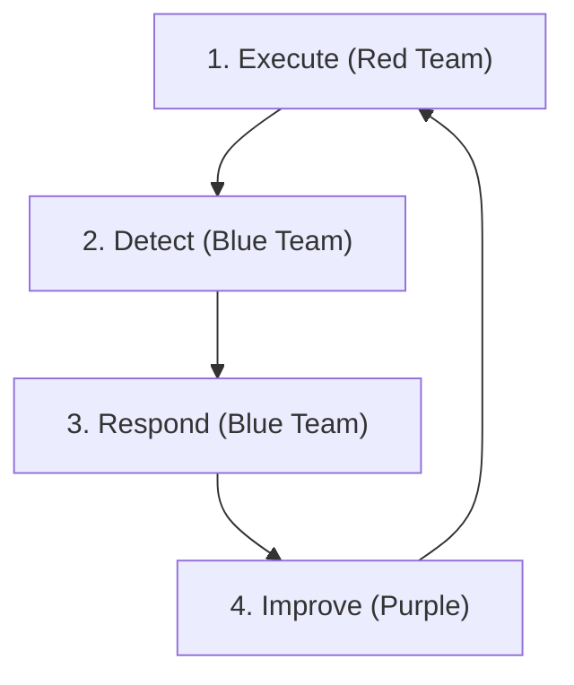

# Simulation & Purple Teaming Guide

This guide explains how to conduct a **Purple Team Exercise** (Red Team Attacks + Blue Team Defends) to validate the SOC's readiness using the provided Playbooks and Detection Rules.

## Prerequisites
1.  **Test Environment**: A dedicated VM or Lab (Do NOT run in Production).
2.  **Tools**:
    -   **Atomic Red Team**: For executing attacks.
    -   **Caldera** (Optional): For automated campaigns.
    -   **SIEM**: To view alerts.

## Execution Workflow (The Feedback Loop)



### Step 1: Execute (Red)
Run the Atomic Test corresponding to the Playbook you want to test.
*Example (Phishing)*:
```powershell
Invoke-AtomicTest T1059.001
```

### Step 2: Detect (Blue)
Check the SIEM Dashboard.
-   **Did the alert trigger?** (Check `proc_office_spawn_powershell.yml` logic).
-   **Was the severity correct?**
-   **Was all context captured?** (User, Host, Command Line).

### Step 3: Respond (Blue)
Open the Playbook (**PB-01 Phishing**).
-   Follow the steps: Analyze -> Contain -> Eradicate.
-   **Gap Analysis**: Did the playbook miss any steps? Was the containment tool (EDR) effective?

### Step 4: Improve (Purple)
-   **Tune Rule**: If alert didn't fire, adjust the Sigma rule.
-   **Update Playbook**: Add missing steps found during the drill.

## Schedule
Recommended Validation Schedule:
-   **Weekly**: Test 1 high-priority Playbook (Ransomware, Phishing).
-   **Monthly**: Test 3-5 random Playbooks.
-   **Quarterly**: Full Chain simulation (Phishing -> Lateral Mov -> Exfil).

## Test Coverage Matrix

| MITRE Tactic | Playbook(s) | Atomic Test(s) | Sigma Rule(s) | Last Tested | Result |
| :--- | :--- | :--- | :--- | :--- | :--- |
| Initial Access | PB-01 Phishing | T1566.001 | cloud_email_inbox_rule | [Date] | [Pass/Fail] |
| Execution | PB-11 Suspicious Script | T1059.001 | proc_powershell_encoded | [Date] | [Pass/Fail] |
| Persistence | PB-05 Account Compromise | T1078 | cloud_unusual_login | [Date] | [Pass/Fail] |
| Privilege Escalation | PB-06 Privilege Escalation | T1068 | win_domain_admin_group_add | [Date] | [Pass/Fail] |
| Defense Evasion | PB-20 Log Clearing | T1070.001 | win_security_log_cleared | [Date] | [Pass/Fail] |
| Credential Access | PB-04 Brute Force | T1110 | win_multiple_failed_logins | [Date] | [Pass/Fail] |
| Discovery | PB-34 Network Discovery | T1046/T1135 | win_network_discovery | [Date] | [Pass/Fail] |
| Lateral Movement | PB-09 Lateral Movement | T1021.002 | win_admin_share_access | [Date] | [Pass/Fail] |
| Collection | PB-35 Data Collection | T1560 | win_data_collection_staging | [Date] | [Pass/Fail] |
| Exfiltration | PB-08 Data Exfiltration | T1041 | net_large_upload | [Date] | [Pass/Fail] |
| C2 | PB-07 C2 Communication | T1071 | net_beaconing | [Date] | [Pass/Fail] |
| Impact | PB-02 Ransomware | T1486 | file_bulk_renaming | [Date] | [Pass/Fail] |

## Scoring Criteria

| Score | Definition | Action Required |
| :---: | :--- | :--- |
| ✅ **Pass** | Alert triggered within SLA, correct severity, full context captured | Log result, schedule re-test |
| ⚠️ **Partial** | Alert triggered but delay/missing context/wrong severity | Tune Sigma rule + update playbook |
| ❌ **Fail** | No alert triggered or completely missed | Create/fix Sigma rule, escalate gap |

## Exercise Report Template

After each exercise, document:

1. **Exercise Summary**: Date, scope, participants, techniques tested
2. **Detection Results**: Per-technique pass/partial/fail results
3. **Response Effectiveness**: Playbook steps followed, gaps identified
4. **Gap Analysis**: Missing detections, slow response, tool limitations
5. **Remediation Plan**: Sigma rule updates, playbook amendments, tool improvements
6. **Timeline**: Target dates for completing remediation items

## Common Pitfalls

| Pitfall | Mitigation |
| :--- | :--- |
| Running tests in production | Always use dedicated lab/sandbox environment |
| No change control approval | Submit RFC before any simulation exercise |
| Testing without monitoring | Ensure SIEM, EDR, and network monitors are active |
| Skipping cleanup | Always reverse changes after test completion |
| No documentation of results | Use the report template above for every exercise |

## Related Documents
-   [Atomic Test Map](Atomic_Test_Map.en.md)
-   [Incident Response Framework](../05_Incident_Response/Framework.en.md)
-   [Detection Engineering Lifecycle](../03_User_Guides/Content_Management.en.md)

## References
-   [Atomic Red Team](https://github.com/redcanaryco/atomic-red-team)
-   [MITRE ATT&CK](https://attack.mitre.org/)
