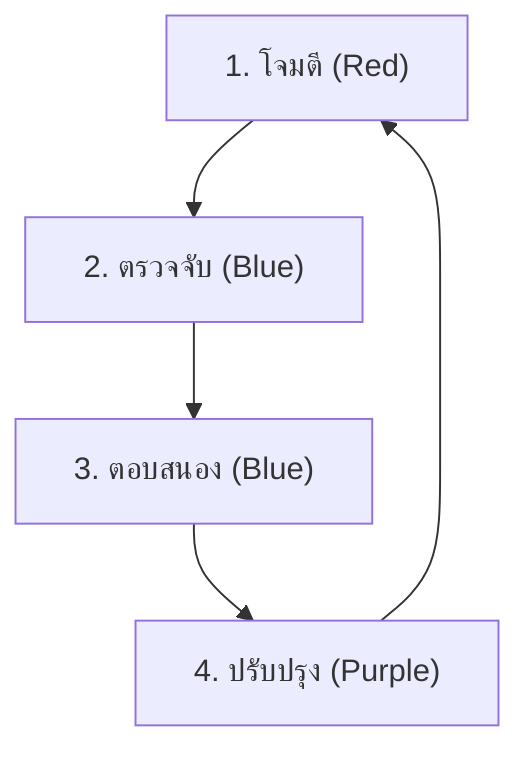

# คู่มือ Simulation & Purple Teaming

คู่มือนี้อธิบายวิธีทำ **Purple Team Exercise** (Red Team โจมตี + Blue Team ป้องกัน) เพื่อทดสอบความพร้อมของ SOC

## สิ่งที่ต้องมี
1. **สภาพแวดล้อมทดสอบ**: VM หรือ Lab เฉพาะ (ห้ามรันใน Production)
2. **เครื่องมือ**:
   - **Atomic Red Team**: สำหรับจำลองการโจมตี
   - **Caldera** (ตัวเลือก): สำหรับ campaign อัตโนมัติ
   - **SIEM**: สำหรับดู alert

## วงจรการทำงาน (Feedback Loop)



### ขั้นตอน 1: โจมตี (Red)
รัน Atomic Test ที่ตรงกับ Playbook ที่ต้องการทดสอบ
```powershell
Invoke-AtomicTest T1059.001
```

### ขั้นตอน 2: ตรวจจับ (Blue)
ตรวจ SIEM Dashboard:
- Alert trigger ไหม?
- Severity ถูกต้องไหม?
- มี context ครบไหม? (User, Host, Command Line)

### ขั้นตอน 3: ตอบสนอง (Blue)
เปิด Playbook แล้วทำตาม:
- วิเคราะห์ → Contain → กำจัด
- **Gap Analysis**: Playbook ขาดขั้นตอนอะไรไหม?

### ขั้นตอน 4: ปรับปรุง (Purple)
- **Tune Rule**: ถ้า alert ไม่ fire → ปรับ Sigma rule
- **Update Playbook**: เพิ่มขั้นตอนที่พบว่าขาด

## ตารางเวลาแนะนำ
- **รายสัปดาห์**: ทดสอบ 1 Playbook สำคัญ (Ransomware, Phishing)
- **รายเดือน**: ทดสอบ 3–5 Playbooks แบบสุ่ม
- **รายไตรมาส**: จำลอง full chain (Phishing → Lateral Mov → Exfil)

## ตารางครอบคลุมการทดสอบ

| MITRE Tactic | Playbook | Atomic Test | Sigma Rule | ผลลัพธ์ |
|:---|:---|:---|:---|:---|
| Initial Access | PB-01 Phishing | T1566.001 | cloud_email_inbox_rule | [ผ่าน/ไม่ผ่าน] |
| Execution | PB-11 Suspicious Script | T1059.001 | proc_powershell_encoded | [ผ่าน/ไม่ผ่าน] |
| Privilege Escalation | PB-06 | T1068 | win_domain_admin_group_add | [ผ่าน/ไม่ผ่าน] |
| Defense Evasion | PB-20 Log Clearing | T1070.001 | win_security_log_cleared | [ผ่าน/ไม่ผ่าน] |
| Lateral Movement | PB-09 | T1021.002 | win_admin_share_access | [ผ่าน/ไม่ผ่าน] |
| Exfiltration | PB-08 | T1041 | net_large_upload | [ผ่าน/ไม่ผ่าน] |
| Impact | PB-02 Ransomware | T1486 | file_bulk_renaming | [ผ่าน/ไม่ผ่าน] |

## เกณฑ์การให้คะแนน

| คะแนน | คำจำกัดความ | การดำเนินการ |
|:---:|:---|:---|
| ✅ **ผ่าน** | แจ้งเตือนภายใน SLA, ระดับความรุนแรงถูกต้อง | บันทึกผลลัพธ์ |
| ⚠️ **บางส่วน** | แจ้งเตือนแต่ล่าช้า/ขาดบริบท | ปรับ Sigma rule + อัปเดต Playbook |
| ❌ **ไม่ผ่าน** | ไม่มีแจ้งเตือน | สร้าง/แก้ไข Sigma rule |

## ข้อผิดพลาดที่พบบ่อย

| ข้อผิดพลาด | วิธีป้องกัน |
|:---|:---|
| รันในระบบ Production | ใช้สภาพแวดล้อม Lab/Sandbox เท่านั้น |
| ไม่มีการอนุมัติ Change Control | ยื่น RFC ก่อนทำ Simulation |
| ทดสอบโดยไม่เปิด Monitoring | ตรวจสอบว่า SIEM, EDR ทำงานอยู่ |
| ไม่ทำ Cleanup หลังทดสอบ | ย้อนกลับการเปลี่ยนแปลงทุกครั้ง |

### Safety Protocols

| Rule | Description | Enforcement |
|:---|:---|:---|
| No production data | ใช้ synthetic data only | Pre-check |
| Kill switch | หยุดได้ทันที | White team |
| Scope boundary | ห้ามเกิน scope | ROE document |
| Time window | ในเวลาที่กำหนดเท่านั้น | Calendar |
| Communication | แจ้ง NOC ก่อนเริ่ม | Email + Chat |

### Post-Simulation Debrief Agenda

| เวลา | หัวข้อ | ผู้นำ |
|:---|:---|:---|
| 0-10 min | Overview + timeline | Facilitator |
| 10-25 min | Attack narrative | Red team |
| 25-40 min | Detection narrative | Blue team |
| 40-55 min | Gap analysis | All |
| 55-60 min | Action items | Facilitator |

## เอกสารที่เกี่ยวข้อง
- [Atomic Test Map](Atomic_Test_Map.en.md)
- [IR Framework](../05_Incident_Response/Framework.th.md)
- [Detection Engineering](../03_User_Guides/Content_Management.th.md)
