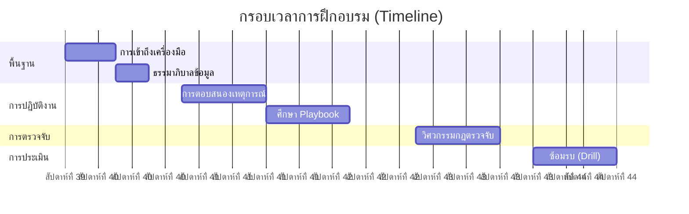

# หลักสูตรการฝึกอบรมเจ้าหน้าที่ SOC (หลักสูตร 4 สัปดาห์)

ยินดีต้อนรับสู่ศูนย์ปฏิบัติการความปลอดภัย (SOC) โปรแกรมนี้ออกแบบมาเพื่อให้คุณพร้อมปฏิบัติงานจริงภายใน 4 สัปดาห์

## สัปดาห์ที่ 1: พื้นฐาน (Infrastructure & Governance)
**เป้าหมาย**: เข้าใจว่าเราทำงาน *ที่ไหน* และปกป้อง *อะไร*

-   **วันที่ 1: การปฐมนิเทศและการเข้าถึงระบบ**
    -   อ่าน: [System Activation](../01_Onboarding/System_Activation.th.md) - ทำความเข้าใจ Stack ของเรา (SIEM, EDR, SOAR)
    -   งาน: ตรวจสอบสิทธิ์การเข้าถึง Dashboard ทั้งหมด
-   **วันที่ 2: ข้อมูลและความเป็นส่วนตัว**
    -   อ่าน: [Data Governance](../02_Platform_Operations/Database_Management.th.md) - เรียนรู้ประเภทข้อมูล (Restricted vs Public)
    -   งาน: ระบุตำแหน่งที่เก็บข้อมูล "Critical" ใน SIEM
-   **วันที่ 3: การจัดการการเปลี่ยนแปลง**
    -   อ่าน: [Deployment Procedures](../02_Platform_Operations/Deployment_Procedures.th.md) - เรียนรู้วิธีการ Deploy (RFC/CAB)
    -   อ่าน: [แบบฟอร์ม - Change Request](../templates/change_request_rfc.th.md)

## สัปดาห์ที่ 2: การรับมือภัยคุกคาม (Incident Response)
**เป้าหมาย**: เรียนรู้วิธีจัดการกับ Alert โดยใช้ Playbook มาตรฐาน

-   **วันที่ 1: กรอบการทำงาน**
    -   อ่าน: [Incident Response Framework](../05_Incident_Response/Framework.th.md) - วงจรชีวิตตาม NIST
    -   อ่าน: [แบบฟอร์ม - Incident Report](../templates/incident_report.th.md)
-   **วันที่ 2: Playbook หลัก (Identity)**
    -   อ่าน: [PB-01 Phishing](../05_Incident_Response/Playbooks/Phishing.th.md)
    -   อ่าน: [PB-04 Brute Force](../05_Incident_Response/Playbooks/Brute_Force.th.md)
-   **วันที่ 3: Playbook หลัก (Endpoint)**
    -   อ่าน: [PB-02 Ransomware](../05_Incident_Response/Playbooks/Ransomware.th.md)
    -   อ่าน: [PB-03 Malware](../05_Incident_Response/Playbooks/Malware_Infection.th.md)

## สัปดาห์ที่ 3: วิศวกรรมการตรวจจับ (Detection Engineering)
**เป้าหมาย**: เข้าใจว่า Alert ทำงานอย่างไรและปรับจูนอย่างไร

-   **วันที่ 1: วงจรชีวิต**
    -   อ่าน: [Content Management](../03_User_Guides/Content_Management.th.md) - วิธีสร้างกฎ
-   **วันที่ 2: Sigma Rules**
    -   สำรวจ: `07_Detection_Rules/` - ดูไฟล์ YAML
    -   งาน: เปรียบเทียบ `proc_office_spawn_powershell.yml` กับ **PB-01**

## สัปดาห์ที่ 4: การจำลองและตรวจสอบ (Purple Team)
**เป้าหมาย**: พิสูจน์ทักษะของคุณโดยการป้องกันการโจมตีจำลอง

-   **วันที่ 1: เครื่องมือทดสอบ**
    -   อ่าน: [Simulation Guide](../08_Simulation_Testing/Simulation_Guide.en.md)
    -   อ่าน: [Atomic Test Map](../08_Simulation_Testing/Atomic_Test_Map.en.md)
-   **วันที่ 2: การสอบปฏิบัติ (Drill)**
    -   งาน: รัน `Invoke-AtomicTest T1059.001` (Phishing Simulation) ในห้อง Lab
    -   งาน: Triage Alert ใน SIEM
    -   งาน: ส่ง [Incident Report](../templates/incident_report.th.md) จำลอง

## เอกสารที่เกี่ยวข้อง (Related Documents)
-   [Training Checklist](Training_Checklist.th.md)
-   [กรอบ Incident Response](../05_Incident_Response/Framework.th.md)
-   [คู่มือจำลองการโจมตี](../08_Simulation_Testing/Simulation_Guide.en.md)

## References
-   [SANS SOC Analyst Training](https://www.sans.org/cyber-security-courses/)
-   [NICE Cybersecurity Workforce Framework](https://niccs.cisa.gov/workforce-development/nice-framework)
