# Compliance Gap Analysis SOP / SOP การวิเคราะห์ช่องว่างด้าน Compliance

**รหัสเอกสาร**: COMP-SOP-003
**เวอร์ชัน**: 1.0
**การจัดชั้นความลับ**: ใช้ภายใน
**อัปเดตล่าสุด**: 2026-02-16

> ขั้นตอน **ประเมินสถานะ Compliance, ระบุช่องว่าง, จัดลำดับการแก้ไข, และติดตามความคืบหน้า** ครอบคลุม ISO 27001, NIST CSF, PCI DSS, PDPA, และ GDPR

---

## กรอบ Compliance

| Framework | ขอบเขต | รอบทบทวน |
|:---|:---|:---:|
| **ISO 27001:2022** | ระบบจัดการความมั่นคงปลอดภัยสารสนเทศ | รายปี |
| **NIST CSF 2.0** | บริหารจัดการ cybersecurity risk | รายปี |
| **PCI DSS v4.0** | ปกป้องข้อมูลบัตรชำระเงิน | รายไตรมาส + รายปี |
| **PDPA** | คุ้มครองข้อมูลส่วนบุคคล (ไทย) | รายปี |
| **GDPR** | คุ้มครองข้อมูลส่วนบุคคล (EU) | รายปี |

---

## กระบวนการ Gap Analysis

```mermaid
flowchart TD
    A[1. กำหนดขอบเขต] --> B[2. สำรวจ controls]
    B --> C[3. Map controls กับข้อกำหนด]
    C --> D[4. ระบุช่องว่าง]
    D --> E[5. ประเมินความเสี่ยง]
    E --> F[6. แผนการแก้ไข]
    F --> G[7. มอบหมาย + timeline]
    G --> H[8. ติดตาม + รายงาน]
    H --> I[9. ประเมินซ้ำ]
    I --> C

    style A fill:#3b82f6,color:#fff
    style D fill:#dc2626,color:#fff
    style F fill:#22c55e,color:#fff
```

---

## SOC-Specific Controls

### Detection & Response

| Control Area | ISO 27001 | NIST CSF | PCI DSS | คำถามหลัก |
|:---|:---:|:---:|:---:|:---|
| **SIEM** | A.8.15 | DE.CM | 10.6 | SIEM ครอบคลุม log sources ทั้งหมด? |
| **Log collection** | A.8.15 | DE.CM-3 | 10.2 | Onboard log sources ที่จำเป็นครบ? |
| **Alert monitoring** | A.8.16 | DE.AE | 10.6.1 | มี 24/7 monitoring? |
| **IR plan** | A.5.24 | RS.RP | 12.10 | IR plan ทดสอบแล้ว? |
| **Vuln scanning** | A.8.8 | DE.CM-8 | 11.3 | สแกนตามความถี่ที่กำหนด? |
| **Pentest** | A.8.8 | PR.IP | 11.4 | ทดสอบเจาะระบบรายปี? |
| **Access mgmt** | A.8.2 | PR.AC | 7.1 | Least privilege? |
| **MFA** | A.8.5 | PR.AC-7 | 8.4 | MFA สำหรับ admin ทั้งหมด? |

### Data Protection (PDPA/GDPR)

| Control | PDPA | GDPR | คำถาม |
|:---|:---:|:---:|:---|
| **ฐานทางกฎหมาย** | §24 | Art. 6 | มีฐานกฎหมายครบทุกกิจกรรม? |
| **ความยินยอม** | §19 | Art. 7 | Consent เป็น free, specific, informed? |
| **สิทธิเจ้าของข้อมูล** | §30–36 | Art. 15–22 | ดำเนินการได้ภายใน 30 วัน? |
| **แจ้งเหตุละเมิด** | §37 | Art. 33–34 | แจ้งได้ภายใน 72 ชม.? |
| **DPO** | §41 | Art. 37 | แต่งตั้ง DPO แล้ว? |
| **DPIA** | §26 | Art. 35 | ทำ DPIA สำหรับ high-risk? |

---

## การให้คะแนนความเสี่ยง

| คะแนนรวม | Priority | แก้ไขภายใน | รายงาน |
|:---:|:---|:---:|:---|
| **13–16** | 🔴 Critical | < 30 วัน | รายสัปดาห์ถึง CISO |
| **9–12** | 🟠 High | < 90 วัน | รายเดือนถึง CISO |
| **5–8** | 🟡 Medium | < 180 วัน | รายไตรมาส |
| **1–4** | 🟢 Low | Audit cycle ถัดไป | รายปี |

---

## การติดตามการแก้ไข

| ตัวชี้วัด | สูตร | เป้าหมาย |
|:---|:---|:---:|
| Compliance score รวม | (Controls met ÷ Total) × 100 | ≥ 85% |
| Critical gaps open | จำนวน score 13–16 ที่เปิด | 0 |
| High gaps overdue | จำนวน score 9–12 เลยกำหนด | 0 |
| MTTR (critical) | วันเฉลี่ยจากเปิด→ปิด | < 30 วัน |
| MTTR (high) | วันเฉลี่ยจากเปิด→ปิด | < 90 วัน |
| Gaps reopened | Gaps ที่ re-validate ไม่ผ่าน | < 5% |

---

## ตัวชี้วัด

| ตัวชี้วัด | เป้าหมาย |
|:---|:---:|
| Overall compliance score | ≥ 85% |
| Critical gaps open | 0 |
| Gap remediation on-time | ≥ 90% |
| Remediation time (critical) | < 30 วัน |
| Audit finding recurrence | < 10% |
| Evidence availability | ≥ 95% |

---

## เอกสารที่เกี่ยวข้อง

-   [Compliance Mapping](Compliance_Mapping.en.md) — ISO 27001 / NIST CSF / PCI DSS
-   [PDPA Incident Response](PDPA_Incident_Response.en.md) — แจ้ง 72 ชม.
-   [SOC Maturity Assessment](../06_Operations_Management/SOC_Maturity_Assessment.en.md) — ประเมิน SOC
-   [Vulnerability Management](../06_Operations_Management/Vulnerability_Management.en.md) — การสแกนและแก้ไข
