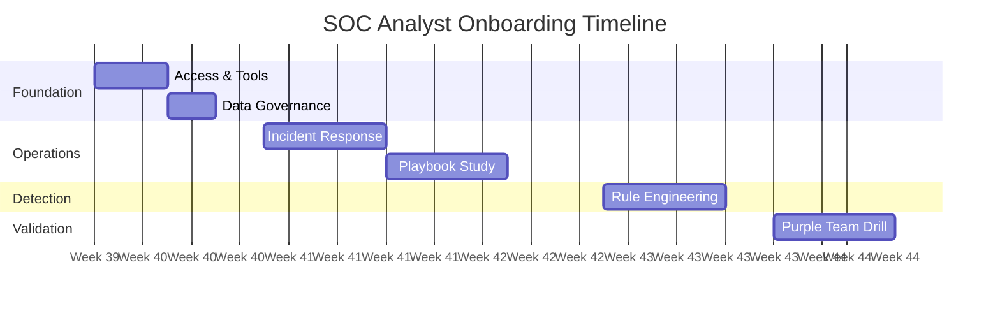

# SOC Analyst Onboarding Curriculum (4-Week Path)

Welcome to the Security Operations Center (SOC). This 4-week program is designed to take you from "Day 1" to "Production Ready".



## Week 1: Foundations (Infrastructure & Governance)
**Goal**: Understand *where* we work and *what* we protect.

-   **Day 1: Orientation & Access**
    -   Read: [System Activation](../10_Training_Onboarding/System_Activation.en.md) - Understand our generic stack (SIEM, EDR, SOAR).
    -   Task: Verify access to all dashboards.
-   **Day 2: Data & Privacy**
    -   Read: [Data Governance](../02_Platform_Operations/Database_Management.en.md) - Learn data classification (Restricted vs Public).
    -   Task: Locate where "Critical" data is stored in our SIEM.
-   **Day 3: Change Management**
    -   Read: [Deployment Procedures](../02_Platform_Operations/Deployment_Procedures.en.md) - Learn how we deploy changes (RFC/CAB).
    -   Read: [Template - Change Request](../templates/change_request_rfc.en.md).

## Week 2: Incident Response (The "How-To")
**Goal**: Learn how to handle alerts using Standard Playbooks.

-   **Day 1: The Framework**
    -   Read: [Incident Response Framework](../05_Incident_Response/Framework.en.md) - The NIST lifecycle.
    -   Read: [Template - Incident Report](../templates/incident_report.en.md).
-   **Day 2: Core Playbooks (Identity)**
    -   Read: [PB-01 Phishing](../05_Incident_Response/Playbooks/Phishing.en.md).
    -   Read: [PB-04 Brute Force](../05_Incident_Response/Playbooks/Brute_Force.en.md).
-   **Day 3: Core Playbooks (Endpoint)**
    -   Read: [PB-02 Ransomware](../05_Incident_Response/Playbooks/Ransomware.en.md).
    -   Read: [PB-03 Malware](../05_Incident_Response/Playbooks/Malware_Infection.en.md).

## Week 3: Detection Engineering (The "Why")
**Goal**: Understand why an alert triggered and how to tune it.

-   **Day 1: The Lifecycle**
    -   Read: [Content Management](../03_User_Guides/Content_Management.en.md) - How we create rules.
-   **Day 2: Sigma Rules**
    -   Explore: `08_Detection_Engineering/sigma_rules/` - Review the YAML files.
    -   Task: Compare `proc_office_spawn_powershell.yml` with **PB-01**.

## Week 4: Simulation & Validation (Purple Team)
**Goal**: Prove your skills by defending against a simulated attack.

-   **Day 1: Testing Tools**
    -   Read: [Simulation Guide](../09_Simulation_Testing/Simulation_Guide.en.md).
    -   Read: [Atomic Test Map](../09_Simulation_Testing/Atomic_Test_Map.en.md).
-   **Day 2: Final Exam (Drill)**
    -   Task: Run `Invoke-AtomicTest T1059.001` (Phishing Simulation) in the Test Lab.
    -   Task: Triage the alert in SIEM.
    -   Task: Submit a mock [Incident Report](../templates/incident_report.en.md).

## Competency Assessment

| Skill | Assessment Method | Pass Criteria |
|:---|:---|:---|
| SIEM Query Writing | Practical exam | Write 3 correct queries in 30 min |
| Alert Triage | Mock alert exercise | Correctly classify 8/10 alerts |
| Incident Documentation | Submit mock IR report | Manager review score ≥ 80% |
| Playbook Execution | Tabletop exercise | Follow playbook with no critical gaps |
| Tool Proficiency | Hands-on demo | Navigate SIEM, EDR, SOAR independently |
| Communication | Escalation role-play | Correct escalation path and content |

## Mentorship Program

| Week | Mentor Activity | New Analyst Activity |
|:---|:---|:---|
| Week 1 | Shadow mentor during shift | Observe triage, take notes, ask questions |
| Week 2 | Mentor reviews analyst's first triages | Triage alerts with mentor review before closing |
| Week 3 | Mentor available for questions only | Triage independently, escalate if unsure |
| Week 4 | Mentor evaluates final drill | Complete drill independently |

## Graduation Criteria

To be cleared for independent production shifts, new analysts must:

- [ ] Complete all 4 weeks of curriculum
- [ ] Pass competency assessment (all skills ≥ 80%)
- [ ] Complete at least 1 purple team drill
- [ ] Submit 1 mock incident report (approved by manager)
- [ ] Demonstrate proficiency in SIEM, EDR, and ticketing tools
- [ ] Receive mentor sign-off
- [ ] Complete PDPA awareness training

## Continuing Education

| Certification | Target Timeline | Relevance |
|:---|:---|:---|
| CompTIA Security+ | Month 3 | Foundational security knowledge |
| SANS SEC401 / GISF | Month 6 | SOC operations fundamentals |
| CySA+ / GCIH | Year 1 | Incident handling expertise |
| SANS SEC504 / GCIH | Year 1-2 | Advanced incident response |
| BTL1 (Blue Team Level 1) | Year 1 | Practical blue team skills |

## 90-Day Onboarding Plan

### Week 1-2: Foundation
| Day | Activity | Deliverable |
|:---|:---|:---|
| 1 | Welcome, badge, account setup | Access to all SOC tools |
| 2 | Read SOC 101 + Glossary | Quiz: 80% pass |
| 3 | SIEM orientation (read-only) | Can navigate dashboards |
| 4 | Ticketing system training | Can create/update tickets |
| 5 | Shadow T1 analyst (full shift) | Observation notes |
| 6-10 | Complete Security+ self-study modules | Module completion |

### Week 3-4: Skill Building
| Day | Activity | Deliverable |
|:---|:---|:---|
| 11-12 | Read top 5 playbooks | Playbook summary |
| 13-14 | SIEM query lab exercises | 10 queries completed |
| 15 | EDR tool orientation | Can navigate EDR console |
| 16-17 | Log analysis workshop | Analyze 20 sample alerts |
| 18-20 | Shadow T1 + handle low-priority alerts | First 5 tickets closed |

### Month 2: Supervised Practice
| Week | Activity | Deliverable |
|:---|:---|:---|
| 5 | Handle alerts independently (T2 reviews) | 80%+ accuracy |
| 6 | Complete all 10 common alert type training | Scorecard: 80%+ |
| 7 | First solo shift (senior on standby) | Shift report |
| 8 | Escalation practice scenarios | 3 scenario passes |

### Month 3: Independence
| Week | Activity | Deliverable |
|:---|:---|:---|
| 9 | Full independent shift work | MTTD within SLA |
| 10 | Purple team exercise participation | Exercise report |
| 11 | Write 1 knowledge base article | Published KB article |
| 12 | 90-day review with SOC Manager | Performance evaluation |

### Completion Criteria
```
□ Can independently triage all 10 common alert types
□ MTTD consistently within SLA (≤ 60 min)
□ FP identification rate > 80%
□ Correct escalation decisions > 90%
□ Complete and accurate ticket documentation
□ Security+ exam passed (or scheduled)
□ Positive feedback from shift mentors
```

## Related Documents
-   [Training Checklist](Training_Checklist.en.md)
-   [Incident Response Framework](../05_Incident_Response/Framework.en.md)
-   [Simulation Guide](../09_Simulation_Testing/Simulation_Guide.en.md)

## References
-   [SANS SOC Analyst Training](https://www.sans.org/cyber-security-courses/)
-   [NICE Cybersecurity Workforce Framework](https://niccs.cisa.gov/workforce-development/nice-framework)
