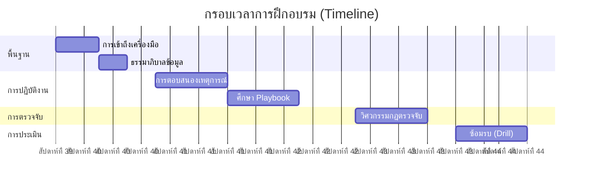

# หลักสูตรการฝึกอบรมเจ้าหน้าที่ SOC (หลักสูตร 4 สัปดาห์)

ยินดีต้อนรับสู่ศูนย์ปฏิบัติการความปลอดภัย (SOC) โปรแกรมนี้ออกแบบมาเพื่อให้คุณพร้อมปฏิบัติงานจริงภายใน 4 สัปดาห์

## สัปดาห์ที่ 1: พื้นฐาน (Infrastructure & Governance)
**เป้าหมาย**: เข้าใจว่าเราทำงาน *ที่ไหน* และปกป้อง *อะไร*

-   **วันที่ 1: การปฐมนิเทศและการเข้าถึงระบบ**
    -   อ่าน: [System Activation](../01_Onboarding/System_Activation.th.md) - ทำความเข้าใจ Stack ของเรา (SIEM, EDR, SOAR)
    -   งาน: ตรวจสอบสิทธิ์การเข้าถึง Dashboard ทั้งหมด
-   **วันที่ 2: ข้อมูลและความเป็นส่วนตัว**
    -   อ่าน: [Data Governance](../02_Platform_Operations/Database_Management.th.md) - เรียนรู้ประเภทข้อมูล (Restricted vs Public)
    -   งาน: ระบุตำแหน่งที่เก็บข้อมูล "Critical" ใน SIEM
-   **วันที่ 3: การจัดการการเปลี่ยนแปลง**
    -   อ่าน: [Deployment Procedures](../02_Platform_Operations/Deployment_Procedures.th.md) - เรียนรู้วิธีการ Deploy (RFC/CAB)
    -   อ่าน: [แบบฟอร์ม - Change Request](../templates/change_request_rfc.th.md)

## สัปดาห์ที่ 2: การรับมือภัยคุกคาม (Incident Response)
**เป้าหมาย**: เรียนรู้วิธีจัดการกับ Alert โดยใช้ Playbook มาตรฐาน

-   **วันที่ 1: กรอบการทำงาน**
    -   อ่าน: [Incident Response Framework](../05_Incident_Response/Framework.th.md) - วงจรชีวิตตาม NIST
    -   อ่าน: [แบบฟอร์ม - Incident Report](../templates/incident_report.th.md)
-   **วันที่ 2: Playbook หลัก (Identity)**
    -   อ่าน: [PB-01 Phishing](../05_Incident_Response/Playbooks/Phishing.th.md)
    -   อ่าน: [PB-04 Brute Force](../05_Incident_Response/Playbooks/Brute_Force.th.md)
-   **วันที่ 3: Playbook หลัก (Endpoint)**
    -   อ่าน: [PB-02 Ransomware](../05_Incident_Response/Playbooks/Ransomware.th.md)
    -   อ่าน: [PB-03 Malware](../05_Incident_Response/Playbooks/Malware_Infection.th.md)

## สัปดาห์ที่ 3: วิศวกรรมการตรวจจับ (Detection Engineering)
**เป้าหมาย**: เข้าใจว่า Alert ทำงานอย่างไรและปรับจูนอย่างไร

-   **วันที่ 1: วงจรชีวิต**
    -   อ่าน: [Content Management](../03_User_Guides/Content_Management.th.md) - วิธีสร้างกฎ
-   **วันที่ 2: Sigma Rules**
    -   สำรวจ: `07_Detection_Rules/` - ดูไฟล์ YAML
    -   งาน: เปรียบเทียบ `proc_office_spawn_powershell.yml` กับ **PB-01**

## สัปดาห์ที่ 4: การจำลองและตรวจสอบ (Purple Team)
**เป้าหมาย**: พิสูจน์ทักษะของคุณโดยการป้องกันการโจมตีจำลอง

-   **วันที่ 1: เครื่องมือทดสอบ**
    -   อ่าน: [Simulation Guide](../08_Simulation_Testing/Simulation_Guide.en.md)
    -   อ่าน: [Atomic Test Map](../08_Simulation_Testing/Atomic_Test_Map.en.md)
-   **วันที่ 2: การสอบปฏิบัติ (Drill)**
    -   งาน: รัน `Invoke-AtomicTest T1059.001` (Phishing Simulation) ในห้อง Lab
    -   งาน: Triage Alert ใน SIEM
    -   งาน: ส่ง [Incident Report](../templates/incident_report.th.md) จำลอง

## การประเมินสมรรถนะ

| ทักษะ | วิธีการประเมิน | เกณฑ์ผ่าน |
|:---|:---|:---|
| การเขียน SIEM Query | สอบปฏิบัติ | เขียน 3 Query ถูกต้องใน 30 นาที |
| การคัดกรองแจ้งเตือน | แบบฝึกหัดจำลอง | จำแนก 8/10 แจ้งเตือนถูกต้อง |
| การทำเอกสารเหตุการณ์ | ส่งรายงาน IR จำลอง | คะแนนรีวิว ≥ 80% |
| การปฏิบัติตาม Playbook | แบบฝึกหัด Tabletop | ไม่มีช่องว่างวิกฤต |
| ความชำนาญเครื่องมือ | สาธิตปฏิบัติ | ใช้ SIEM, EDR, SOAR ได้เอง |

## โปรแกรมพี่เลี้ยง

| สัปดาห์ | กิจกรรมพี่เลี้ยง | กิจกรรมนักวิเคราะห์ใหม่ |
|:---|:---|:---|
| สัปดาห์ 1 | Shadow ระหว่างกะ | สังเกตการคัดกรอง, จดบันทึก |
| สัปดาห์ 2 | รีวิวการคัดกรองแรก | คัดกรองพร้อมรีวิวก่อนปิด |
| สัปดาห์ 3 | พร้อมตอบคำถาม | คัดกรองเองได้ |
| สัปดาห์ 4 | ประเมิน Drill สุดท้าย | ทำ Drill ด้วยตัวเอง |

## เกณฑ์สำเร็จ

- [ ] เรียนครบ 4 สัปดาห์
- [ ] ผ่านการประเมินสมรรถนะ (≥ 80%)
- [ ] ทำ Purple team drill อย่างน้อย 1 ครั้ง
- [ ] ส่งรายงาน IR จำลอง 1 ฉบับ (ผู้จัดการอนุมัติ)
- [ ] แสดงความชำนาญ SIEM, EDR, Ticketing
- [ ] พี่เลี้ยงลงนามยืนยัน
- [ ] ผ่านการอบรม PDPA

## เส้นทางใบรับรอง

| ใบรับรอง | เป้าหมาย | ความเกี่ยวข้อง |
|:---|:---|:---|
| CompTIA Security+ | เดือน 3 | ความรู้ด้านความปลอดภัยพื้นฐาน |
| CySA+ / GCIH | ปี 1 | ความเชี่ยวชาญจัดการเหตุการณ์ |
| SANS SEC504 | ปี 1-2 | การตอบสนองเหตุการณ์ขั้นสูง |
| BTL1 | ปี 1 | ทักษะ Blue team ปฏิบัติ |

## เอกสารที่เกี่ยวข้อง (Related Documents)
-   [Training Checklist](Training_Checklist.th.md)
-   [กรอบ Incident Response](../05_Incident_Response/Framework.th.md)
-   [คู่มือจำลองการโจมตี](../08_Simulation_Testing/Simulation_Guide.en.md)

## References
-   [SANS SOC Analyst Training](https://www.sans.org/cyber-security-courses/)
-   [NICE Cybersecurity Workforce Framework](https://niccs.cisa.gov/workforce-development/nice-framework)
