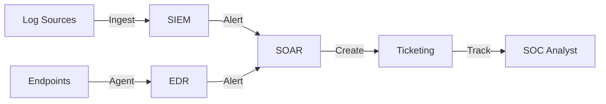

# Standard SOC Infrastructure Setup

This document outlines the standard infrastructure requirements and setup procedures for a modern Security Operations Center (SOC).

## 1. Core Components

A fully functional SOC requires the following core components:

### 1.1 SIEM (Security Information and Event Management)
-   **Purpose**: Centralized log aggregation, correlation, and alerting.
-   **Requirements**:
    -   High availability and scalability.
    -   Retention policy compliance (e.g., 90 days hot, 1 year cold).
    -   Support for common log formats (Syslog, CEF, JSON).

### 1.2 EDR (Endpoint Detection and Response)
-   **Purpose**: Real-time monitoring and prevention on endpoints.
-   **Deployment**: Agents must be deployed to all workstations, servers, and critical assets.
-   **Policy**: Enforce prevention policies (Block/Quarantine) for known malware.

### 1.3 SOAR (Security Orchestration, Automation, and Response)
-   **Purpose**: Automate repetitive tasks and orchestrate incident response workflows.
-   **Integration**: Must connect with SIEM, EDR, and Ticketing systems.

### 1.4 Ticketing / Case Management
-   **Purpose**: Track incidents, investigations, and analyst activities.
-   **Workflow**: Seamless integration from SIEM alerts to case creation.

## 2. Infrastructure Hardening

### 2.1 Access Control
-   **MFA**: Enforce Multi-Factor Authentication for all SOC tools.
-   **RBAC**: Implement Role-Based Access Control (Analyst, Engineer, Manager).
-   **Segmentation**: SOC infrastructure should reside in a secure, segmented network zone.

### 2.2 Monitoring
-   **Health Checks**: Continuous monitoring of tool availability and performance.
-   **Audit Logs**: Enable audit logging for all SOC analyst actions.

## 3. Network Architecture

-   **Log Shippers**: Use dedicated forwarders to send logs to the SIEM securely (TLS encryption).
-   **Jump Host**: Use a secure Jump Host or VPN for administrative access to SOC infrastructure.

## 4. Tool Access Matrix

| Tool | Tier 1 Analyst | Tier 2 Analyst | Tier 3/IR | SOC Engineer | SOC Manager |
|:---|:---:|:---:|:---:|:---:|:---:|
| SIEM (Read) | ✅ | ✅ | ✅ | ✅ | ✅ |
| SIEM (Write/Config) | ❌ | ❌ | ✅ | ✅ | ✅ |
| EDR (View/Triage) | ✅ | ✅ | ✅ | ✅ | ✅ |
| EDR (Isolate/Contain) | ❌ | ✅ | ✅ | ✅ | ✅ |
| SOAR (Execute Playbooks) | ✅ | ✅ | ✅ | ✅ | ✅ |
| SOAR (Configure Workflows) | ❌ | ❌ | ✅ | ✅ | ✅ |
| Ticketing (Create/Update) | ✅ | ✅ | ✅ | ✅ | ✅ |
| Ticketing (Admin) | ❌ | ❌ | ❌ | ✅ | ✅ |
| Firewall/Proxy (View Logs) | ❌ | ✅ | ✅ | ✅ | ✅ |
| Firewall/Proxy (Block) | ❌ | ❌ | ✅ | ✅ | ✅ |

## 5. Health Check Schedule

| Component | Check | Frequency | Owner |
|:---|:---|:---|:---|
| SIEM Indexing | Verify all parsers active, no queue backlog | Hourly (automated) | SOC Engineering |
| EDR Coverage | Verify agent health on ≥95% endpoints | Daily | SOC Engineering |
| SOAR Connectivity | Test all integrations (API health check) | Daily | SOC Engineering |
| Log Forwarding | Confirm all critical sources reporting | Every shift | Shift Lead |
| Backup Status | Verify last backup success | Daily | SOC Engineering |
| Certificate Expiry | Check TLS certs for all SOC tools | Weekly | SOC Engineering |

## 6. Initial Setup Checklist

| # | Task | Owner | Done |
|:---:|:---|:---|:---:|
| 1 | Provision network segment for SOC infrastructure | Network Team | ☐ |
| 2 | Deploy SIEM cluster with HA configuration | SOC Engineering | ☐ |
| 3 | Install EDR agents on all endpoints | Endpoint Team | ☐ |
| 4 | Configure SOAR integrations (SIEM, EDR, Ticketing) | SOC Engineering | ☐ |
| 5 | Set up ticketing system and workflow rules | SOC Engineering | ☐ |
| 6 | Enable audit logging on all SOC tools | SOC Engineering | ☐ |
| 7 | Configure MFA for all SOC analyst accounts | IAM Team | ☐ |
| 8 | Implement RBAC roles (Analyst, Engineer, Manager) | IAM Team | ☐ |
| 9 | Set up jump host / VPN access | Network Team | ☐ |
| 10 | Validate log ingestion from all critical sources | SOC Engineering | ☐ |
| 11 | Import baseline detection rules | Detection Engineering | ☐ |
| 12 | Conduct initial health check validation | SOC Manager | ☐ |

## Related Documents
-   [Analyst Onboarding Path](../09_Training_Onboarding/Analyst_Onboarding_Path.en.md)
-   [Data Governance & Retention](../02_Platform_Operations/Database_Management.en.md)
-   [Deployment Procedures](../02_Platform_Operations/Deployment_Procedures.en.md)

## References
-   [NIST Cybersecurity Framework](https://www.nist.gov/cyberframework)
-   [CISA SOC Best Practices](https://www.cisa.gov/topics/cyber-threats-and-advisories)
