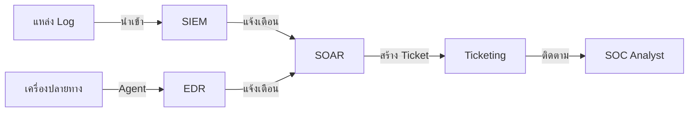

# การติดตั้งโครงสร้างพื้นฐาน SOC มาตรฐาน (Standard SOC Infrastructure Setup)

เอกสารนี้ระบุข้อกำหนดและขั้นตอนการติดตั้งโครงสร้างพื้นฐานสำหรับศูนย์ปฏิบัติการความปลอดภัย (SOC) สมัยใหม่

## 1. องค์ประกอบหลัก (Core Components)

SOC ที่สมบูรณ์จำเป็นต้องมีองค์ประกอบหลักดังนี้:

### 1.1 SIEM (Security Information and Event Management)
-   **วัตถุประสงค์**: รวบรวม Log จากศูนย์กลาง, วิเคราะห์ความสัมพันธ์ (Correlation), และแจ้งเตือน
-   **ข้อกำหนด**:
    -   มีความเสถียรและรองรับการขยายตัว (Scalability)
    -   ปฏิบัติตามนโยบายการเก็บข้อมูล (เช่น Hot 90 วัน, Cold 1 ปี)
    -   รองรับ Log format มาตรฐาน (Syslog, CEF, JSON)

### 1.2 EDR (Endpoint Detection and Response)
-   **วัตถุประสงค์**: ตรวจจับและป้องกันภัยคุกคามบนเครื่องปลายทางแบบ Real-time
-   **การติดตั้ง**: ต้องติดตั้ง Agent ลงบน Workstation, Server และทรัพย์สินสำคัญทั้งหมด
-   **นโยบาย**: บังคับใช้นโยบายป้องกัน (Block/Quarantine) สำหรับมัลแวร์ที่รู้จัก

### 1.3 SOAR (Security Orchestration, Automation, and Response)
-   **วัตถุประสงค์**: ทำงานซ้ำๆ แบบอัตโนมัติ และจัดการ Workflow การตอบสนองภัยคุกคาม
-   **การเชื่อมต่อ**: ต้องเชื่อมต่อกับ SIEM, EDR, และระบบ Ticketing ได้

### 1.4 Ticketing / Case Management
-   **วัตถุประสงค์**: ติดตามเหตุการณ์ (Incidents), การสืบสวน, และกิจกรรมของ Analyst
-   **Workflow**: เชื่อมโยงจาก Alert ใน SIEM ไปสู่การสร้าง Case ได้อย่างราบรื่น

## 2. การทำให้ระบบแข็งแกร่ง (Infrastructure Hardening)

### 2.1 การควบคุมการเข้าถึง (Access Control)
-   **MFA**: บังคับใช้ Multi-Factor Authentication สำหรับเครื่องมือ SOC ทั้งหมด
-   **RBAC**: กำหนดสิทธิ์ตามบทบาทหน้าที่ (Analyst, Engineer, Manager)
-   **Segmentation**: โครงสร้างพื้นฐาน SOC ควรอยู่ใน Network Zone ที่แยกส่วนและปลอดภัย

### 2.2 การเฝ้าระวัง (Monitoring)
-   **Health Checks**: ตรวจสอบสถานะและประสิทธิภาพของเครื่องมืออย่างต่อเนื่อง
-   **Audit Logs**: เปิดใช้งาน Audit Log สำหรับทุกการกระทำของ Analyst

## 3. สถาปัตยกรรมเครือข่าย (Network Architecture)

-   **Log Shippers**: ใช้ตัวส่ง Log (Forwarder) เพื่อส่งข้อมูลไปยัง SIEM อย่างปลอดภัย (เข้ารหัส TLS)
-   **Jump Host**: ใช้ Jump Host หรือ VPN ที่ปลอดภัยสำหรับการเข้าถึงระดับผู้ดูแลระบบ

## ตารางสิทธิ์เข้าถึงเครื่องมือ

| เครื่องมือ | Tier 1 | Tier 2 | Tier 3/IR | SOC Engineer | SOC Manager |
|:---|:---:|:---:|:---:|:---:|:---:|
| SIEM (อ่าน) | ✅ | ✅ | ✅ | ✅ | ✅ |
| SIEM (แก้ไข/Config) | ❌ | ❌ | ✅ | ✅ | ✅ |
| EDR (ดู/คัดกรอง) | ✅ | ✅ | ✅ | ✅ | ✅ |
| EDR (แยก/ควบคุม) | ❌ | ✅ | ✅ | ✅ | ✅ |
| SOAR (รัน Playbook) | ✅ | ✅ | ✅ | ✅ | ✅ |
| SOAR (ตั้งค่า Workflow) | ❌ | ❌ | ✅ | ✅ | ✅ |
| Ticketing (สร้าง/อัปเดต) | ✅ | ✅ | ✅ | ✅ | ✅ |
| Firewall (ดู Log) | ❌ | ✅ | ✅ | ✅ | ✅ |
| Firewall (Block) | ❌ | ❌ | ✅ | ✅ | ✅ |

## ตารางตรวจสุขภาพระบบ

| ส่วนประกอบ | การตรวจสอบ | ความถี่ | ผู้รับผิดชอบ |
|:---|:---|:---|:---|
| SIEM Indexing | ตรวจสอบ Parser ทั้งหมดทำงาน | รายชั่วโมง (อัตโนมัติ) | SOC Engineering |
| EDR Coverage | ตรวจสอบ Agent ≥95% | รายวัน | SOC Engineering |
| SOAR Connectivity | ทดสอบ Integration (API health) | รายวัน | SOC Engineering |
| Log Forwarding | ยืนยันแหล่ง Log สำคัญ | ทุกกะ | Shift Lead |
| Backup Status | ตรวจสอบการสำรองข้อมูลล่าสุด | รายวัน | SOC Engineering |

## เอกสารที่เกี่ยวข้อง (Related Documents)
-   [หลักสูตรฝึกอบรม Analyst](../09_Training_Onboarding/Analyst_Onboarding_Path.th.md)
-   [ธรรมาภิบาลข้อมูล](../02_Platform_Operations/Database_Management.th.md)
-   [ขั้นตอนการ Deploy](../02_Platform_Operations/Deployment_Procedures.th.md)

### Activation Verification Checklist

| System | Check | Expected Result | Status |
|:---|:---|:---|:---|
| SIEM | Query test | Results in < 5s | ☐ |
| EDR | Agent status | All endpoints green | ☐ |
| Ticketing | Create test ticket | Auto-assign works | ☐ |
| TI Feed | IOC lookup | Results returned | ☐ |
| SOAR | Test playbook | Runs successfully | ☐ |

## References
-   [NIST Cybersecurity Framework](https://www.nist.gov/cyberframework)
-   [CISA SOC Best Practices](https://www.cisa.gov/topics/cyber-threats-and-advisories)
