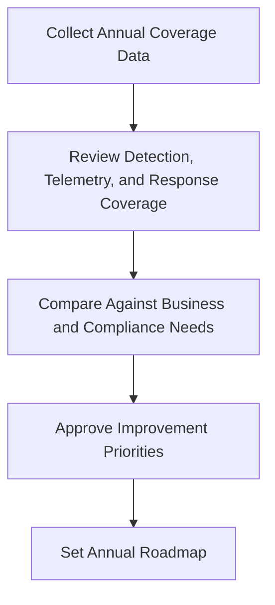

# Annual Control Coverage Review Pack

**Audience**: CISO, SOC Manager, Security Engineer, Compliance Lead
**Purpose**: Use this pack to review annual control coverage across detections, telemetry, playbooks, and governance obligations.

## 1. Meeting Header

| Field | Value |
|:---|:---|
| **Review Year** | [YYYY] |
| **Prepared By** | |
| **Review Date** | |
| **Chair** | |

## 2. Minimum Inputs

-   [ ] Detection coverage matrix updated
-   [ ] Log source matrix updated
-   [ ] Playbook and runbook gaps captured
-   [ ] Compliance control mapping and open gaps updated

## 3. Coverage Summary

| Domain | Current State | Gap Level | Priority Action |
|:---|:---|:---:|:---|
| Detection coverage | | High / Medium / Low | |
| Telemetry coverage | | | |
| Playbook coverage | | | |
| Compliance coverage | | | |

## 4. Annual Baseline Thresholds

| Domain | Baseline Question | Escalate When | Required Decision |
|:---|:---|:---|:---|
| **Detection coverage** | Do critical attack paths have validated coverage? | Critical service or regulated-data scenario has no validated detection | Approve engineering backlog or funding |
| **Telemetry coverage** | Are required logs present, retained, and usable? | Blind spot affects investigation of crown-jewel assets | Approve onboarding, retention, or platform change |
| **Playbook coverage** | Do top incident types have current decision-ready playbooks? | High-frequency or high-impact scenario lacks usable guidance | Approve document/update owner and due date |
| **Compliance coverage** | Are control obligations evidenced and reviewable? | Open gap can affect audit, notification, or legal position | Approve remediation, compensation, or acceptance path |

## 5. Annual Decisions Required

-   [ ] Approve top control coverage improvements for the next year.
-   [ ] Approve telemetry or tooling investment where coverage remains below baseline.
-   [ ] Confirm which gaps require risk acceptance, compensation, or project funding.
-   [ ] Record annual roadmap owners and target dates.

## 6. Inputs From Monthly and Quarterly Governance

-   [ ] Review repeated monthly governance escalations that remained open across the year.
-   [ ] Review quarterly risk acceptance items that were renewed, escalated, or closed.
-   [ ] Identify structural patterns: repeated telemetry blind spots, recurring exceptions, or unfunded critical control gaps.

## 7. Required Annual Outputs

-   [ ] Publish the next-year control coverage roadmap with named owners and target quarter.
-   [ ] Identify which gaps stay in backlog, which move to funded projects, and which require formal risk acceptance.
-   [ ] Feed approved priorities into the SOC roadmap, budget planning, and board decision cycle.

## Related Documents

-   [Detection Coverage Matrix](../08_Detection_Engineering/Coverage_Matrix.en.md)
-   [Log Source Matrix](../06_Operations_Management/Log_Source_Matrix.en.md)
-   [Compliance Mapping](../07_Compliance_Privacy/Compliance_Mapping.en.md)
-   [SOC Building Roadmap](../01_SOC_Fundamentals/SOC_Building_Roadmap.en.md)
-   [Monthly Governance Review Pack](Monthly_Governance_Review_Pack.en.md)
-   [Quarterly Risk Acceptance Review Pack](Quarterly_Risk_Acceptance_Review_Pack.en.md)

## References

-   [NIST Cybersecurity Framework 2.0](https://www.nist.gov/cyberframework)
-   [MITRE ATT&CK](https://attack.mitre.org/)
