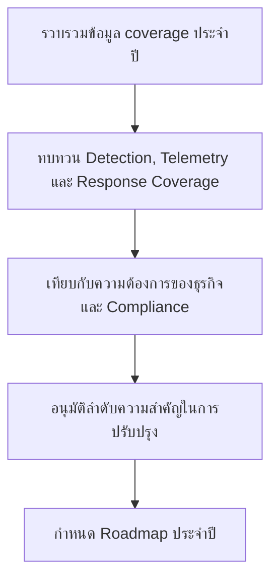

# ชุดทบทวน Control Coverage ประจำปี

**กลุ่มเป้าหมาย**: CISO, SOC Manager, Security Engineer, Compliance Lead
**วัตถุประสงค์**: ใช้ชุดเอกสารนี้เพื่อทบทวน control coverage ประจำปีในมิติ detections, telemetry, playbooks, และ governance obligations

## 1. ส่วนหัวการประชุม

| รายการ | ค่า |
|:---|:---|
| **ปีที่ทบทวน** | [YYYY] |
| **ผู้จัดทำ** | |
| **วันที่ทบทวน** | |
| **ประธานการประชุม** | |

## 2. ข้อมูลขั้นต่ำที่ต้องมี

-   [ ] อัปเดต detection coverage matrix แล้ว
-   [ ] อัปเดต log source matrix แล้ว
-   [ ] บันทึก playbook และ runbook gaps แล้ว
-   [ ] อัปเดต compliance control mapping และ open gaps แล้ว

## 3. สรุป Coverage

| มิติ | สถานะปัจจุบัน | ระดับช่องว่าง | การดำเนินการลำดับแรก |
|:---|:---|:---:|:---|
| Detection coverage | | สูง / กลาง / ต่ำ | |
| Telemetry coverage | | | |
| Playbook coverage | | | |
| Compliance coverage | | | |

## 4. เกณฑ์ baseline ประจำปี

| Domain | คำถาม baseline | ยกระดับเมื่อ | การตัดสินใจที่ต้องมี |
|:---|:---|:---|:---|
| **Detection coverage** | critical attack paths มี coverage ที่ validate แล้วหรือไม่ | ไม่มี detection ที่ validate แล้วสำหรับ critical service หรือ regulated-data scenario | อนุมัติ engineering backlog หรือ funding |
| **Telemetry coverage** | required logs มีครบ เก็บพอ และใช้ได้จริงหรือไม่ | blind spot กระทบการสืบสวนของ crown-jewel assets | อนุมัติ onboarding, retention, หรือ platform change |
| **Playbook coverage** | incident types สำคัญมี playbook ที่ใช้ตัดสินใจได้จริงหรือไม่ | กรณีที่เกิดบ่อยหรือมี impact สูงยังไม่มี guidance ที่ใช้งานได้ | อนุมัติ owner และ due date สำหรับการอัปเดต |
| **Compliance coverage** | control obligations มีหลักฐานรองรับและตรวจสอบได้หรือไม่ | มี open gap ที่กระทบ audit, notification, หรือ legal position | อนุมัติ remediation, compensation, หรือ acceptance path |

## 5. ประเด็นที่ต้องตัดสินใจประจำปี

-   [ ] อนุมัติ control coverage improvements สำคัญสำหรับปีถัดไป
-   [ ] อนุมัติ telemetry หรือ tooling investment หาก coverage ยังต่ำกว่า baseline
-   [ ] ยืนยันว่าช่องว่างใดต้องใช้ risk acceptance, compensation, หรือ project funding
-   [ ] บันทึก annual roadmap owners และ target dates

## 6. Inputs จากการทบทวนรายเดือนและรายไตรมาส

-   [ ] ทบทวน monthly governance escalations ที่ยังเปิดค้างตลอดปี
-   [ ] ทบทวน quarterly risk acceptance items ที่ renew, escalate, หรือ close ไปแล้ว
-   [ ] ระบุ pattern เชิงโครงสร้าง เช่น telemetry blind spot ซ้ำ exception ที่เกิดซ้ำ หรือ critical control gap ที่ยังไม่ได้งบ

## 7. ผลลัพธ์ประจำปีที่ต้องได้

-   [ ] เผยแพร่ control coverage roadmap สำหรับปีถัดไปพร้อม owner และ target quarter
-   [ ] ระบุว่าช่องว่างใดอยู่ใน backlog ต่อ ช่องว่างใดต้องย้ายเป็น funded project และช่องว่างใดต้องใช้ formal risk acceptance
-   [ ] feed priorities ที่อนุมัติแล้วกลับไปยัง SOC roadmap, budget planning, และ board decision cycle

## เอกสารที่เกี่ยวข้อง (Related Documents)

-   [ตาราง Coverage ของ Detection](../08_Detection_Engineering/Coverage_Matrix.th.md)
-   [ตารางแหล่งข้อมูล Log](../06_Operations_Management/Log_Source_Matrix.th.md)
-   [เอกสาร Mapping ด้าน Compliance](../07_Compliance_Privacy/Compliance_Mapping.th.md)
-   [Roadmap การสร้าง SOC](../01_SOC_Fundamentals/SOC_Building_Roadmap.th.md)
-   [ชุดทบทวน Governance รายเดือน](Monthly_Governance_Review_Pack.th.md)
-   [ชุดทบทวนการยอมรับความเสี่ยงรายไตรมาส](Quarterly_Risk_Acceptance_Review_Pack.th.md)

## References

-   [NIST Cybersecurity Framework 2.0](https://www.nist.gov/cyberframework)
-   [MITRE ATT&CK](https://attack.mitre.org/)
