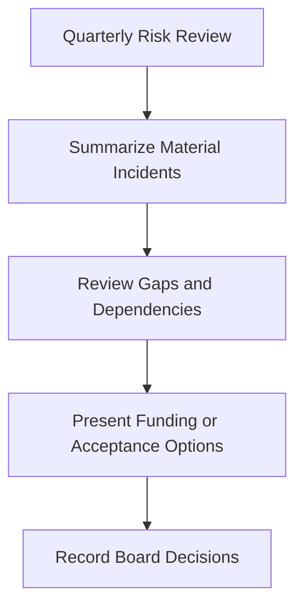

# Board Quarterly Decision Pack

**Audience**: Board, CISO, CEO, Executive Committee
**Purpose**: Use this pack to present the minimum decisions the board or executive committee must make each quarter based on SOC risk, unresolved gaps, and investment needs.

## 1. When to Use This Pack

-   [ ] Use this pack for quarterly board or executive risk review meetings.
-   [ ] Use this pack after any quarter with a material incident, repeated SLA failure, or unresolved strategic gap.
-   [ ] Use this pack when funding, risk acceptance, or exception decisions require governance-level approval.

## 2. Minimum Pack Contents

| Section | What to Show | Why It Matters |
|:---|:---|:---|
| **Executive Summary** | 3-5 bullets on security posture, material incidents, and top decisions required | Keeps the meeting focused on decisions, not raw operations |
| **Material Incident Review** | Incident type, impact, current status, and unresolved exposure | Confirms whether risk is stabilizing or compounding |
| **Control Gap Review** | Top gaps affecting critical assets or regulated data | Shows where exposure still exceeds tolerance |
| **Decision Items** | Funding request, risk acceptance, or exception decision needed | Makes ownership and deadlines explicit |
| **Follow-up Tracker** | Prior quarter decisions and current completion status | Prevents governance actions from stalling |

## 3. Board-Level Decision Triggers

| Trigger | Decision Type | Typical Owner | Deadline Expectation |
|:---|:---|:---|:---|
| **Material incident with business or regulatory impact** | Recovery oversight and remediation funding | CISO / Business Executive | Same meeting or emergency session |
| **Repeated SLA breach or loss of critical visibility** | Capacity or tooling decision | CISO / COO / CIO | Within 30 days |
| **Unresolved risk to regulated data or critical services** | Risk acceptance or compensating control approval | Business Owner + CISO | Within 30 days |
| **Strategic dependency on unsupported platform or vendor** | Replacement or transition decision | CIO / Procurement / CISO | This quarter |
| **Security investment request above approved authority** | Budget approval or deferment | Executive Committee / Board | This quarter |

## 4. Escalation Inputs Required Before Board Review

-   [ ] Monthly governance review shows repeated SLA failure, recurring telemetry loss, or overdue executive action.
-   [ ] Quarterly risk acceptance review escalated items with High residual risk, failed compensating controls, or stalled remediation.
-   [ ] Annual control coverage review identified structural gaps needing board-funded remediation or formal acceptance.
-   [ ] Executive dashboard shows RED status in business-impact, coverage, or compliance domains for the quarter.
-   [ ] Incident report or PDPA response record shows executive, legal, or privacy notification path was activated for a material case.
-   [ ] Public statement, media inquiry, or customer-trust issue required executive communications control during a material case.

## 5. Material Incident Summary Table

| Incident | Business Impact | Current Residual Risk | Decision Needed | Owner |
|:---|:---|:---|:---|:---|
| [INC-XXX] | | | | |
| [INC-XXX] | | | | |
| [INC-XXX] | | | | |

## 6. Open Risk and Gap Summary

| Gap or Exposure | Affected Service | Current Control State | Board Concern | Recommendation |
|:---|:---|:---|:---|:---|
| | | | | |
| | | | | |
| | | | | |

## 7. Decision Options by Scenario

| Scenario | Option A | Option B | Option C |
|:---|:---|:---|:---|
| **Unfunded critical control gap** | Approve funding now | Accept temporary exposure with due date | Reduce business scope until control is restored |
| **High residual risk from expiring exception** | Approve renewal with conditions | Reject renewal and force remediation | Escalate to business owner for risk ownership |
| **Repeated telemetry blind spot** | Fund restoration or replacement | Approve temporary compensating control | Accept degraded visibility with board sign-off |
| **Capacity failure affecting SLA** | Approve headcount or MSSP support | Reprioritize service scope | Accept lower SLA for defined period |

## 8. Decision Register

| Decision ID | Decision Required | Options Presented | Recommended Option | Decision Date |
|:---|:---|:---|:---|:---|
| BRD-[001] | | | | |
| BRD-[002] | | | | |
| BRD-[003] | | | | |

## 9. Minimum Supporting Evidence

-   [ ] Latest quarterly business review metrics.
-   [ ] Executive dashboard with trend and threshold status.
-   [ ] List of open risk acceptances and pending exceptions.
-   [ ] Cost, timeline, and owner for any funding request.
-   [ ] Current status of prior board or executive action items.
-   [ ] Incident notification record for material incidents involving executive, legal, privacy, customer, or regulator escalation.
-   [ ] Communications log or approved public statement for incidents that became public-facing.

## 10. Follow-up Expectations

-   [ ] Record every accepted risk, approved exception, or funded action with a named owner.
-   [ ] Set a due date for every board-level action item.
-   [ ] Return unresolved decisions in the next quarterly pack or sooner if the risk worsens.

## 11. Board Closure and Return Path

-   [ ] Send every funded or approved action back to monthly governance and remediation tracking with a named operational owner.
-   [ ] Record which board decisions are meant to eliminate risk versus temporarily tolerate it.
-   [ ] Re-present any board-approved acceptance that survives without measurable progress into the next quarter.

## Related Documents

-   [Quarterly Business Review](Quarterly_Business_Review.en.md)
-   [Executive Dashboard](Executive_Dashboard.en.md)
-   [Risk Acceptance Template](Risk_Acceptance_Template.en.md)
-   [Investment Justification Template](Investment_Justification_Template.en.md)
-   [Monthly Governance Review Pack](Monthly_Governance_Review_Pack.en.md)
-   [Quarterly Risk Acceptance Review Pack](Quarterly_Risk_Acceptance_Review_Pack.en.md)
-   [Annual Control Coverage Review Pack](Annual_Control_Coverage_Review_Pack.en.md)
-   [Incident Report Template](incident_report.en.md)
-   [PDPA Incident Response Guide](../07_Compliance_Privacy/PDPA_Incident_Response.en.md)
-   [Communication Templates](../05_Incident_Response/Communication_Templates.en.md)

## References

-   [NIST Cybersecurity Framework 2.0](https://www.nist.gov/cyberframework)
-   [FIRST CSIRT Services Framework](https://www.first.org/standards/frameworks/csirts/FIRST_CSIRT_Services_Framework_v2.1)
