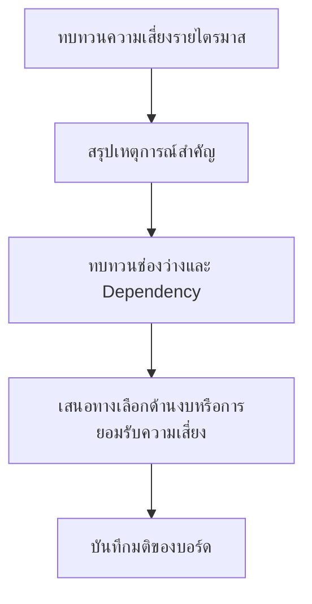

# ชุดเอกสารการตัดสินใจรายไตรมาสสำหรับบอร์ด

**กลุ่มเป้าหมาย**: Board, CISO, CEO, Executive Committee
**วัตถุประสงค์**: ใช้ชุดเอกสารนี้เพื่อเสนอประเด็นตัดสินใจขั้นต่ำที่บอร์ดหรือคณะผู้บริหารต้องตัดสินใจในแต่ละไตรมาส โดยอิงจากความเสี่ยงของ SOC ช่องว่างที่ยังไม่ปิด และความต้องการด้านการลงทุน

## 1. ใช้ชุดเอกสารนี้เมื่อใด

-   [ ] ใช้สำหรับการประชุมทบทวนความเสี่ยงรายไตรมาสของบอร์ดหรือคณะผู้บริหาร
-   [ ] ใช้หลังไตรมาสที่มี material incident, SLA failure ซ้ำ, หรือ strategic gap ที่ยังไม่ปิด
-   [ ] ใช้เมื่อการขอ funding, risk acceptance, หรือ exception ต้องได้รับอนุมัติในระดับ governance

## 2. เนื้อหาขั้นต่ำที่ต้องมีในชุดเอกสาร

| Section | สิ่งที่ต้องแสดง | เหตุผล |
|:---|:---|:---|
| **Executive Summary** | 3-5 bullets เกี่ยวกับ security posture, material incidents, และประเด็นตัดสินใจหลัก | ทำให้การประชุมโฟกัสที่ decision ไม่ใช่งานปฏิบัติการดิบ |
| **Material Incident Review** | ประเภท incident, impact, current status, และ exposure ที่ยังไม่ปิด | ยืนยันว่าความเสี่ยงกำลังลดลงหรือสะสมเพิ่ม |
| **Control Gap Review** | ช่องว่างสำคัญที่กระทบ critical assets หรือ regulated data | แสดงจุดที่ exposure ยังเกิน tolerance |
| **Decision Items** | คำขอ funding, risk acceptance, หรือ exception ที่ต้องตัดสินใจ | ทำให้ owner และ deadline ชัด |
| **Follow-up Tracker** | มติจากไตรมาสก่อนและสถานะปัจจุบัน | ป้องกันไม่ให้ governance action ค้าง |

## 3. Trigger ระดับบอร์ดที่ควรใช้ชุดนี้

| Trigger | Decision Type | Typical Owner | Deadline Expectation |
|:---|:---|:---|:---|
| **Material incident ที่มีผลกระทบทางธุรกิจหรือกฎระเบียบ** | Recovery oversight และ remediation funding | CISO / Business Executive | ตัดสินใจในที่ประชุมเดียวกันหรือ emergency session |
| **SLA breach ซ้ำหรือสูญเสีย critical visibility** | Capacity หรือ tooling decision | CISO / COO / CIO | ภายใน 30 วัน |
| **ความเสี่ยงต่อ regulated data หรือ critical services ที่ยังไม่ปิด** | Risk acceptance หรือ compensating control approval | Business Owner + CISO | ภายใน 30 วัน |
| **Strategic dependency กับ platform หรือ vendor ที่ไม่พร้อมใช้งานต่อ** | Replacement หรือ transition decision | CIO / Procurement / CISO | ภายในไตรมาสนี้ |
| **Security investment request ที่เกินอำนาจอนุมัติเดิม** | Budget approval หรือ deferment | Executive Committee / Board | ภายในไตรมาสนี้ |

## 4. Inputs ที่ต้องมี ก่อนยกระดับมาที่บอร์ด

-   [ ] monthly governance review แสดง SLA failure ซ้ำ telemetry loss ซ้ำ หรือ executive action ที่ค้างเกินกำหนด
-   [ ] quarterly risk acceptance review ยกระดับรายการที่มี High residual risk compensating control ล้มเหลว หรือ remediation ไม่เดินหน้า
-   [ ] annual control coverage review ระบุ structural gaps ที่ต้องใช้งบระดับบอร์ดหรือ formal acceptance
-   [ ] executive dashboard แสดงสถานะ RED ในมิติ business impact, coverage, หรือ compliance ของไตรมาสนั้น
-   [ ] incident report หรือ PDPA response record แสดงว่า executive / legal / privacy notification path ถูกใช้งานในเคสระดับ material
-   [ ] มี public statement, media inquiry, หรือ customer-trust issue ที่ต้องให้ผู้บริหารคุมการสื่อสารระหว่างเคส material

## 5. ตารางสรุปเหตุการณ์สำคัญ

| Incident | Business Impact | Current Residual Risk | Decision Needed | Owner |
|:---|:---|:---|:---|:---|
| [INC-XXX] | | | | |
| [INC-XXX] | | | | |
| [INC-XXX] | | | | |

## 6. สรุปความเสี่ยงและช่องว่างที่ยังเปิดอยู่

| Gap or Exposure | Affected Service | Current Control State | Board Concern | Recommendation |
|:---|:---|:---|:---|:---|
| | | | | |
| | | | | |
| | | | | |

## 7. ทางเลือกการตัดสินใจตามสถานการณ์

| สถานการณ์ | Option A | Option B | Option C |
|:---|:---|:---|:---|
| **critical control gap ที่ยังไม่ได้งบ** | อนุมัติงบทันที | ยอมรับ exposure ชั่วคราวพร้อม due date | ลด business scope จนกว่าจะคืน control ได้ |
| **exception ใกล้หมดอายุแต่ residual risk ยังสูง** | อนุมัติต่ออายุแบบมีเงื่อนไข | ไม่อนุมัติและบังคับ remediation | ยกระดับให้ business owner รับความเสี่ยงโดยตรง |
| **telemetry blind spot เกิดซ้ำ** | อนุมัติงบเพื่อกู้คืนหรือเปลี่ยน platform | อนุมัติ compensating control ชั่วคราว | ยอมรับ degraded visibility พร้อม board sign-off |
| **capacity failure กระทบ SLA** | อนุมัติ headcount หรือ MSSP support | ปรับลด service scope | ยอมรับ SLA ที่ลดลงตามช่วงเวลาที่กำหนด |

## 8. ทะเบียนการตัดสินใจ

| Decision ID | Decision Required | Options Presented | Recommended Option | Decision Date |
|:---|:---|:---|:---|:---|
| BRD-[001] | | | | |
| BRD-[002] | | | | |
| BRD-[003] | | | | |

## 9. หลักฐานขั้นต่ำที่ต้องแนบ

-   [ ] Quarterly business review metrics ล่าสุด
-   [ ] Executive dashboard ที่มี trend และ threshold status
-   [ ] รายการ open risk acceptances และ pending exceptions
-   [ ] Cost, timeline, และ owner ของ funding request ทุกข้อ
-   [ ] สถานะปัจจุบันของ action items จากบอร์ดหรือผู้บริหารรอบก่อน
-   [ ] incident notification record สำหรับเคส material ที่มีการยกระดับไป executive, legal, privacy, ลูกค้า, หรือ regulator
-   [ ] communications log หรือ public statement ที่อนุมัติแล้ว สำหรับ incident ที่กลายเป็นประเด็นสาธารณะ

## 10. ความคาดหวังหลังการประชุม

-   [ ] บันทึก accepted risk, approved exception, หรือ funded action ทุกข้อพร้อม owner
-   [ ] กำหนด due date ให้ action item ทุกข้อในระดับบอร์ด
-   [ ] นำ unresolved decisions กลับมาในชุดเอกสารไตรมาสถัดไป หรือเร็วกว่านั้นหากความเสี่ยงแย่ลง

## 11. เส้นทางส่งกลับหลังมติบอร์ด

-   [ ] ส่ง funded action หรือมติที่อนุมัติแล้วทุกข้อกลับไป monthly governance และ remediation tracking พร้อม owner ฝั่งปฏิบัติการ
-   [ ] บันทึกให้ชัดว่ามติของบอร์ดข้อใดมีเป้าหมายเพื่อกำจัดความเสี่ยง และข้อใดเป็นการยอมรับชั่วคราว
-   [ ] หากรายการที่บอร์ดอนุมัติแล้วยังไม่มีความคืบหน้าที่วัดผลได้ในไตรมาสถัดไป ต้องนำกลับเข้าชุดทบทวนอีกครั้ง

## เอกสารที่เกี่ยวข้อง (Related Documents)

-   [Quarterly Business Review](Quarterly_Business_Review.th.md)
-   [Executive Dashboard](Executive_Dashboard.th.md)
-   [Risk Acceptance Template](Risk_Acceptance_Template.th.md)
-   [Investment Justification Template](Investment_Justification_Template.th.md)
-   [Monthly Governance Review Pack](Monthly_Governance_Review_Pack.th.md)
-   [Quarterly Risk Acceptance Review Pack](Quarterly_Risk_Acceptance_Review_Pack.th.md)
-   [Annual Control Coverage Review Pack](Annual_Control_Coverage_Review_Pack.th.md)
-   [Incident Report Template](incident_report.th.md)
-   [คู่มือ PDPA Incident Response](../07_Compliance_Privacy/PDPA_Incident_Response.th.md)
-   [แม่แบบการสื่อสารเหตุการณ์](../05_Incident_Response/Communication_Templates.th.md)

## References

-   [NIST Cybersecurity Framework 2.0](https://www.nist.gov/cyberframework)
-   [FIRST CSIRT Services Framework](https://www.first.org/standards/frameworks/csirts/FIRST_CSIRT_Services_Framework_v2.1)
