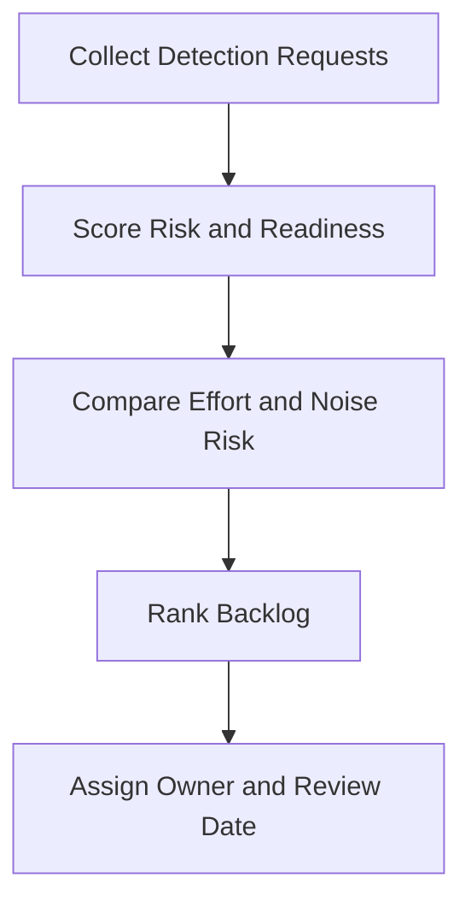

# Detection Backlog Prioritization Template

**Audience**: Detection Engineer, SOC Manager, Threat Hunter
**Purpose**: Use this template to rank pending detection work by risk, telemetry readiness, and operational value.

## 1. Backlog Item Register

| ID | Detection Request | Threat Scenario | Owner | Status |
|:---|:---|:---|:---|:---:|
| DET-BL-[001] | | | | ☐ New ☐ Ranked ☐ In Progress ☐ Done |
| DET-BL-[002] | | | | ☐ New ☐ Ranked ☐ In Progress ☐ Done |

## 2. Scoring Model

| Factor | Question | Score (1-5) |
|:---|:---|:---:|
| Business impact | Would failure affect critical services or regulated data? | |
| Threat likelihood | Is the threat active, common, or already observed? | |
| Telemetry readiness | Are required logs present and usable now? | |
| Response readiness | Is there a playbook and owner for the alert? | |
| Noise risk | Can the team handle expected alert volume? | |
| Effort | How quickly can the detection be delivered safely? | |

## 3. Prioritization Table

| Item | Impact | Likelihood | Telemetry | Response | Noise | Effort | Total | Priority |
|:---|:---:|:---:|:---:|:---:|:---:|:---:|:---:|:---:|
| | | | | | | | | High / Medium / Low |
| | | | | | | | | |

## 4. Review Rules

-   [ ] Prioritize items with confirmed telemetry and high business impact first.
-   [ ] Defer items that cannot be tested or do not have an alert owner.
-   [ ] Re-score items when incident trends or threat intelligence change.
-   [ ] Record noise concerns before assigning a production deadline.

## Related Documents

-   [Detection Request Template](Detection_Request_Template.en.md)
-   [SOC Use Case Library](../08_Detection_Engineering/SOC_Use_Case_Library.en.md)
-   [Detection Rule Testing](../06_Operations_Management/Detection_Rule_Testing.en.md)
-   [Alert Tuning](../06_Operations_Management/Alert_Tuning.en.md)

## References

-   [MITRE ATT&CK](https://attack.mitre.org/)
-   [Sigma Rule Specification](https://sigmahq.io/sigma-specification/specification/sigma-rules-specification.html)
