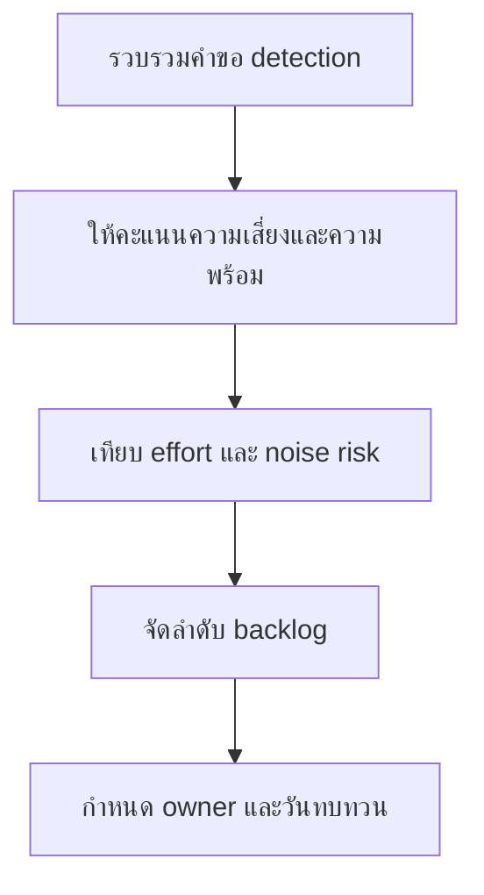

# แบบฟอร์มจัดลำดับ Detection Backlog

**กลุ่มเป้าหมาย**: Detection Engineer, SOC Manager, Threat Hunter
**วัตถุประสงค์**: ใช้แบบฟอร์มนี้เพื่อจัดลำดับงาน detection ที่ค้างอยู่ตามความเสี่ยง ความพร้อมของ telemetry และคุณค่าทางปฏิบัติการ

## 1. ทะเบียนรายการ Backlog

| รหัส | คำขอ Detection | ฉากทัศน์ภัยคุกคาม | ผู้รับผิดชอบ | สถานะ |
|:---|:---|:---|:---|:---:|
| DET-BL-[001] | | | | ☐ New ☐ Ranked ☐ In Progress ☐ Done |
| DET-BL-[002] | | | | ☐ New ☐ Ranked ☐ In Progress ☐ Done |

## 2. โมเดลการให้คะแนน

| ปัจจัย | คำถาม | คะแนน (1-5) |
|:---|:---|:---:|
| Business impact | หากพลาดจะกระทบ critical services หรือ regulated data หรือไม่ | |
| Threat likelihood | Threat นี้กำลัง active, พบบ่อย, หรือเกิดขึ้นแล้วหรือไม่ | |
| Telemetry readiness | มี required logs และใช้งานได้แล้วหรือไม่ | |
| Response readiness | มี playbook และ alert owner หรือไม่ | |
| Noise risk | ทีมรับ alert volume ที่คาดไว้ได้หรือไม่ | |
| Effort | ส่งมอบ detection นี้อย่างปลอดภัยได้เร็วแค่ไหน | |

## 3. ตารางจัดลำดับความสำคัญ

| รายการ | Impact | Likelihood | Telemetry | Response | Noise | Effort | คะแนนรวม | ลำดับความสำคัญ |
|:---|:---:|:---:|:---:|:---:|:---:|:---:|:---:|:---:|
| | | | | | | | | สูง / กลาง / ต่ำ |
| | | | | | | | | |

## 4. กติกาการทบทวน

-   [ ] ให้ priority กับรายการที่มี telemetry พร้อมและมี business impact สูงก่อน
-   [ ] defer รายการที่ยังทดสอบไม่ได้หรือยังไม่มี alert owner
-   [ ] re-score เมื่อ incident trends หรือ threat intelligence เปลี่ยน
-   [ ] บันทึก noise concerns ก่อนกำหนด production deadline

## 5. เส้นทางส่งต่อใน Backlog และ Governance

-   [ ] เชื่อมรายการที่ยังขาด telemetry ไปยัง telemetry backlog หรือ log source onboarding request
-   [ ] เชื่อมรายการที่มาจาก PIR, incident, หรือ hunt ไปยัง remediation และ governance tracking ตามความจำเป็น
-   [ ] ยกระดับ detection gap ที่คงอยู่และกระทบ critical services ไปยัง monthly governance review

## เอกสารที่เกี่ยวข้อง (Related Documents)

-   [แบบฟอร์มคำขอ Detection](Detection_Request_Template.th.md)
-   [SOC Use Case Library](../08_Detection_Engineering/SOC_Use_Case_Library.th.md)
-   [การทดสอบ Detection Rules](../06_Operations_Management/Detection_Rule_Testing.th.md)
-   [แนวทาง Alert Tuning](../06_Operations_Management/Alert_Tuning.th.md)

## References

-   [MITRE ATT&CK](https://attack.mitre.org/)
-   [Sigma Rule Specification](https://sigmahq.io/sigma-specification/specification/sigma-rules-specification.html)
