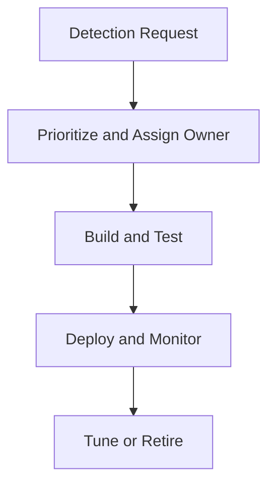

# Detection Ownership RACI

**Audience**: Detection Engineer, SOC Manager, Threat Hunter, SOC Analyst
**Purpose**: Use this document to assign ownership for detection intake, build, testing, deployment, tuning, and retirement.

## 1. Scope

-   [ ] Use this RACI for all new detections, tuning requests, and retirement decisions.
-   [ ] Apply this RACI during weekly detection review and monthly management review.

## 2. RACI Matrix

| Activity | Detection Engineer | SOC Manager | Threat Hunter | SOC Analyst | Security Engineer |
|:---|:---:|:---:|:---:|:---:|:---:|
| Intake detection request | **R** | A | C | C | I |
| Prioritize backlog item | C | **A** | C | I | I |
| Define detection logic | **R** | I | C | C | C |
| Validate telemetry needs | C | I | I | I | **R** |
| Test detection quality | **R** | C | C | C | I |
| Approve production deployment | C | **A** | I | I | C |
| Monitor false positives | C | A | I | **R** | I |
| Tune or suppress rule | **R** | A | C | C | I |
| Retire obsolete detection | **R** | A | C | I | I |

*R = Responsible, A = Accountable, C = Consulted, I = Informed*

## 3. Minimum Ownership Rules

-   [ ] Every detection item must have one named owner.
-   [ ] No production deployment proceeds without an accountable approver.
-   [ ] Telemetry dependency issues must be handed to Security Engineering with an owner and due date.
-   [ ] False positive pressure must be reviewed weekly until resolved or formally deferred.

## Related Documents

-   [Detection Request Template](Detection_Request_Template.en.md)
-   [Detection Backlog Prioritization](Detection_Backlog_Prioritization.en.md)
-   [Weekly Detection Review Pack](Weekly_Detection_Review_Pack.en.md)
-   [Detection Rule Testing](../06_Operations_Management/Detection_Rule_Testing.en.md)

## References

-   [Sigma Rule Specification](https://sigmahq.io/sigma-specification/specification/sigma-rules-specification.html)
-   [MITRE ATT&CK](https://attack.mitre.org/)
