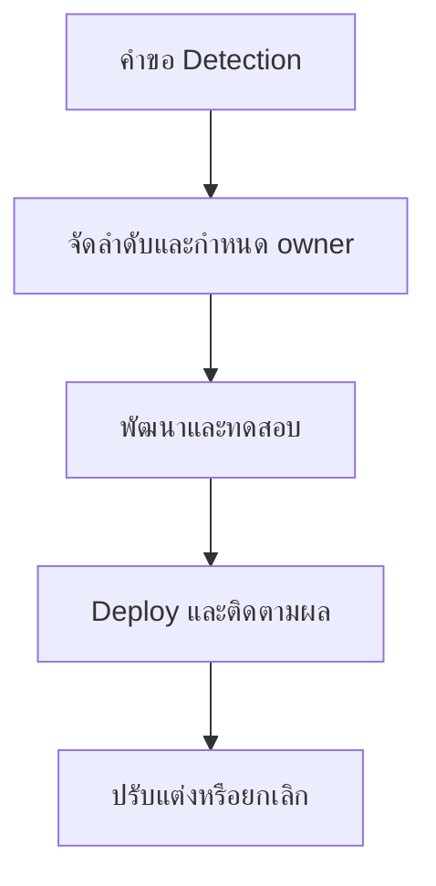

# RACI ความเป็นเจ้าของงาน Detection

**กลุ่มเป้าหมาย**: Detection Engineer, SOC Manager, Threat Hunter, SOC Analyst
**วัตถุประสงค์**: ใช้เอกสารนี้เพื่อกำหนด owner ของงาน detection ตั้งแต่ intake, build, testing, deployment, tuning, ไปจนถึง retirement

## 1. ขอบเขตการใช้งาน

-   [ ] ใช้ RACI นี้กับ detection ใหม่ คำขอ tuning และการตัดสินใจ retire rule
-   [ ] ใช้ระหว่าง weekly detection review และ monthly management review

## 2. RACI Matrix

| กิจกรรม | Detection Engineer | SOC Manager | Threat Hunter | SOC Analyst | Security Engineer |
|:---|:---:|:---:|:---:|:---:|:---:|
| รับคำขอ detection | **R** | A | C | C | I |
| จัดลำดับ backlog item | C | **A** | C | I | I |
| กำหนด detection logic | **R** | I | C | C | C |
| ยืนยัน telemetry needs | C | I | I | I | **R** |
| ทดสอบคุณภาพ detection | **R** | C | C | C | I |
| อนุมัติ production deployment | C | **A** | I | I | C |
| ติดตาม false positives | C | A | I | **R** | I |
| tune หรือ suppress rule | **R** | A | C | C | I |
| retire detection ที่ล้าสมัย | **R** | A | C | I | I |

*R = Responsible, A = Accountable, C = Consulted, I = Informed*

## 3. กติกาขั้นต่ำเรื่อง Ownership

-   [ ] detection ทุกชิ้นต้องมี owner ชัดเจนเพียงหนึ่งคน
-   [ ] ห้าม deploy ขึ้น production หากยังไม่มี accountable approver
-   [ ] ปัญหา telemetry dependency ต้อง handoff ไป Security Engineering พร้อม owner และ due date
-   [ ] แรงกดดันจาก false positives ต้องถูกทบทวนรายสัปดาห์จนกว่าจะปิดหรือ defer อย่างเป็นทางการ

## 4. เส้นทางส่งต่อใน Governance

-   [ ] detection gap ที่กระทบ critical services ต้องถูกยกระดับไป weekly review และ monthly governance review ตามความรุนแรง
-   [ ] รายการที่ยังปล่อย production ไม่ได้เพราะ telemetry ขาด ต้องเชื่อมไป telemetry backlog หรือ log source onboarding request

## เอกสารที่เกี่ยวข้อง (Related Documents)

-   [แบบฟอร์มคำขอ Detection](Detection_Request_Template.th.md)
-   [แบบฟอร์มจัดลำดับ Detection Backlog](Detection_Backlog_Prioritization.th.md)
-   [ชุดทบทวน Detection ประจำสัปดาห์](Weekly_Detection_Review_Pack.th.md)
-   [การทดสอบ Detection Rules](../06_Operations_Management/Detection_Rule_Testing.th.md)

## References

-   [Sigma Rule Specification](https://sigmahq.io/sigma-specification/specification/sigma-rules-specification.html)
-   [MITRE ATT&CK](https://attack.mitre.org/)
