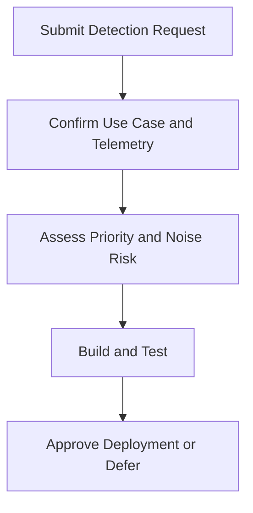

# Detection Request Template

**Audience**: Detection Engineer, SOC Analyst, Threat Hunter, SOC Manager
**Purpose**: Use this template to request a new detection, rule change, or tuning action with enough context to prioritize and implement it safely.

## 1. Request Header

| Field | Value |
|:---|:---|
| **Request ID** | DET-[YYYYMMDD]-[001] |
| **Requester** | |
| **Request Type** | ☐ New Detection · ☐ Tuning · ☐ Gap Fix · ☐ Retirement |
| **Date Submitted** | |
| **Requested Priority** | ☐ Critical · ☐ High · ☐ Medium · ☐ Low |

## 2. Detection Goal

| Question | Answer |
|:---|:---|
| **Threat or behavior to detect** | |
| **Business or security reason** | |
| **Related incident, hunt, or audit finding** | |
| **Expected source of evidence** | |

## 3. Telemetry and Data Requirements

| Requirement | Status | Notes |
|:---|:---:|:---|
| Required log source identified | ☐ | |
| Required fields confirmed | ☐ | |
| Sample data available | ☐ | |
| Known blind spots documented | ☐ | |

## 4. Implementation Notes

| Topic | Notes |
|:---|:---|
| **Detection logic idea** | |
| **Expected false positive pattern** | |
| **Suppression or threshold considerations** | |
| **Related playbook or runbook** | |

## 5. Approval and Outcome

| Role | Name | Decision | Date |
|:---|:---|:---:|:---|
| Detection Engineer | | ☐ Accept · ☐ Reject · ☐ Need More Info | |
| SOC Manager | | ☐ Prioritized | |

## Related Documents

-   [SOC Service Catalog](../06_Operations_Management/SOC_Service_Catalog.en.md)
-   [SOC Use Case Library](../08_Detection_Engineering/SOC_Use_Case_Library.en.md)
-   [Alert Tuning](../06_Operations_Management/Alert_Tuning.en.md)
-   [Detection Rule Testing](../06_Operations_Management/Detection_Rule_Testing.en.md)

## References

-   [Sigma Rule Specification](https://sigmahq.io/sigma-specification/specification/sigma-rules-specification.html)
-   [MITRE ATT&CK](https://attack.mitre.org/)
