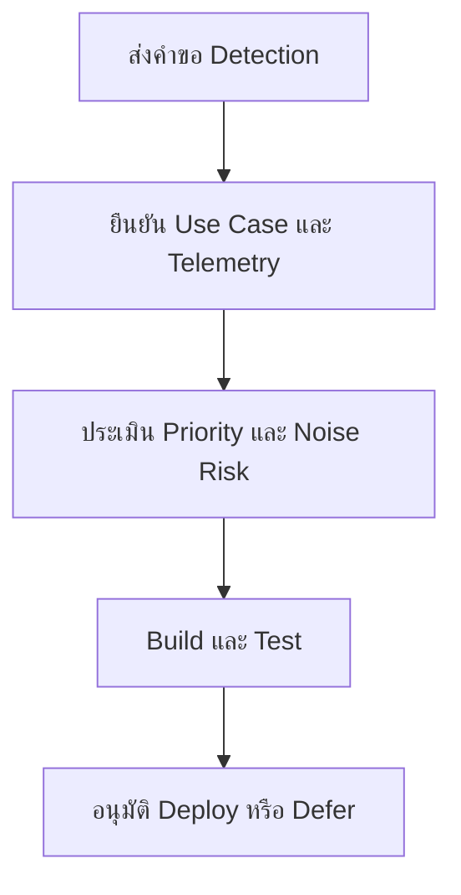

# แบบฟอร์มคำขอ Detection

**กลุ่มเป้าหมาย**: Detection Engineer, SOC Analyst, Threat Hunter, SOC Manager
**วัตถุประสงค์**: ใช้แบบฟอร์มนี้เพื่อขอ detection ใหม่ ปรับ rule หรือ tune rule โดยมีบริบทเพียงพอสำหรับการจัดลำดับความสำคัญและ implement อย่างปลอดภัย

## 1. ส่วนหัวคำขอ

| Field | Value |
|:---|:---|
| **Request ID** | DET-[YYYYMMDD]-[001] |
| **ผู้ร้องขอ** | |
| **ประเภทคำขอ** | ☐ New Detection · ☐ Tuning · ☐ Gap Fix · ☐ Retirement |
| **วันที่ส่งคำขอ** | |
| **ความสำคัญที่ร้องขอ** | ☐ Critical · ☐ High · ☐ Medium · ☐ Low |

## 2. เป้าหมายของ Detection

| Question | Answer |
|:---|:---|
| **Threat หรือ behavior ที่ต้องการตรวจจับ** | |
| **เหตุผลทางธุรกิจหรือความปลอดภัย** | |
| **Incident, hunt, หรือ audit finding ที่เกี่ยวข้อง** | |
| **แหล่งหลักฐานที่คาดหวัง** | |

## 3. ความต้องการด้าน Telemetry และข้อมูล

| Requirement | Status | Notes |
|:---|:---:|:---|
| ระบุ required log source แล้ว | ☐ | |
| ยืนยัน required fields แล้ว | ☐ | |
| มี sample data พร้อม | ☐ | |
| บันทึก blind spots แล้ว | ☐ | |

## 4. หมายเหตุด้านการ Implement

| Topic | Notes |
|:---|:---|
| **แนวคิดของ detection logic** | |
| **รูปแบบ false positive ที่คาดไว้** | |
| **แนวทาง suppression หรือ threshold** | |
| **Playbook หรือ runbook ที่เกี่ยวข้อง** | |

## 5. การอนุมัติและผลลัพธ์

| Role | Name | Decision | Date |
|:---|:---|:---:|:---|
| Detection Engineer | | ☐ Accept · ☐ Reject · ☐ Need More Info | |
| SOC Manager | | ☐ Prioritized | |

## เอกสารที่เกี่ยวข้อง (Related Documents)

-   [SOC Service Catalog](../06_Operations_Management/SOC_Service_Catalog.th.md)
-   [SOC Use Case Library](../08_Detection_Engineering/SOC_Use_Case_Library.th.md)
-   [Alert Tuning](../06_Operations_Management/Alert_Tuning.th.md)
-   [Detection Rule Testing](../06_Operations_Management/Detection_Rule_Testing.th.md)

## References

-   [Sigma Rule Specification](https://sigmahq.io/sigma-specification/specification/sigma-rules-specification.html)
-   [MITRE ATT&CK](https://attack.mitre.org/)
