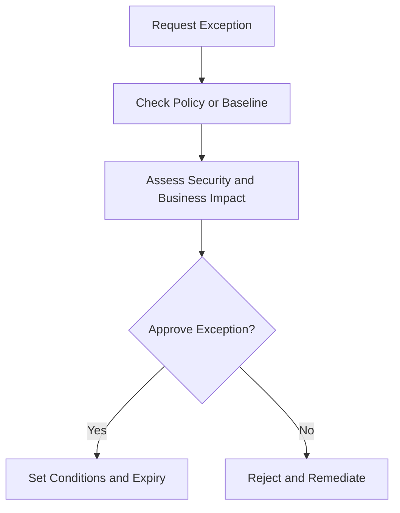

# Security Exception Approval Template

**Audience**: CISO, SOC Manager, Security Owner, Business Owner, Change Approver
**Purpose**: Use this template when a standard security policy, baseline, or required control must be temporarily bypassed or formally exempted.

## 1. When to Use This Template

-   [ ] Use when a team requests a deviation from an approved security baseline.
-   [ ] Use when a control cannot be implemented due to technical or operational limitations.
-   [ ] Use when a temporary exception is needed to support a migration, incident, or urgent business launch.

## 2. Exception Details

| Field | Value |
|:---|:---|
| **Exception ID** | EX-[YYYYMMDD]-[001] |
| **Requester** | [Name / Role] |
| **System / Service** | |
| **Policy / Control Being Excepted** | |
| **Exception Start Date** | |
| **Exception End Date** | |
| **Reason for Exception** | |

## 3. Security Impact

| Question | Answer |
|:---|:---|
| **What control is missing or weakened?** | |
| **What attack scenario becomes more likely?** | |
| **What data, users, or services are exposed?** | |
| **What monitoring or restrictions will remain in place?** | |

## 4. Decision Conditions

| Condition | Status | Notes |
|:---|:---:|:---|
| Compensating controls defined | ☐ | |
| Business owner accepts operational risk | ☐ | |
| Review date defined | ☐ | |
| Rollback or remediation path exists | ☐ | |
| Regulatory or contractual conflict checked | ☐ | |

## 5. Required Safeguards

-   [ ] Restrict scope to the minimum systems, users, or time period necessary.
-   [ ] Increase monitoring for the excepted asset or workflow.
-   [ ] Record a clear expiry date and trigger for re-review.
-   [ ] Revoke the exception immediately if conditions change or misuse is detected.

## 6. Approval

| Role | Name | Decision | Date |
|:---|:---|:---:|:---|
| Security Owner | | ☐ Recommend · ☐ Reject | |
| SOC Manager | | ☐ Reviewed | |
| Business Owner | | ☐ Accept | |
| CISO / Delegate | | ☐ Approve · ☐ Reject | |

## 7. Tracking and Closure

| Action | Owner | Due Date | Status |
|:---|:---|:---|:---:|
| Confirm safeguards active | | | ☐ |
| Review before expiry | | | ☐ |
| Remove exception or renew with justification | | | ☐ |
| Update decision log | | | ☐ |

## 8. Governance Routing

-   [ ] Review open exceptions in monthly governance review until they are removed, renewed, or escalated.
-   [ ] Move repeated exceptions or failed safeguards to quarterly risk acceptance review.
-   [ ] Escalate material authority or funding questions to the board quarterly decision pack.

## Related Documents

-   [Risk Acceptance Template](Risk_Acceptance_Template.en.md)
-   [Request for Change (RFC)](change_request_rfc.en.md)
-   [Compliance Mapping](../07_Compliance_Privacy/Compliance_Mapping.en.md)
-   [Access Control Policy](../06_Operations_Management/Access_Control.en.md)
-   [Monthly Governance Review Pack](Monthly_Governance_Review_Pack.en.md)

## References

-   [NIST SP 800-53](https://csrc.nist.gov/publications/detail/sp/800-53/rev-5/final)
-   [ISO/IEC 27001](https://www.iso.org/isoiec-27001-information-security.html)
