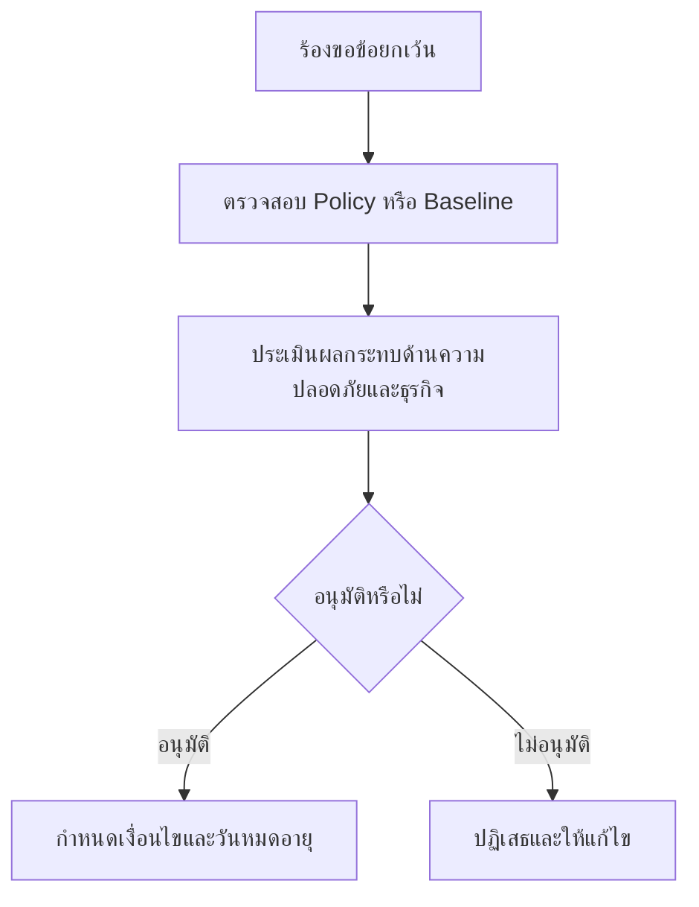

# แบบฟอร์มอนุมัติข้อยกเว้นด้านความปลอดภัย

**กลุ่มเป้าหมาย**: CISO, SOC Manager, Security Owner, Business Owner, Change Approver
**วัตถุประสงค์**: ใช้แบบฟอร์มนี้เมื่อจำเป็นต้องยกเว้น security policy, baseline, หรือ control requirement เป็นการชั่วคราวหรืออย่างเป็นทางการ

## 1. ใช้แบบฟอร์มนี้เมื่อใด

-   [ ] ใช้เมื่อมีทีมขอเบี่ยงเบนจาก security baseline ที่อนุมัติไว้
-   [ ] ใช้เมื่อ control ไม่สามารถ implement ได้เพราะข้อจำกัดทางเทคนิคหรือปฏิบัติการ
-   [ ] ใช้เมื่อจำเป็นต้องมีข้อยกเว้นชั่วคราวเพื่อรองรับ migration, incident, หรือ business launch เร่งด่วน

## 2. รายละเอียดข้อยกเว้น

| รายการ | ค่า |
|:---|:---|
| **Exception ID** | EX-[YYYYMMDD]-[001] |
| **ผู้ร้องขอ** | [ชื่อ / บทบาท] |
| **ระบบ / บริการ** | |
| **Policy / Control ที่ขอยกเว้น** | |
| **วันที่เริ่มข้อยกเว้น** | |
| **วันที่สิ้นสุดข้อยกเว้น** | |
| **เหตุผลของข้อยกเว้น** | |

## 3. ผลกระทบด้านความปลอดภัย

| คำถาม | คำตอบ |
|:---|:---|
| **Control ใดที่ขาดหายหรืออ่อนลง** | |
| **Attack scenario ใดมีโอกาสเกิดมากขึ้น** | |
| **ข้อมูล ผู้ใช้ หรือบริการใดถูกเปิดรับความเสี่ยง** | |
| **ยังคงมี monitoring หรือ restrictions อะไรอยู่บ้าง** | |

## 4. เงื่อนไขการตัดสินใจ

| เงื่อนไข | สถานะ | หมายเหตุ |
|:---|:---:|:---|
| Compensating controls ถูกกำหนดแล้ว | ☐ | |
| Business owner ยอมรับความเสี่ยงเชิงปฏิบัติการ | ☐ | |
| กำหนดวันทบทวนแล้ว | ☐ | |
| มี rollback หรือ remediation path | ☐ | |
| ตรวจสอบ conflict ด้านกฎหมายหรือสัญญาแล้ว | ☐ | |

## 5. มาตรการป้องกันที่ต้องมี

-   [ ] จำกัดขอบเขตให้แคบที่สุดทั้งระบบ ผู้ใช้ หรือช่วงเวลา
-   [ ] เพิ่ม monitoring สำหรับ asset หรือ workflow ที่ได้รับข้อยกเว้น
-   [ ] บันทึก expiry date และ trigger สำหรับการทบทวนใหม่ให้ชัด
-   [ ] เพิกถอนข้อยกเว้นทันทีหากเงื่อนไขเปลี่ยนหรือพบ misuse

## 6. การอนุมัติ

| บทบาท | ชื่อ | การตัดสินใจ | วันที่ |
|:---|:---|:---:|:---|
| Security Owner | | ☐ Recommend · ☐ Reject | |
| SOC Manager | | ☐ Reviewed | |
| Business Owner | | ☐ Accept | |
| CISO / Delegate | | ☐ Approve · ☐ Reject | |

## 7. การติดตามและการปิดงาน

| การดำเนินการ | ผู้รับผิดชอบ | กำหนดเสร็จ | สถานะ |
|:---|:---|:---|:---:|
| ยืนยันว่า safeguards ทำงานอยู่ | | | ☐ |
| ทบทวนก่อนหมดอายุ | | | ☐ |
| ยกเลิกข้อยกเว้นหรือขอต่ออายุพร้อมเหตุผล | | | ☐ |
| อัปเดต decision log | | | ☐ |

## 8. เส้นทางส่งต่อใน Governance

-   [ ] ทบทวนข้อยกเว้นที่ยังเปิดอยู่ใน monthly governance review จนกว่าจะยกเลิก ต่ออายุ หรือยกระดับ
-   [ ] หากข้อยกเว้นเกิดซ้ำหรือ safeguards ล้มเหลว ให้ส่งต่อเข้า quarterly risk acceptance review
-   [ ] หากต้องใช้อำนาจตัดสินใจหรือวงเงินระดับสูง ให้ยกระดับเข้า board quarterly decision pack

## เอกสารที่เกี่ยวข้อง (Related Documents)

-   [เทมเพลตการยอมรับความเสี่ยง](Risk_Acceptance_Template.th.md)
-   [แบบฟอร์ม Request for Change (RFC)](change_request_rfc.th.md)
-   [เอกสาร Mapping ด้าน Compliance](../07_Compliance_Privacy/Compliance_Mapping.th.md)
-   [นโยบายควบคุมการเข้าถึง](../06_Operations_Management/Access_Control.th.md)
-   [ชุดทบทวน Governance รายเดือน](Monthly_Governance_Review_Pack.th.md)

## References

-   [NIST SP 800-53](https://csrc.nist.gov/publications/detail/sp/800-53/rev-5/final)
-   [ISO/IEC 27001](https://www.iso.org/isoiec-27001-information-security.html)
